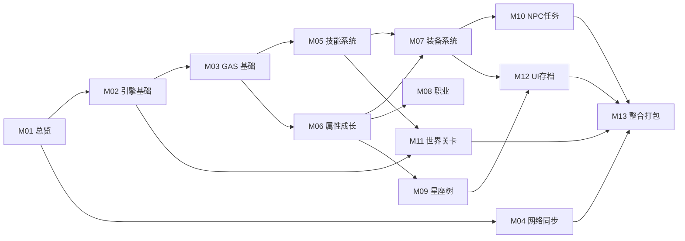

# GameDev 学习导航

目标：**30 天，一边学 UE/GAS，一边做出俯视角刷宝 ARPG（类似恐怖黎明，先单机后联机）**。

- 引擎版本：UE 5.7.4
- 实现方式：C++ 为主 + 蓝图做表现/配置
- 单元总数：**64**（精细粒度），分 13 个模块
- 每单元一个文件，严格套 `_templates/knowledge-unit.md`

## 模块索引

| 模块 | 目录 | 单元 | 对应设计点 |
|---|---|---|---|
| M01 总览 | `01-总览/` | K01–K02 | 全局 |
| M02 UE 引擎基础 | `02-引擎基础/` | K03–K10 | ① |
| M03 GAS 基础 | `03-GAS基础/` | K11–K19 | ③⑥⑪⑫ |
| M04 网络同步 | `04-网络同步/` | K20–K24 | ① |
| M05 技能系统 | `05-技能系统/` | K25–K32 | ⑪⑫ |
| M06 属性与成长 | `06-属性成长/` | K33–K37 | ⑦⑧⑫ |
| M07 装备系统 | `07-装备系统/` | K38–K44 | ③④ |
| M08 职业系统 | `08-职业系统/` | K45–K47 | ⑧ |
| M09 星座树 | `09-星座树/` | K48–K50 | ⑦ |
| M10 NPC 与任务 | `10-NPC任务/` | K51–K54 | ② |
| M11 世界与关卡 | `11-世界关卡/` | K55–K58 | ⑤⑥⑨⑩⑪ |
| M12 UI 与存档 | `12-UI存档/` | K59–K62 | ③⑦⑧ |
| M13 整合 | `13-整合打包/` | K63–K64 | 全局 |

## 依赖关系



## 构建里程碑

1. **M1（D4）**：可运行俯视角角色 + 鼠标点击移动。
2. **M2（D8）**：GAS 最小可玩（属性集 + 一个技能）。
3. **M3（D14）**：技能/伤害/抗性体系成型。
4. **M4（D20）**：装备掉落与词条闭环。
5. **M5（D24）**：职业/星座/NPC 好感度。
6. **M6（D30）**：世界/地牢/Boss/UI/存档 + 打包，并接入联机基础。

## 物理位置（写代码前必看）

- [**00-项目目录地图.md**](00-项目目录地图.md)：所有文件的"门牌号"总纲，逻辑分层 ↔ 物理目录对照，新增文件放哪的决策规则。
- 规则：每个知识单元第 4 节都会列出"本单元新建/修改的文件 + 精确路径"，并与目录地图保持一致。

## 单元链接

### M01 总览
- [K01 整体技术架构](01-总览/K01-整体技术架构.md)
- [K02 客户端与服务端职责划分](01-总览/K02-客户端与服务端职责划分.md)

### M02 UE 引擎基础
- [K03 项目结构与模块依赖](02-引擎基础/K03-项目结构与模块依赖.md)
- [K04 C++ 类与 UObject 体系](02-引擎基础/K04-C++类与UObject体系.md)
- [K05 反射宏 UPROPERTY/UFUNCTION/UCLASS](02-引擎基础/K05-反射宏UPROPERTY-UFUNCTION-UCLASS.md)
- [K06 Gameplay 框架核心类](02-引擎基础/K06-Gameplay框架核心类.md)

> 其余模块的单元链接在"生成 x"完成后，逐个追加到本小节。

## 每日学习流程（怎么和智能体配合）

1. **开始**：对智能体说 `生成 K0X`（一次只生成一个）。智能体会先读 `00-导航.md`、`00-项目目录地图.md`、`_state/TODO.md`、`_state/PROGRESS.md` 和该单元前置，再按模板输出 0~13 全部小节到 `NN-模块/K0X-标题.md`。
2. **实现**：先看单元第 4 节确认文件"放哪"，再照第 8 节代码在 UE 5.7.4 工程里落地，用第 9 节方法验证，做第 11 节练习。
3. **卡住**：把编译错误/日志/截图描述发给智能体，说 `K0X 排错`。
4. **学会**：对智能体说 `K0X 已学完`，智能体会把 `PROGRESS.md` 的学习状态改 `[x]` 并追加 recent。
5. **澄清概念**：直接针对该单元提问，智能体只解释、不改状态、不生成新单元。

### 每日对话模板（复制即用）

```
生成 K07

【当前工程进度】已完成 K01-K06，UE 工程里已有 XXX
【昨日问题】<没有就写无>
【今日目标】按 K07 实现 XXX
```

学完后：

```
K07 已学完
```

排错时：

```
K07 排错
现象：<报错文本/日志>
我改动的文件：<路径>
```

## 进度

见 `_state/PROGRESS.md`（30 天排期 + 生成/学习状态）与 `_state/TODO.md`（单元清单 + 行动步骤）。
