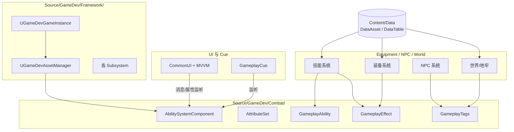

# K01 整体技术架构

## 0. 一句话结论
我们的游戏 = **一个 UE 5.7.4 的 C++ 主模块（住在 `Source/GameDev/`）+ GAS 战斗内核 + 数据资产驱动 + 子系统/接口/消息解耦**；蓝图只负责"长什么样、配什么数"，C++ 负责"规则与权威"。

> 本单元配套总纲：`00-项目目录地图.md`。任何"这个文件放哪"的问题都以它为准。

## 1. 为什么需要它
- 场景：这是整个 30 天项目的"施工总图"。后面 60 多个知识点都是在这张图上往格子里填东西，先有图纸再盖楼，避免边写边改、越写越乱。
- 不学它会导致什么问题（具体反例）：
  - 没有分层约定 → 你会在 `MyCharacter.cpp` 里直接写掉血、掉落、弹 UI、加好感度，这个文件最终暴涨到 3000 行，改一处崩三处。
  - 全局服务用"自己写的单例 Manager" → 联机时每台机器各有一份数据，玩家 A 的血量和服务器对不上，只能推倒重写。
  - 数值硬编码（`Health = 100`）→ 策划想调平衡，你要改代码、重编译、重新打包，一小时调一个数。

## 2. 前置知识
- 第一个单元，无 prerequisite。
- 需要先有的 3 个概念（用生活化的话）：
  1. **UE 模块（Module）**：把一堆 `.cpp/.h` 打包成一个"部门"（编译成 DLL）。部门之间要走正式流程（在 `Build.cs` 里登记）才能互相调用，不能随便串门。
  2. **子系统（Subsystem）**：大楼（游戏进程）自带的公共设施，比如"物业前台"。大楼在，设施就在，不用你自己到处 new 一个全局变量。
  3. **GAS（Gameplay Ability System）**：引擎自带的"战斗引擎总成"，把技能、属性、效果、标签四件套标准化，还自带联机同步能力。

## 3. UE 里的相关概念（术语表）

| 术语 | 生活化类比（它在现实里像什么） | 在本项目里具体指什么 | 官方一句话定义 |
|---|---|---|---|
| 项目（Project） | 一个工地 | `D:\UEProjects\GameDev\` 这个文件夹，含代码、资产、配置 | UE 工程 |
| 模块（Module） | 一个部门 | `Source/GameDev/` 编译成的 DLL，叫 `GameDev` | 可独立编译的代码集合 |
| C++ | 工地的钢筋水泥（结构） | 规则、算法、网络权威逻辑 | 编译型语言 |
| 蓝图（Blueprint） | 工地里的装修和家具 | 拼装表现、连数值、摆关卡 | 可视化脚本 |
| 资产（Asset） | 仓库里的物料 | `Content/` 下所有被编辑器管理的东西：蓝图、贴图、音频、DataAsset、地图 | UObject 序列化文件 |
| 资产（更准确说 UAsset） | — | 一个 `.uasset` 文件，比如 `B_PlayerCharacter.uasset` | 编辑器资产 |
| AssetManager | **仓库管理员 + 开业准备组** | 游戏启动时，他负责登记仓库物料、提前加载常用资产、顺便跑一些"开业前必须做的初始化"（比如启动 GAS 全局数据）。**它不是一个"资产"，而是"管资产的人"。** | 主资产管理与启动钩子 |
| 启动钩子（Startup Hook） | 店铺开门前必做的清单 | 游戏启动早期会被自动调用的函数，你往里塞"开机必做事项" | 生命周期回调 |
| 子系统（Subsystem） | 大楼的公共设施 | 挂载在 GameInstance/World/Player 上的服务类，用 `GetSubsystem<>` 取 | 引擎托管对象 |
| DataAsset | 一张填好的配置卡 | 策划在编辑器里填的配置对象，如一把武器的基础数据 | 可配置 UObject |
| DataTable | 一本表格册 | 大量同类数据，如技能表、掉落表，一行一条 | 行式数据资产 |
| GameplayTag | 全公司通用的标签贴纸 | 如 `Ability.Skill.Fire`，用标签代替硬编码字符串/枚举 | 层级化标签 |
| 插件（Plugin） | 外购的专业设备 | GAS、CommonUI、消息总线都以插件形式启用 | 可插拔功能包 |

> 记住这条分界线：**"代码"是我们自己写的逻辑；"资产"是编辑器里配出来的东西；"AssetManager"是管资产的类**。三者常被初学者混淆。

## 4. 物理落位（物理模块 ↔ 逻辑层 ↔ 具体文件）
> 三维同时标注：**物理模块（DLL）** / **逻辑层** / **具体文件**。物理模块规划见 `00-项目目录地图.md` 第 1.5 节。

**本单元新建/修改的文件：**

| 类 / 文件 | 物理模块（DLL） | 逻辑层（子目录） | 具体文件 | 新增/修改 |
|---|---|---|---|---|
| `FGameDevModule` | `GameDev` | 模块入口 | `Source/GameDev/GameDev.h` / `.cpp` | 新增 |
| `GameDev` 构建规则 | `GameDev` | 模块入口 | `Source/GameDev/GameDev.Build.cs` | 新增 |
| `UGameDevAssetManager` | `GameDev` | 基础设施层 | `Source/GameDev/Framework/GameDevAssetManager.h` / `.cpp` | 新增 |
| `UGameDevGameInstance` | `GameDev` | 基础设施层 | `Source/GameDev/Framework/GameDevGameInstance.h` / `.cpp` | 新增 |
| 配置 `AssetManagerClassName` / `GameInstanceClass` | —（非代码） | — | `Config/DefaultEngine.ini` | 修改 |
| 插件清单 | —（非代码） | — | `GameDev.uproject`（Plugins 段） | 修改（由用户手动，agent 不改 `.uproject`） |

**物理模块 ↔ 逻辑层 ↔ 物理目录 对照树（本单元涉及）：**

```text
Source/
└── GameDev/                         ← DLL：玩法实现
    ├── GameDev.h / .cpp             ← 模块入口（本单元）
    ├── GameDev.Build.cs             ← 模块依赖（本单元）
    └── Framework/                   ← 逻辑层：基础设施
        ├── GameDevAssetManager.h / .cpp    ← 本单元
        └── GameDevGameInstance.h / .cpp    ← 本单元
```

- **为什么放这里**：`FGameDevModule` 是模块门面，放模块根；全局服务属"基础设施层"，统一放 `Framework/`。本单元全部代码在 `GameDev` 这一个 DLL 内（`GameDevCore` 到 K03 才建）。
- 本单元没有新增目录（用的都是 `00-项目目录地图.md` 已登记的 `Framework/`）。

## 5. 涉及的 UE 类与函数

| 类 / 函数 | 头文件 | 用大白话讲它是干嘛的 |
|---|---|---|
| `FDefaultGameModuleImpl` | `Modules/ModuleManager.h` | "模块基类"，提供 `StartupModule`/`ShutdownModule` 两个可重写的开机/关机回调 |
| `IMPLEMENT_PRIMARY_GAME_MODULE` | `Modules/ModuleManager.h` | 一个宏，作用像"在门上挂牌"：告诉引擎"这个模块就是游戏主模块" |
| `UAssetManager` | `Engine/AssetManager.h` | "仓库管理员"基类；引擎启动时会调用它的 `StartInitialLoading` |
| `UAssetManager::StartInitialLoading` | `Engine/AssetManager.h` | 管理员"开门前清单"，适合放 GAS 全局初始化 |
| `UAbilitySystemGlobals::Get` | `AbilitySystemGlobals.h` | 拿到 GAS 的"总控台"对象 |
| `UAbilitySystemGlobals::InitGlobalData` | `AbilitySystemGlobals.h` | 把 GAS 的一批全局数据准备好；不做这步，用 `TargetData` 等会崩溃 |
| `UGameInstance` | `Engine/GameInstance.h` | "游戏进程本体"，跨关卡一直活着 |
| `UGameInstance::Init` | `Engine/GameInstance.h` | 游戏启动时调一次的开机函数 |
| `UGameInstanceSubsystem` | `Subsystems/GameInstanceSubsystem.h` | 想挂在大楼上的"公共设施"基类 |
| `UGameInstance::GetSubsystem<T>` | `Engine/GameInstance.h` | 去前台取某个设施 |

## 6. 架构设计

### 6.1 五个分层（从下到上）
1. **基础设施层**（`Source/GameDev/Framework/`）：模块入口、AssetManager、各 Subsystem。负责"开机、装载、全局数据"。
2. **战斗内核层**（`Source/GameDev/Combat/` + 角色的 `AttributeSet`）：GAS 四件套。所有战斗规则只在这里实现。
3. **系统层**（`Equipment/`、`NPC/`、`World/` 等）：每个系统只依赖战斗内核的公开接口；系统之间用 GameplayTag / 消息通信。
4. **表现层**（`UI/` + `Content/UI/`、GameplayCue）：只消费数据、播画面，不改规则。
5. **数据层**（`Content/Data/`）：DataAsset / DataTable / CurveTable，所有数值与配置。

### 6.2 解耦三原则（本项目的硬约束）
- **禁止直接 Cast 到具体系统类**：跨系统用接口（如 `IInteractable`）或 `GameplayMessageSubsystem` 广播。
- **禁止 God-object Manager**：全局服务一律做成 Subsystem，谁需要谁取。
- **禁止硬编码数值**：任何魔法数字进 DataAsset/DataTable。

### 6.3 模块依赖图


### 6.4 关键数据结构骨架（附门牌号）
```cpp
// 【文件】Source/GameDev/GameDev.h
class FGameDevModule : public FDefaultGameModuleImpl { /* 开机/关机 */ };

// 【文件】Source/GameDev/Framework/GameDevAssetManager.h
UCLASS()
class GAMEDEV_API UGameDevAssetManager : public UAssetManager { /* 仓库管理员 */ };

// 【文件】Source/GameDev/Framework/GameDevGameInstance.h
UCLASS()
class GAMEDEV_API UGameDevGameInstance : public UGameInstance { /* 游戏进程 */ };
```

## 7. 函数逐个设计

### 7.1 `FGameDevModule::StartupModule`
- **签名**：`virtual void FGameDevModule::StartupModule() override;`
- **所属文件**：`Source/GameDev/GameDev.cpp`（声明在 `GameDev.h`）
- **参数表**：无
- **返回值**：无
- **调用时机**：引擎加载 `GameDev` 模块时自动调用一次（游戏启动很早，早于任何地图加载）。
- **内部步骤**：
  1. 只做"引擎级"注册（如自定义 GAS 全局类、日志类别）。
  2. 不要碰依赖 World 的东西——此刻 World 还不存在。
- **对应 UE 源码位置**（可选）：`Engine/Source/Runtime/CoreUObject/Public/Modules/ModuleManager.h`
- **常见坑**：在这里调 `GetWorld()` 一定是 `nullptr`。

### 7.2 `UGameDevAssetManager::StartInitialLoading`
- **签名**：`virtual void UGameDevAssetManager::StartInitialLoading() override;`
- **所属文件**：`Source/GameDev/Framework/GameDevAssetManager.cpp`
- **参数表**：无
- **返回值**：无
- **调用时机**：引擎初始化阶段自动调用一次，早于主资产加载（前提：已在 `DefaultEngine.ini` 里把管理员换成我们这版）。
- **内部步骤**：
  1. `Super::StartInitialLoading();` —— 先让官方管理员做完默认工作。
  2. `UAbilitySystemGlobals::Get().InitGlobalData();` —— 再准备 GAS 全局数据。
- **常见坑**：忘了在 `DefaultEngine.ini` 配置 `AssetManagerClassName`，则这个函数永远不会被调用。

### 7.3 `UGameDevGameInstance::Init`
- **签名**：`virtual void UGameDevGameInstance::Init() override;`
- **所属文件**：`Source/GameDev/Framework/GameDevGameInstance.cpp`
- **参数表**：无
- **返回值**：无
- **调用时机**：GameInstance 创建后、进入第一张地图前调用一次。
- **内部步骤**：
  1. `Super::Init();`
  2. 注册全局消息监听（`UGameplayMessageSubsystem` 是 GameInstance 子系统；所属插件 `GameplayMessageRouter` 已安装启用）。
  3. 初始化不依赖具体 World 的全局服务。
- **常见坑**：GameInstance 跨地图存活，别往里塞"当前关卡才有效"的数据（那属于 WorldSubsystem）。

## 8. 完整代码示例

> 以下文件路径均相对 `D:\UEProjects\GameDev\`。保存时严格放到对应文件，否则编译找不到。

### 8.1 `Source/GameDev/GameDev.Build.cs`
```csharp
using UnrealBuildTool;

public class GameDev : ModuleRules
{
    public GameDev(ReadOnlyTargetRules Target) : base(Target)
    {
        PCHUsage = PCHUsageMode.UseExplicitOrSharedPCHs;

        // 这些是"部门之间要走的关系"：把自己依赖的引擎模块/插件登记在这
        PublicDependencyModuleNames.AddRange(new string[]
        {
            "Core",                   // 基础类型、容器
            "CoreUObject",            // UObject 体系
            "Engine",                 // 引擎核心（Actor、World 等）
            "InputCore",              // 输入
            "EnhancedInput",          // 增强输入（EnhancedInput 插件）
            "GameplayAbilities",      // GAS 核心（GameplayAbilities 插件）
            "GameplayTags",           // GameplayTag（引擎模块）
            "GameplayTasks",          // AbilityTask 依赖（引擎模块）
            "GameplayMessageRuntime", // GameplayMessageSubsystem（GameplayMessageRouter 插件）
            "CommonUI",               // UI 框架（CommonUI 插件）
            "ModularGameplay",        // 模块化框架（ModularGameplay 插件）
            "ModularGameplayActors",  // 模块化 Pawn/GameMode 等（ModularGameplayActors 插件）
            "CommonGame",             // CommonUI 的 Game 层封装（CommonGame 插件）
            "CommonUser",             // CommonUI 的 User/Setting 层（CommonUser 插件）
            "UMG",                    // Widget（引擎模块）
            "Slate",                  // CommonUI 底层 UI（引擎模块）
            "SlateCore"               // Slate 核心（引擎模块）
        });
    }
}
```

### 8.2 `Source/GameDev/GameDev.h`
```cpp
#pragma once

#include "CoreMinimal.h"
#include "Modules/ModuleManager.h"

// 模块入口类：整个部门的"前台"
class FGameDevModule : public FDefaultGameModuleImpl
{
public:
    virtual void StartupModule() override;
    virtual void ShutdownModule() override;
};
```

### 8.3 `Source/GameDev/GameDev.cpp`
```cpp
#include "GameDev.h"

void FGameDevModule::StartupModule()
{
    // 只做引擎级注册；依赖 World 的初始化放到 GameInstance
}

void FGameDevModule::ShutdownModule()
{
    // 与 StartupModule 成对释放
}

// 在门上挂牌：告诉引擎这是游戏主模块。"GameDev" 必须与 .uproject 中的模块名一致
IMPLEMENT_PRIMARY_GAME_MODULE(FGameDevModule, GameDev, "GameDev");
```

### 8.4 `Source/GameDev/Framework/GameDevAssetManager.h`
```cpp
#pragma once

#include "CoreMinimal.h"
#include "Engine/AssetManager.h"
#include "GameDevAssetManager.generated.h"

// 仓库管理员：继承官方 UAssetManager，好在"开门前"做我们自己的初始化
UCLASS()
class GAMEDEV_API UGameDevAssetManager : public UAssetManager
{
    GENERATED_BODY()
public:
    virtual void StartInitialLoading() override;
};
```

### 8.5 `Source/GameDev/Framework/GameDevAssetManager.cpp`
```cpp
#include "GameDevAssetManager.h"
#include "AbilitySystemGlobals.h"   // UAbilitySystemGlobals

void UGameDevAssetManager::StartInitialLoading()
{
    Super::StartInitialLoading();

    // 在任何人使用 GAS 的 TargetData 之前，必须先执行这句
    UAbilitySystemGlobals::Get().InitGlobalData();
}
```

### 8.6 `Source/GameDev/Framework/GameDevGameInstance.h`
```cpp
#pragma once

#include "CoreMinimal.h"
#include "Engine/GameInstance.h"
#include "GameDevGameInstance.generated.h"

// 游戏进程本体：跨地图一直活着
UCLASS()
class GAMEDEV_API UGameDevGameInstance : public UGameInstance
{
    GENERATED_BODY()
public:
    virtual void Init() override;
};
```

### 8.7 `Source/GameDev/Framework/GameDevGameInstance.cpp`
```cpp
#include "GameDevGameInstance.h"

void UGameDevGameInstance::Init()
{
    Super::Init();

    // 示例：注册全局消息监听（UGameplayMessageSubsystem 是 GameInstance 子系统）
    // UGameplayMessageSubsystem::Get(this).RegisterListener<FYourMessage>(...);
}
```

### 8.8 `Config/DefaultEngine.ini`
```ini
[/Script/Engine.Engine]
; 把官方"仓库管理员"换成我们自己的，才会触发上面的 StartInitialLoading
AssetManagerClassName=/Script/GameDev.GameDevAssetManager

[/Script/EngineSettings.GameMapsSettings]
GameDefaultMap=/Game/Maps/L_Prototype.L_Prototype
```

### 8.9 插件启用与配置补漏（补充说明）

> **状态更新**：本工程已安装并启用全部所需插件——4 个基础插件（`GameplayAbilities`、`CommonUI`、`ModularGameplay`、`EnhancedInput`）+ 4 个 Lyra 插件（`GameplayMessageRouter`、`ModularGameplayActors`、`CommonGame`、`CommonUser`）。因此 `GameplayMessageRuntime` 等模块现在**可以**写进 `Build.cs`（见 8.1）。完整清单见 `_state/PLUGINS.md`。

**（1）`GameDev.uproject` 的 `Plugins` 数组（已由用户手动完成，agent 不改 `.uproject`）：**

```json
{ "Name": "GameplayAbilities", "Enabled": true },
{ "Name": "CommonUI", "Enabled": true },
{ "Name": "ModularGameplay", "Enabled": true },
{ "Name": "EnhancedInput", "Enabled": true },
{ "Name": "GameplayMessageRouter", "Enabled": true },
{ "Name": "ModularGameplayActors", "Enabled": true },
{ "Name": "CommonGame", "Enabled": true },
{ "Name": "CommonUser", "Enabled": true }
```

**（2）实际 `Build.cs` 依赖（以 8.1 为准）：**
`Core, CoreUObject, Engine, InputCore, EnhancedInput, GameplayAbilities, GameplayTags, GameplayTasks, GameplayMessageRuntime, CommonUI, ModularGameplay, ModularGameplayActors, CommonGame, CommonUser, UMG, Slate, SlateCore`。

**（3）8.8 漏写的 `GameInstanceClass`（不补则 `UGameDevGameInstance::Init` 永不调用）：**

```ini
[/Script/EngineSettings.GameMapsSettings]
GameInstanceClass=/Script/GameDev.GameDevGameInstance
```

**（4）行为约束**：插件**未接入**时禁止自研替代，缺失依赖写 TODO 占位（见 `Article\AGENTS.md`→「禁止自造轮子」）。当前所需插件均已接入，无需替身实现。

## 9. 验证方法
- 怎么运行：编译后启动编辑器，打开 `Window > Output Log`，过滤 `LogGameplayAbilities`。
- 预期输出/画面：没有 GAS 崩溃报错。
- 断点打在哪里看变量：在 `UGameDevAssetManager::StartInitialLoading` 第一行打断点，启动游戏应命中一次；若没命中，八成是 `DefaultEngine.ini` 没配对。

## 10. 常见错误与排查
| 现象 | 原因 | 解决 |
|---|---|---|
| 启动崩溃，报 `TargetData` 未初始化 | `InitGlobalData` 没调用或太晚 | 放进 `AssetManager::StartInitialLoading` |
| 自定义 AssetManager 不生效 | `DefaultEngine.ini` 未配置类名 | 补上 `AssetManagerClassName` |
| 编译提示找不到 `GameplayAbilities` | `.uproject` 未启用插件 | 插件面板启用 GAS 等 |
| 模块互相 include 报错 | `Build.cs` 没登记依赖 | 在对应模块的依赖数组里加 |
| 文件放错目录导致编译失败 | 没按 `00-项目目录地图.md` 落位 | 对照第 4 节门牌号移动文件 |

## 11. 动手练习
- 新建 `Source/GameDev/Framework/HelloSubsystem.h/.cpp`，写一个 `UHelloSubsystem : UGameInstanceSubsystem`，在 `Initialize` 里 `UE_LOG` 打印一句话；然后在 `UGameDevGameInstance::Init` 里用 `GetSubsystem<UHelloSubsystem>()` 取出来。观察日志出现顺序，体会"子系统"和"自己 new 的单例"的区别。做完记得：这个新文件属于 `Framework/` 层，无需更新目录地图（目录已存在）。

## 12. 关联单元
- 上游：无（本单元为起点）
- 下游：K02 客户端与服务端职责划分、K03 项目结构与模块依赖（会细讲 `Build.cs`、`.Target.cs`）、K04 C++ 类与 UObject 体系

## 13. 参考
- 本项目 `00-项目目录地图.md`（物理位置总纲）
- Epic Games, *Gameplay Ability System*（官方文档）
- Epic Games, *Lyra Sample Game*（目录划分与启动流程的工业范本）
- Epic Games, *Programming Subsystems*
