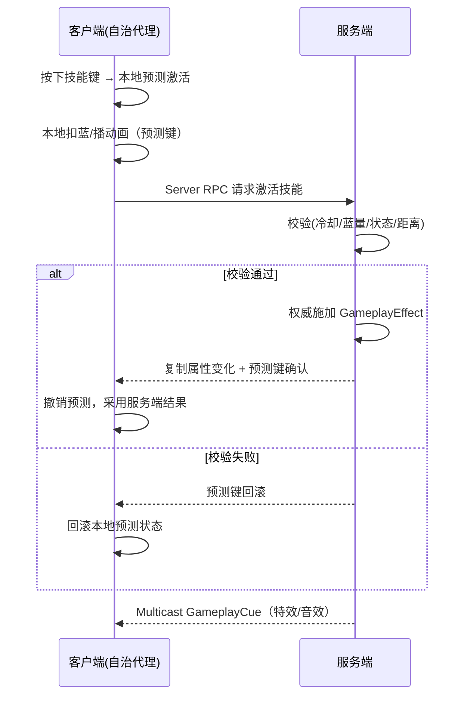

# K02 客户端与服务端职责划分

## 0. 一句话结论
**规则和真相永远在服务端，画面和手感在客户端**：客户端可以"先自己演一遍"（预测），但凡是会改变游戏状态的事，最后都由服务端拍板。

## 1. 为什么需要它
- 场景：设计①要求"支持多人联机"。哪怕你现在只做单机，也必须一开始就按这条边界写，否则将来加联机等于重写整个战斗。
- 不学它会导致什么问题（具体反例）：
  - 你在客户端直接 `Health -= 10` 然后显示血条 → 单机看不出问题；一联机，两个玩家各自算各自的，A 那边 B 已经死了、B 这边自己还活着。
  - 你把"扣血"和"播放受击动画"写在同一个函数 → 想只让服务端扣血、只让客户端播动画时，拆不开了。
  - 掉落装备在客户端随机 → 每个客户端刷出的装备不一样，服务端不认。

## 2. 前置知识
- **K01 整体技术架构**：先懂分层；本单元讲这些层"跑在哪台电脑上"。
- 需要先搞懂的 3 个概念（用生活化的话）：
  1. **权威（Authority）**：一个"总部"角色。只有总部能改账本，分部只能申请。
  2. **复制（Replication）**：总部把账本变化"抄送"给各分部，让大家的画面一致。
  3. **预测（Prediction）**：玩家操作时，先在自己机器上"预演"一遍，不等总部回信，这样手感不卡；总部回信后再校正。

## 3. UE 里的相关概念（术语表）

| 术语 | 生活化类比（它在现实里像什么） | 在本项目里具体指什么 | 官方一句话定义 |
|---|---|---|---|
| 服务端（Server） | 总部/法院 | 拥有游戏真相的那台机器（Listen Server 时是某个玩家） | 权威端 |
| 客户端（Client） | 分部/玩家的手柄 | 玩家自己那台机器，负责输入与画面 | 非权威端 |
| 权威（Authority） | "谁说了算" | `Actor->HasAuthority()` 为 true 的端改状态才有效 | 控制权 |
| 复制（Replication） | 总部抄送账本 | 服务端自动把 `Replicated` 属性同步到客户端 | 状态同步 |
| RPC | 打电话/发电报 | 跨端调用函数：客户端请求、服务端下发、服务端广播 | 远程过程调用 |
| Server RPC | 分部打电话给总部 | 客户端 → 服务端，如"我要买这件装备" | 服务端 RPC |
| Client RPC | 总部给某分部发电报 | 服务端 → 某个客户端，如"你该看到提示了" | 客户端 RPC |
| Multicast RPC | 总部广播通知 | 服务端 → 所有客户端，如"放个爆炸特效" | 多播 RPC |
| 自治代理（Autonomous Proxy） | 你自己手里的角色 | 你操作的、能立刻响应、能预测的那个 | 自控代理 |
| 拟真代理（Simulated Proxy） | 别人手里的角色（你只看到动画） | 你这边只按复制来的数据播放的克隆 | 模拟代理 |
| 预测（Prediction） | 先预判、后对账 | GAS 先本地演，服务端确认或回滚 | 客户端预测 |
| `HasAuthority()` | 问"我是不是总部" | 写任何改状态代码前先问它 | Actor 权威判定 |

## 4. 物理落位（物理模块 ↔ 逻辑层 ↔ 具体文件）
> 三维同时标注：**物理模块（DLL）** / **逻辑层** / **具体文件**。物理模块规划见 `00-项目目录地图.md` 第 1.5 节。

**本单元新建/修改的文件：**

| 类 / 文件 | 物理模块（DLL） | 逻辑层（子目录） | 具体文件 | 新增/修改 |
|---|---|---|---|---|
| `AMyPlayerController` | `GameDev` | 基础设施层 | `Source/GameDev/Framework/MyPlayerController.h` / `.cpp` | 新增（实际由 K06 落地） |
| `IInteractable` | `GameDevCore` | 契约层（接口） | `Source/GameDevCore/Interfaces/Interactable.h` | 新增（实际由 K51 落地） |

**物理模块 ↔ 逻辑层 ↔ 物理目录 对照树（本单元设计意图）：**

```text
Source/
├── GameDevCore/                     ← DLL：契约与共享地基
│   └── Interfaces/
│       └── Interactable.h           ← IInteractable（契约，供插件/编辑器共用）
└── GameDev/                         ← DLL：玩法实现
    └── Framework/
        └── MyPlayerController.h/.cpp ← 玩家控制器（玩法）
```

- **为什么这样放**：`IInteractable` 是"契约"（谁都可实现、谁都可调用），依赖玩法实现吗？不依赖——所以归 `GameDevCore`，避免让消费方被迫链接 `GameDev`。`MyPlayerController` 是玩法实体，归 `GameDev`。
- 本单元未新增目录（`Interfaces/` 由 K51 创建，K02 不预建）。

> **落地时机补充**：本单元列出的 `MyPlayerController` / `Interactable` **不在 K01/K02 批次落地**——`PlayerController` 实际由 K06 创建、`IInteractable` 由 K51 创建、Server/Client RPC 细化由 K21 讲。本单元先建立"职责边界"的认知，代码按对应单元再落。
>
> **插件/模块前置**：RPC/复制本身不额外依赖插件；但本工程输入/UI 依赖 `EnhancedInput`/`CommonUI` 插件，`PlayerController` 的挂载还依赖 `EnhancedInput` 模块。本工程现已安装并启用全部所需插件（含 Lyra 的 `GameplayMessageRouter` 等），`UGameplayMessageSubsystem` 可用于 Client RPC 的纯表现广播。名称与状态见 `_state/PLUGINS.md`。

## 5. 涉及的 UE 类与函数

| 类 / 函数 | 头文件 | 用大白话讲它是干嘛的 |
|---|---|---|
| `AActor::HasAuthority` | `GameFramework/Actor.h` | 问一句"我是不是总部"，是则返回 true |
| `AActor::GetLocalRole` | `GameFramework/Actor.h` | 看"我在这台机器上是什么身份"（总部/自控/模拟） |
| `APlayerController::IsLocalController` | `GameFramework/PlayerController.h` | 这个控制器是不是属于本机玩家 |
| `UAbilitySystemComponent::GetAvatarActor` | `AbilitySystemComponent.h` | 取"这套技能系统作用在哪个角色身上" |
| `UFUNCTION(Server, Reliable)` | `UObject` | 标记一个函数是 Server RPC（客户端调、服务端执行） |
| `UFUNCTION(Client, Reliable)` | `UObject` | 标记一个函数是 Client RPC（服务端调、某客户端执行） |
| `UPROPERTY(Replicated)` | `UObject` | 标记一个属性要被总部"抄送"到客户端 |
| `DOREPLIFETIME_CONDITION` | `Net/UnrealNetwork.h` | 在复制登记表里写清"这个属性发给谁" |

## 6. 架构设计

### 6.1 职责矩阵（本项目）
| 系统 | 服务端（总部，真相） | 客户端（分部，表现） |
|---|---|---|
| 移动 | 校验合法性 | 自控角色本地立即动（自治代理） |
| 技能激活 | 最终判定、扣消耗、进冷却 | GAS 预测先演 |
| 伤害/属性 | 服务端施加 `GameplayEffect` 改属性 | 预测显示，服务端确认后校正 |
| 装备/背包 | 拥有真实数据、校验交易 | 发 Server RPC 请求，接复制 |
| 掉落 | 服务端掷骰决定 | 只显示结果 |
| NPC 好感度 | 服务端持有与修改 | 见复制值 |
| 商店 | 校验货币与物品 | 请求购买 |
| 存档 | 服务端（联机）/本地（单机） | 触发保存请求 |
| UI | 无 | 全在客户端，只读数据、发请求 |
| 特效/音效 | 无 | GameplayCue 在客户端播 |

### 6.2 一个技能从按下到生效（时序图）


### 6.3 边界原则
- **规则与表现分离**：`ApplyDamage()`（服务端）与 `PlayHitCue()`（客户端）是两个函数，永不合并。
- **请求-校验-执行**：客户端只"请求"，服务端"校验并执行"。
- **读复制、写 RPC**：客户端读 `Replicated` 属性，写操作走 Server RPC。
- **GAS 优先**：能用 GAS 预测技能，就不要手写 RPC 同步战斗逻辑。

### 6.4 关键数据结构骨架（附门牌号）
```cpp
// 【文件】Source/GameDev/Framework/MyPlayerController.h
UCLASS()
class GAMEDEV_API AMyPlayerController : public APlayerController
{
    GENERATED_BODY()
public:
    AMyPlayerController();

    UFUNCTION(Server, Reliable)  // 客户端 → 服务端
    void Server_RequestInteract(AActor* Target);

    UFUNCTION(Client, Reliable)  // 服务端 → 该客户端
    void Client_ShowInteractionHint(FText Hint);

    UPROPERTY(Replicated)        // 总部抄送给客户端的数据（示例）
    int32 AvailableAttributePoints = 0;

    virtual void GetLifetimeReplicatedProps(TArray<FLifetimeProperty>& Out) const override;

private:
    bool Server_RequestInteract_Validate(AActor* Target);
};
```

## 7. 函数逐个设计

### 7.1 `AMyPlayerController::Server_RequestInteract`
- **签名**：`UFUNCTION(Server, Reliable) void AMyPlayerController::Server_RequestInteract(AActor* Target);`
- **所属文件**：`Source/GameDev/Framework/MyPlayerController.cpp`
- **参数表**：
  | 参数 | 类型 | 含义 | 取值范围 |
  |---|---|---|---|
  | Target | `AActor*` | 要交互的目标 | 有效 Actor，非空 |
- **返回值**：无
- **调用时机**：客户端检测到"点击/按键交互"时调用；`_Implementation` 只在服务端执行。
- **内部步骤**：
  1. 取本地 Pawn，校验非空。
  2. 距离校验（防伪造远端交互）。
  3. 用接口 `Execute_Interact` 调用，禁止 Cast 到具体类。
- **执行端**：**服务端**（由客户端触发）。
- **是否需要 Replication / RPC**：是 Server RPC，`Reliable` 保证不丢。
- **是否涉及 Authority**：是，服务端是权威执行方。
- **常见坑**：在 `_Implementation` 里以为自己在客户端；参数不校验；用 Cast 导致耦合。

### 7.2 `AMyPlayerController::Server_RequestInteract_Validate`
- **签名**：`bool AMyPlayerController::Server_RequestInteract_Validate(AActor* Target);`
- **所属文件**：`Source/GameDev/Framework/MyPlayerController.cpp`
- **参数表**：同 7.1
- **返回值**：`bool`，`true` 表示参数可接受。返回 `false` 会断开该客户端连接。
- **调用时机**：服务端收到 Server RPC 后自动先调用它。
- **内部步骤**：检查 `Target` 非空、属于本世界。复杂业务校验放 `_Implementation`。
- **常见坑**：`Validate` 返回 `false` 会踢人，别拿它做"业务失败"判定。

### 7.3 `AMyPlayerController::Client_ShowInteractionHint`
- **签名**：`UFUNCTION(Client, Reliable) void AMyPlayerController::Client_ShowInteractionHint(FText Hint);`
- **所属文件**：`Source/GameDev/Framework/MyPlayerController.cpp`
- **参数表**：
  | 参数 | 类型 | 含义 | 取值范围 |
  |---|---|---|---|
  | Hint | `FText` | 给玩家的提示文本 | 已本地化文本 |
- **返回值**：无
- **调用时机**：服务端校验交互合法后调用，通知该客户端 UI 显示提示。
- **内部步骤**：只调纯 UI 逻辑（可用消息总线广播给 Widget），不改游戏状态。
- **执行端**：**拥有该控制器的客户端**。
- **常见坑**：把状态修改塞进 Client RPC；`Client` RPC 只发 Owner，要广播用 Multicast。

## 8. 完整代码示例

> 路径均相对 `D:\UEProjects\GameDev\`。

### 8.1 `Source/GameDev/Framework/Interactable.h`
```cpp
#pragma once

#include "CoreMinimal.h"
#include "UObject/Interface.h"
#include "Interactable.generated.h"

// 交互接口：任何"可被玩家交互的东西"（NPC、宝箱、传送门）都实现它
// 好处：调用方不需要知道对方到底是哪种类，避免 Cast 造成的强耦合
UINTERFACE(MinimalAPI)
class UInteractable : public UInterface
{
    GENERATED_BODY()
};

class GAMEDEV_API IInteractable
{
    GENERATED_BODY()
public:
    // 由交互者（通常是玩家的 Pawn）发起交互
    virtual void Interact(AActor* Interactor) = 0;
};
```

### 8.2 `Source/GameDev/Framework/MyPlayerController.cpp`
```cpp
#include "MyPlayerController.h"
#include "GameFramework/Pawn.h"
#include "Interactable.h"
#include "Net/UnrealNetwork.h"
// #include "GameplayMessageSubsystem.h"  // 后续 UI 解耦时使用

AMyPlayerController::AMyPlayerController()
{
    // PlayerController 必须复制，才能收到 Client RPC
    bReplicates = true;
}

void AMyPlayerController::GetLifetimeReplicatedProps(
    TArray<FLifetimeProperty>& OutLifetimeProps) const
{
    Super::GetLifetimeReplicatedProps(OutLifetimeProps);

    // 把 AvailableAttributePoints 登记为"只抄送给拥有者"，省带宽；服务端仍是权威
    DOREPLIFETIME_CONDITION(AMyPlayerController, AvailableAttributePoints, COND_OwnerOnly);
}

void AMyPlayerController::Server_RequestInteract_Implementation(AActor* Target)
{
    // ===== 本函数只在服务端执行 =====
    APawn* MyPawn = GetPawn();
    if (!IsValid(MyPawn) || !IsValid(Target))
    {
        return;
    }

    // 距离校验，防止客户端伪造远处交互
    const float DistSq = FVector::DistSquared(
        MyPawn->GetActorLocation(), Target->GetActorLocation());
    if (DistSq > FMath::Square(300.f))
    {
        return;
    }

    // 用接口解耦，禁止 Cast 到具体 NPC/宝箱类
    if (Target->GetClass()->ImplementsInterface(UInteractable::StaticClass()))
    {
        IInteractable::Execute_Interact(Target, MyPawn);
    }

    // 纯表现反馈：只发给本客户端
    Client_ShowInteractionHint(NSLOCTEXT("Game", "InteractOk", "已交互"));
}

bool AMyPlayerController::Server_RequestInteract_Validate(AActor* Target)
{
    // 只做参数合法性；返回 false 会断开该客户端
    return Target != nullptr;
}

void AMyPlayerController::Client_ShowInteractionHint_Implementation(FText Hint)
{
    // ===== 本函数只在该客户端执行，禁止改游戏状态 =====
    // 通过消息总线广播给 UI，避免 Controller 直接引用 Widget：
    // UGameplayMessageSubsystem::Get(this).BroadcastMessage(
    //     GameplayTags::UI_Message_Hint, FHintMessage{ Hint });
}
```

> **权威判定速记**：写任何改状态的代码前，先问三句——这段跑在服务端吗？需要 `HasAuthority()` 吗？客户端失败怎么回滚？

## 9. 验证方法
- 怎么运行：编辑器 `Play` 时把 `Net Mode` 设为 `Play As Listen Server`，窗口数 1 或 2。
- 预期输出/画面：在 `Server_RequestInteract_Implementation` 断点，只有服务端实例命中；`Client_ShowInteractionHint_Implementation` 断点，只有客户端实例命中。
- 断点打在哪里看变量：`GetLocalRole()` 在服务端返回 `ROLE_Authority`，在自控客户端返回 `ROLE_AutonomousProxy`。

## 10. 常见错误与排查
| 现象 | 原因 | 解决 |
|---|---|---|
| Server RPC 没反应 | 目标 Actor 无复制 / 非 Owner | 设 `bReplicates = true`，RPC 只能由 Owner 发 |
| 客户端改了血量又跳回去 | 客户端非法改权威状态 | 状态修改全部移到服务端 |
| 特效播两次 | 服务端也播了本地特效 | 纯表现放进 GameplayCue / Multicast |
| 联机时技能不生效 | 缺权威校验或预测键 | 用 GAS 技能，服务端 `CommitAbility` |
| `Validate` 返回 false 掉线 | 把业务失败当参数非法 | 业务失败在 `_Implementation` 内 return |

## 11. 动手练习
- 把 `Server_RequestInteract` 的距离阈值从 300 改成 100，用两个客户端测试：远处点击应被服务端拒绝。再在服务端 `UE_LOG` 打印 `GetLocalRole()`，对比客户端与服务端的身份差异。

## 12. 关联单元
- 上游：K01 整体技术架构
- 下游：K20 Replication 基础、K21 RPC 与 Authority、K22 GAS 网络预测与回滚

## 13. 参考
- 本项目 `00-项目目录地图.md`
- Epic Games, *Multiplayer Programming Quick Start*
- Epic Games, *Actor Relevancy and Replication*
- Epic Games, *Gameplay Ability System — Networking / Prediction*
