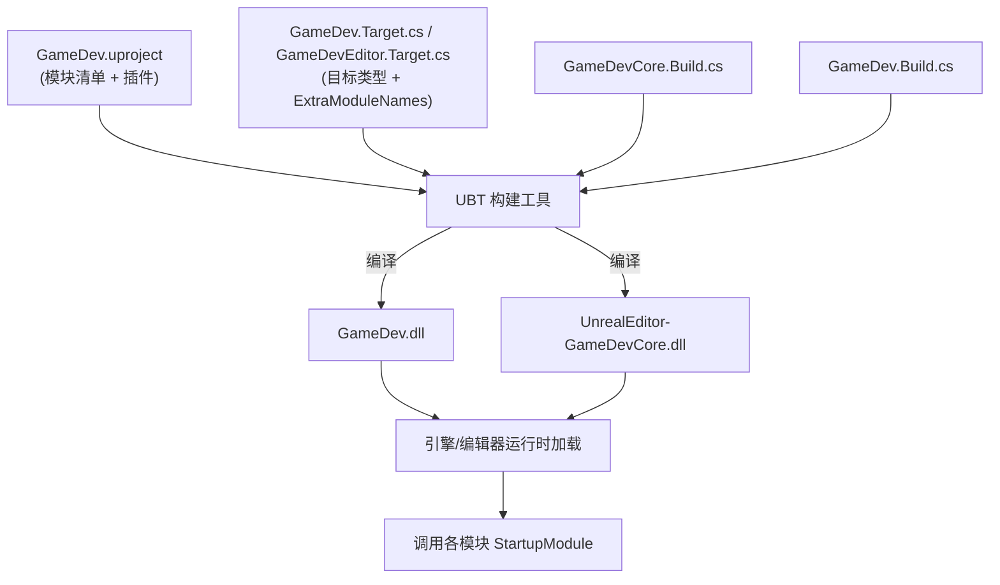

# K03 项目结构与模块依赖

## 0. 一句话结论
UE 工程像一栋**写清楚图纸的大楼**：`.uproject` 是"总说明"，`.Target.cs` 是"这次盖住宅还是售楼处"（游戏版/编辑器版），`.Build.cs` 是每个"部门（模块）"对外说的"我需要谁帮忙"。真正干活的是 **UBT**，它照这些说明书把代码编成 DLL，再让引擎把 DLL 装进运行中的游戏。本单元还要把本公司**到底设几个部门**（物理模块）一次性规划清楚。

> 本单元配套总纲：`00-项目目录地图.md`（尤其第 1.5 节「物理模块规划」）。

## 1. 为什么需要它
- 场景：K01 定了"分层的图纸"，K03 把图纸拆成**硬盘上真实的三份说明书 + 若干编译单元**。你以后每加一个系统都要动 `.Build.cs`，每加一个模块都要动 `.uproject`/`.Target.cs`。不懂它们，编译报错时你连从哪查都不知道。
- 不学它会导致什么问题（具体反例）：
  - **依赖写错数组**：把 `GameplayAbilities` 写进 `PrivateDependencyModuleNames`，又在 `.h` 里 include 它——UBT 报"未定义"。
  - **少登记模块**：代码用了 `UGameplayMessageSubsystem` 但 `Build.cs` 没写 `GameplayMessageRuntime`——链接期报 unresolved external symbol。
  - **模块归属混乱**：把"契约接口"塞进 `GameDev`（玩法实现），插件想用它就得链接整个玩法模块，产生循环依赖——这是工业项目最典型的结构性烂账。
  - **乱改 `Target.cs` 的 `Type`**：把编辑器目标改成 `Game`，编辑器功能全废。

## 2. 前置知识
- **K01 整体技术架构**：先懂"分层"和"模块是一个部门"的比喻；本单元把它落到"哪份文件、写哪一行、编成哪个 DLL"。
- 需要先搞懂的 3 个概念（生活化的话）：
  1. **构建（Build）**：把 `.cpp/.h` 翻译成机器能跑的 DLL/EXE，像"把图纸变成真房子"。
  2. **模块（Module）**：能单独编译的代码包（产物是 `.dll`），像公司里的"一个部门"。
  3. **依赖（Dependency）**：部门间要打交道，必须先在通讯录（`.Build.cs`）登记，否则电话打不通（编译报错）。

## 3. UE 里的相关概念（术语表）

| 术语 | 生活化类比 | 在本项目里具体指什么 | 官方一句话定义 |
|---|---|---|---|
| 工程 / 项目 | 一整个工地 | `D:\cheny\Documents\Unreal Projects\GameDev\` | 代码+资产集合，由 `.uproject` 描述 |
| `.uproject` | 工地总说明牌 | 记录引擎版本、**模块清单**、插件开关 | 项目描述文件（JSON） |
| Target（目标） | 这次盖"住宅"还是"售楼处" | `GameDev`（游戏版）、`GameDevEditor`（编辑器版） | 一次构建的产物配置 |
| `.Target.cs` | 施工任务书 | `GameDev.Target.cs` / `GameDevEditor.Target.cs` | 定义 Target 的构建规则 |
| **UBT** | 施工总包 | 读所有 `.cs` 脚本、调用编译器产出 DLL | UE 官方构建工具 |
| Module（模块） | 一个部门 | `GameDev`、`GameDevCore`（各一个 DLL） | 可独立编译的代码集合 |
| `.Build.cs` | 部门的对外通讯录 | 声明某模块依赖哪些模块 | 模块的构建规则 |
| DLL | 部门工作成果仓库 | `Binaries\...\GameDev.dll`、`UnrealEditor-GameDevCore.dll` | Windows 动态链接库 |
| LoadingPhase | 部门上班时间 | 模块在启动流程哪一阶段加载 | 模块加载时机 |
| PublicDependencyModuleNames | "我用，也让依赖我的人用" | 公开依赖数组（传递） | 传递性依赖 |
| PrivateDependencyModuleNames | "只我自己用" | 私有依赖数组（不传递） | 非传递性依赖 |
| 插件（Plugin） | 外购专业设备 | `Plugins/` 下 `GameplayAbilities` 等 | 可插拔功能包（`.uplugin`） |

> **一句话记住**：`.uproject` 管"有什么"、`.Target.cs` 管"盖哪个版本"、`.Build.cs` 管"这个部门要谁帮忙"。

## 4. 物理落位（物理模块 ↔ 逻辑层 ↔ 具体文件）
> 与 `00-项目目录地图.md` 对齐。**三个维度必须同时标注**：物理模块(DLL) / 逻辑层 / 具体文件。

**本单元新建/修改的文件：**

| 类 / 文件 | 物理模块（DLL） | 逻辑层（子目录） | 具体文件 | 新增/修改 |
|---|---|---|---|---|
| `FGameDevCoreModule` | `GameDevCore` | 模块入口 | `Source/GameDevCore/GameDevCore.h` | 新增 |
| `FGameDevCoreModule` 实现 | `GameDevCore` | 模块入口 | `Source/GameDevCore/GameDevCore.cpp` | 新增 |
| `GameDevCore` 构建规则 | `GameDevCore` | 模块入口 | `Source/GameDevCore/GameDevCore.Build.cs` | 新增 |
| `FGameDevModule` | `GameDev` | 模块入口 | `Source/GameDev/GameDev.h` + `.cpp` | 已有（K01） |
| `GameDev` 构建规则 | `GameDev` | 模块入口 | `Source/GameDev/GameDev.Build.cs` | 已有（K01） |
| `GameDevTarget` | —（构建脚本） | — | `Source/GameDev.Target.cs` | 修改（加 `GameDevCore`） |
| `GameDevEditorTarget` | —（构建脚本） | — | `Source/GameDevEditor.Target.cs` | 修改（加 `GameDevCore`） |
| 模块清单 | —（非代码） | — | `GameDev.uproject` 的 `Modules` 段 | 修改（由用户手动） |

**物理模块 ↔ 逻辑层 ↔ 物理目录 对照树：**

```text
Source/
├── GameDev.Target.cs          ← 游戏目标：要编哪些模块
├── GameDevEditor.Target.cs    ← 编辑器目标
├── GameDevCore/               ← DLL #1：契约与共享地基（本单元新建）
│   ├── GameDevCore.Build.cs
│   └── GameDevCore.h / .cpp
└── GameDev/                   ← DLL #2：玩法实现（K01 已建）
    ├── GameDev.Build.cs
    └── GameDev.h / .cpp
```

- **为什么 `GameDevCore` 与 `GameDev` 平级**：它们是两个独立 DLL。`GameDevCore` 是 `Source/GameDevCore/`，**不是** `Source/GameDev/GameDevCore/`（后者会变成嵌套同一个 DLL 的子目录，概念错误）。
- **为什么这么规划**：`GameDevCore` 放"契约/共享/工具"（接口、GameplayTag、共享结构、消息），`GameDev` 放"玩法实现"（Actor、技能、装备……）。这样将来的插件/编辑器模块只依赖轻量的 Core，不被迫链接庞大的玩法模块，避免循环依赖。完整规划见 `00-项目目录地图.md` 第 1.5 节。
- 本单元**不预建** `Interfaces/`/`Tags/`/`Types/` 子目录——它们分别由 K51/K15/K32 按需创建。

## 5. 涉及的 UE 类与函数
> 只列引擎自带；自写类的物理模块归属见第 4 节。

| 类 / 函数 | 头文件 | 用大白话讲它是干嘛的 |
|---|---|---|
| `TargetRules` | `UnrealBuildTool`（C#） | 构建脚本基类；`.Target.cs` 的 `GameDevTarget` 继承它 |
| `TargetType` | `UnrealBuildTool` | 枚举：`Game` / `Editor` / `Server` |
| `BuildSettingsVersion` | `UnrealBuildTool` | 选默认构建设置版本（本项目 `V6`） |
| `EngineIncludeOrderVersion` | `UnrealBuildTool` | 选头文件包含顺序版本（本项目 `Unreal5_7`） |
| `ModuleRules` | `UnrealBuildTool`（C#） | 构建脚本基类；`.Build.cs` 的 `GameDev`/`GameDevCore` 继承它 |
| `IModuleInterface` | `Modules/ModuleInterface.h` | 模块生命周期接口（`StartupModule`/`ShutdownModule`） |
| `FDefaultGameModuleImpl` | `Modules/ModuleManager.h` | `IModuleInterface` 的默认实现 |
| `FModuleManager` | `Modules/ModuleManager.h` | 引擎的"部门调度中心"，负责加载/查询模块 |
| `IMPLEMENT_PRIMARY_GAME_MODULE` | `Modules/ModuleManager.h` | 宏：登记"**主**游戏模块"（全工程唯一，3 参） |
| `IMPLEMENT_MODULE` | `Modules/ModuleManager.h` | 宏：登记"普通模块"（2 参） |
| `LoadingPhase` | `.uproject`/`.uplugin` 字段 | 模块加载时机（如 `Default`、`PreDefault`） |

## 6. 架构设计

### 6.1 构建流水线


### 6.2 本项目物理模块规划（终身职责）
| 模块(DLL) | 类型 | 职责 | 依赖 |
|---|---|---|---|
| `GameDevCore` | Runtime | 契约与共享地基：接口 / Tags / 共享结构 / 消息；**不放玩法逻辑** | 引擎模块 |
| `GameDev` | Runtime | 玩法实现：Framework / Character / Combat / Equipment / NPC / World / UI | `GameDevCore` + GAS 等 |
| `GameDevEditor` | Editor | 编辑器扩展（后期） | `GameDev` + `GameDevCore` |

依赖方向：`GameDevEditor → GameDev → GameDevCore`。

### 6.3 Public vs Private 依赖
- `PublicDependencyModuleNames`：**传递性**，头文件里 include 到的放这里。
- `PrivateDependencyModuleNames`：**非传递性**，只在 `.cpp` 里用的放这里。
- 口诀：**头文件用 → Public；仅实现用 → Private**。

### 6.4 数据结构骨架（附门牌号）
```csharp
// 【文件】Source/GameDevCore/GameDevCore.Build.cs
public class GameDevCore : ModuleRules
{
    public GameDevCore(ReadOnlyTargetRules Target) : base(Target)
    {
        PublicDependencyModuleNames.AddRange(new string[] { "Core", "CoreUObject", "Engine" });
    }
}

// 【文件】Source/GameDev.Target.cs
public class GameDevTarget : TargetRules
{
    public GameDevTarget(TargetInfo Target) : base(Target)
    {
        Type = TargetType.Game;
        ExtraModuleNames.Add("GameDev");
        ExtraModuleNames.Add("GameDevCore"); // 本单元新增
    }
}
```

## 7. 函数逐个设计

### 7.1 `FGameDevCoreModule::StartupModule`
- **签名**：`virtual void FGameDevCoreModule::StartupModule() override;`
- **所属文件**：`Source/GameDevCore/GameDevCore.cpp`（声明在 `GameDevCore.h`）
- **物理模块 / 逻辑层**：`GameDevCore` / 模块入口
- **参数表**：无
- **返回值**：无
- **调用时机**：引擎加载 `GameDevCore` 模块时自动调用一次。
- **内部步骤**：只做引擎级注册；禁止访问 World。
- **常见坑**：在这里 `GetWorld()` 得到空指针。

### 7.2 `FGameDevCoreModule::ShutdownModule`
- **签名**：`virtual void FGameDevCoreModule::ShutdownModule() override;`
- **所属文件**：`Source/GameDevCore/GameDevCore.cpp`
- **参数表**：无
- **返回值**：无
- **调用时机**：模块卸载时。
- **内部步骤**：反向释放 `StartupModule` 申请的资源，成对出现。
- **常见坑**：只申请不释放，热重载残留崩溃。

### 7.3 `IMPLEMENT_MODULE`（普通模块注册宏）
- **签名**：`IMPLEMENT_MODULE(ModuleImplClass, ModuleName)`
- **所属文件**：`Source/GameDevCore/GameDevCore.cpp`
- **参数表**：
  | 参数 | 含义 | 本项目取值 |
  |---|---|---|
  | `ModuleImplClass` | 模块实现类 | `FGameDevCoreModule` |
  | `ModuleName` | 模块名，须与 `.uproject`/`Build.cs` 一致 | `GameDevCore` |
- **调用时机**：编译期展开；运行期由 `FModuleManager` 用来创建模块实例。
- **要点**：**两个参数**。`GameDevCore` 不是主模块，所以用 `IMPLEMENT_MODULE`，**不能**用 `IMPLEMENT_PRIMARY_GAME_MODULE`。
- **常见坑**：普通模块误用三参主模块宏，会导致"重复定义主模块"链接错误。

### 7.4 `IMPLEMENT_PRIMARY_GAME_MODULE`（主模块注册宏，对比用）
- **签名**：`IMPLEMENT_PRIMARY_GAME_MODULE(ModuleImplClass, ModuleName, LogCategoryName)`
- **参数表**：
  | 参数 | 含义 | 本项目取值 |
  |---|---|---|
  | `ModuleImplClass` | 主模块实现类 | `FGameDevModule` |
  | `ModuleName` | 模块名 | `GameDev` |
  | `LogCategoryName` | 日志类别名 | `GameDev` |
- **要点**：**三个参数**；全工程**只能出现一次**（由 `GameDev.cpp` 占用）。
- **对比记忆**：主模块 3 参带日志名；普通模块 2 参无日志名。

### 7.5 `GameDev::GameDev(ReadOnlyTargetRules)`（UBT 构造）
- **签名**：`public GameDev(ReadOnlyTargetRules Target) : base(Target)`
- **所属文件**：`Source/GameDev/GameDev.Build.cs`
- **参数表**：
  | 参数 | 类型 | 含义 |
  |---|---|---|
  | Target | `ReadOnlyTargetRules` | UBT 传入的本次构建目标信息 |
- **返回值**：无（构造函数）
- **调用时机**：UBT 解析脚本时构造规则对象。
- **内部步骤**：设 `PCHUsage`，往依赖数组 `AddRange`。
- **常见坑**：数组名拼错（少写 `Names`）不报错但依赖不生效。

## 8. 完整代码示例

> 路径相对工程根 `D:\cheny\Documents\Unreal Projects\GameDev\`。

### 8.1 `GameDev.uproject`（`Modules` 段，本单元新增 GameDevCore；由用户手动粘贴）
```json
"Modules": [
	{ "Name": "GameDev",     "Type": "Runtime", "LoadingPhase": "Default" },
	{ "Name": "GameDevCore", "Type": "Runtime", "LoadingPhase": "Default" }
]
```

### 8.2 `Source/GameDevCore/GameDevCore.Build.cs`
```csharp
// Copyright Epic Games, Inc. All Rights Reserved.

using UnrealBuildTool;

public class GameDevCore : ModuleRules
{
	public GameDevCore(ReadOnlyTargetRules Target) : base(Target)
	{
		PCHUsage = PCHUsageMode.UseExplicitOrSharedPCHs;

		// Core 只依赖"地基"级别的引擎模块，不依赖玩法/GAS/UI
		PublicDependencyModuleNames.AddRange(new string[]
		{
			"Core",        // 基础类型与容器
			"CoreUObject", // UObject 体系与反射
			"Engine"       // 引擎核心
			// 后续需要时再逐一添加，例如 K15 加 "GameplayTags"
		});
	}
}
```

### 8.3 `Source/GameDevCore/GameDevCore.h`
```cpp
#pragma once

#include "CoreMinimal.h"
#include "Modules/ModuleManager.h"

// GameDevCore 模块入口：与 GameDev 的入口写法相同，但它是"普通模块"
class FGameDevCoreModule : public FDefaultGameModuleImpl
{
public:
	virtual void StartupModule() override;   // 模块加载时调用
	virtual void ShutdownModule() override;  // 模块卸载时调用
};
```

### 8.4 `Source/GameDevCore/GameDevCore.cpp`
```cpp
#include "GameDevCore.h"

void FGameDevCoreModule::StartupModule()  { /* 只做引擎级注册，禁止访问 World */ }
void FGameDevCoreModule::ShutdownModule() { /* 成对释放 */ }

// 普通模块注册：两个参数（实现类, 模块名）
// 注意：不能用在主模块 GameDev 上；主模块用三参的 IMPLEMENT_PRIMARY_GAME_MODULE
IMPLEMENT_MODULE(FGameDevCoreModule, GameDevCore);
```

### 8.5 `Source/GameDev.Target.cs`（新增一行）
```csharp
// Copyright Epic Games, Inc. All Rights Reserved.

using UnrealBuildTool;
using System.Collections.Generic;

public class GameDevTarget : TargetRules
{
	public GameDevTarget(TargetInfo Target) : base(Target)
	{
		Type = TargetType.Game;
		DefaultBuildSettings = BuildSettingsVersion.V6;
		IncludeOrderVersion = EngineIncludeOrderVersion.Unreal5_7;
		ExtraModuleNames.Add("GameDev");
		ExtraModuleNames.Add("GameDevCore"); // 本单元新增：把新模块纳入游戏构建
	}
}
```

### 8.6 `Source/GameDevEditor.Target.cs`（同样新增一行）
```csharp
// Copyright Epic Games, Inc. All Rights Reserved.

using UnrealBuildTool;
using System.Collections.Generic;

public class GameDevEditorTarget : TargetRules
{
	public GameDevEditorTarget(TargetInfo Target) : base(Target)
	{
		Type = TargetType.Editor;
		DefaultBuildSettings = BuildSettingsVersion.V6;
		IncludeOrderVersion = EngineIncludeOrderVersion.Unreal5_7;
		ExtraModuleNames.Add("GameDev");
		ExtraModuleNames.Add("GameDevCore"); // 本单元新增
	}
}
```

## 9. 验证方法
- 怎么运行：改完 `.uproject` 后，右键 `GameDev.uproject` → `Generate Visual Studio project files`；编译 `GameDevEditor` Development Editor。
- 预期输出/画面：编译通过，`Binaries\Win64\` 下出现 `GameDevCore` 相关 DLL；编辑器 `Output Log` 搜 `LogModuleManager` 能看到 `GameDevCore` 被加载。
- 断点打在哪里看变量：在 `FGameDevCoreModule::StartupModule` 第一行打断点，启动编辑器应命中一次。
- 反向验证：把 `GameDevEditor.Target.cs` 里的 `ExtraModuleNames.Add("GameDevCore")` 注释掉，编译仍可能通过、但编辑器构建不再包含该模块——体会 `.Target.cs` 决定"编哪些模块"。

## 10. 常见错误与排查
| 现象 | 原因 | 解决 |
|---|---|---|
| 重复定义主模块 / 链接错误 | 普通模块误用 `IMPLEMENT_PRIMARY_GAME_MODULE` | 普通模块改用 `IMPLEMENT_MODULE` |
| 新模块没被编译 | `.uproject` 或 `.Target.cs` 没登记 | 两处都加模块名，再 Generate |
| unresolved external symbol | `.Build.cs` 少登记依赖 | 加入 `Public/PrivateDependencyModuleNames` |
| 头文件找不到 / 重复定义 | `IncludeOrderVersion` 与引擎不匹配 | 设 `EngineIncludeOrderVersion.Unreal5_7` |
| 编辑器功能消失 | `.Target.cs` 的 `Type` 被误设 | 编辑器目标必须 `TargetType.Editor` |
| 循环依赖 | 契约层误放玩法实现 | 契约/接口放 `GameDevCore`，实现放 `GameDev` |

## 11. 动手练习
- 让 `GameDev` 真正用上 `GameDevCore`：在 `Source/GameDev/GameDev.Build.cs` 的依赖数组里加 `"GameDevCore"`，然后在 `Source/GameDev/GameDev.cpp` 顶部 `#include "GameDevCore.h"`，编译。观察：加依赖前 include 会报"找不到头文件"；加后编译通过。
- **不要删掉这两处修改**——从 K15/K51 起，`GameDev` 会持续依赖 `GameDevCore`，这次改动是最终架构的一部分。

## 12. 关联单元
- 上游：K01 整体技术架构
- 下游：K04 C++ 类与 UObject 体系、K05 反射宏 UPROPERTY/UFUNCTION/UCLASS

## 13. 参考
- 本项目 `00-项目目录地图.md`（物理模块规划）、`_state/PLUGINS.md`
- Epic Games, *Unreal Build Tool*、*Unreal Engine Modules*
- Epic Games, *Lyra Sample Game*（多模块与插件划分的工业范本）
