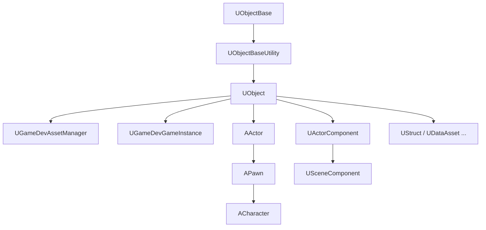
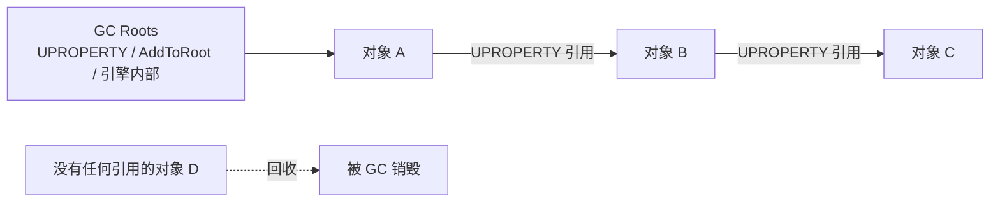

# K04 C++ 类与 UObject 体系

## 0. 一句话结论
UE 的 C++ 世界里，**几乎一切"活着的对象"都是 `UObject` 的后代**。`UObject` 是引擎给 C++ 类套上的一层"官方户籍"：有了它，引擎才能记住你、自动帮你回收内存（GC）、在编辑器里显示你的属性、让你在蓝图里调用你的函数。普通 C++ 类是"黑户"，引擎看不见也管不着。

> 本单元配套总纲：`00-项目目录地图.md`。本单元**不新建文件**，纯理解 + 读你已有的代码。

## 1. 为什么需要它
- 场景：K03 建好了两个模块（`GameDevCore` / `GameDev`）。接下来每个"系统"都要写成类——`UGameDevAssetManager`、`AMyPlayerCharacter`、`UMyAttributeSet`……到底为什么都带个 `U`/`A` 前缀？为什么不直接写 `class Player {}` 就完事？答案就在 `UObject` 体系。
- 不学它会导致什么问题（具体反例）：
  - **用 `new` 创建对象**：`new UMyAbility()` —— 引擎完全不知道这个对象存在，不会被 GC 管理，也不会在蓝图里出现，还会内存泄漏。
  - **裸指针指向 UObject**：`UMyAbility* P = GetDefault<UMyAbility>();` 存了个全局裸指针 —— 没被任何 `UPROPERTY` 引用，GC 一轮就把它扫掉，你的指针变野指针。
  - **手动 `delete`**：`delete MyUObject;` —— GC 之后还会再碰它，直接崩溃。
  - **普通 C++ 类想进蓝图**：写了个纯 `class FDamageInfo {}` 却想在蓝图里当节点用 —— 做不到，因为没 `UCLASS`/`USTRUCT` 的反射信息。

## 2. 前置知识
- **K03 项目结构与模块依赖**：先懂"代码编进哪个 DLL"；本单元讲这些代码里"类的本质"。
- 需要先搞懂的 3 个概念（生活化的话）：
  1. **对象（Object）**：程序运行时真实存在、占内存的一个"东西"，像一个具体的人。
  2. **类（Class）**：对象的"设计图/模具"，像"人类"这个物种。
  3. **内存管理**：决定"一个东西什么时候被销毁、内存回收"，像物业定期清理没人认领的物品。

## 3. UE 里的相关概念（术语表）

| 术语 | 生活化类比 | 在本项目里具体指什么 | 官方一句话定义 |
|---|---|---|---|
| `UObject` | 有户籍的公民 | 所有引擎托管对象的基类；`UGameDevAssetManager` 就是它的后代 | 引擎对象基类 |
| `UCLASS` | 给类上户口 | 标记"这个类要被引擎/反射系统接管" | 反射标记宏 |
| 反射（Reflection） | 会读心术的档案系统 | 引擎能知道你的类有哪些属性/函数，才能给蓝图用、做序列化 | 运行时类型信息 |
| GC（垃圾回收） | 物业定期清理无主物 | 引擎自动销毁没有任何引用的 `UObject` | 自动内存回收 |
| GC Root（根） | 必须保留的固定资产 | 被 `UPROPERTY`、被 `AddToRoot` 等引用的对象不会被回收 | 可达性起点 |
| CDO（Class Default Object） | 每个物种的"标准像/标本" | 每个 `UCLASS` 自动生成一个默认实例，做属性默认值 | 类默认对象 |
| `UPROPERTY` | 给属性贴定位标签 | 让引擎"看得见"这个成员变量，从而保住引用、可编辑、可复制 | 反射属性标记 |
| `NewObject<T>()` | 走正规流程登记新生 | 在运行时创建 `UObject` 的正确方式 | 对象工厂函数 |
| `CreateDefaultSubobject` | 出生就自带的身体部件 | 在构造函数里创建 Actor 的组件/子对象 | 默认子对象创建 |
| `AActor` | 能被摆进世界的公民 | 能放进关卡、有坐标的东西（角色、武器、传送门） | 可放置对象 |
| `UActorComponent` | 挂在公民身上的功能模块 | 可复用的能力件（技能系统组件、装备组件） | Actor 组件 |
| `UStruct` | 轻量级的数据卡片 | 纯数据聚合，非 `UObject`（如伤害信息、词条） | 反射结构体 |
| `FObjectInitializer` | 新生入学登记表 | 构造对象时传递初始化信息 | 对象初始化器 |
| `TObjectPtr<T>` | 带产权登记的指针 | UE5 推荐的 UObject 智能指针（保留引用） | 对象指针包装 |
| `TWeakObjectPtr<T>` | 只登记不占产权 | 不阻止对象被 GC 的弱引用 | 弱对象指针 |

> **一句话记住**：`UObject` 是"引擎管得着的对象"；`UCLASS` 给它上户口，GC 负责清理，`UPROPERTY` 是"保住引用"的护身符。

## 4. 物理落位（物理模块 ↔ 逻辑层 ↔ 具体文件）
> 三维同时标注：**物理模块（DLL）** / **逻辑层** / **具体文件**。物理模块规划见 `00-项目目录地图.md` 第 1.5 节。
> **本单元不新建任何文件**，只读已存在的类作为例子。

**本单元涉及的类（均已存在，不新增）：**

| 类 / 文件 | 物理模块（DLL） | 逻辑层（子目录） | 具体文件 | 新增/修改 |
|---|---|---|---|---|
| `UGameDevAssetManager` | `GameDev` | 基础设施层 | `Source/GameDev/Framework/GameDevAssetManager.h` | 只读（K01 建） |
| `UGameDevGameInstance` | `GameDev` | 基础设施层 | `Source/GameDev/Framework/GameDevGameInstance.h` | 只读（K01 建） |
| `FGameDevCoreModule` | `GameDevCore` | 模块入口 | `Source/GameDevCore/GameDevCore.h` | 只读（K03 建，**非** UObject） |

**物理模块 ↔ 逻辑层 ↔ 物理目录 对照树（本单元涉及）：**

```text
Source/
├── GameDevCore/
│   └── GameDevCore.h/.cpp        ← FGameDevCoreModule（纯 C++ 类，无 U 前缀）
└── GameDev/
    └── Framework/
        ├── GameDevAssetManager.h/.cpp   ← UGameDevAssetManager（UObject 后代）
        └── GameDevGameInstance.h/.cpp   ← UGameDevGameInstance（UObject 后代）
```

- **为什么 FGameDevCoreModule 没有 U 前缀**：它是"模块入口"，不是引擎托管对象，只是普通 C++ 类（继承 `FDefaultGameModuleImpl`）——正好是"UObject vs 普通 C++ 类"的对照例子。
- 本单元不新增目录、不新增文件，无需更新 `00-项目目录地图.md`。

## 5. 涉及的 UE 类与函数
> 只列引擎自带；自写类的物理模块归属见第 4 节。

| 类 / 函数 | 头文件 | 用大白话讲它是干嘛的 |
|---|---|---|
| `UObject` | `UObject/Object.h` | 所有引擎托管对象的基类（"户籍系统"的根） |
| `UObjectBase` / `UObjectBaseUtility` | `UObject/UObjectBase.h` | `UObject` 更底层的实现，管链条关系 |
| `UClass` | `UObject/Class.h` | "类的类"：描述一个 `UCLASS` 的元信息 |
| `UObject::StaticClass()` | `UObject/Object.h` | 拿到"我这个类"对应的 `UClass`（反射入口） |
| `UObject::GetClass()` | `UObject/Object.h` | 拿到"这个对象所属于哪个类" |
| `NewObject<T>()` | `UObject/UObjectGlobals.h` | 运行时创建 `UObject` 的正规工厂 |
| `GetDefault<T>()` | `UObject/UObjectGlobals.h` | 拿到某类的 CDO（默认实例） |
| `FObjectInitializer` | `UObject/UObjectGlobals.h` | 构造对象时的初始化登记表 |
| `UObject::CreateDefaultSubobject<T>()` | `UObject/UObject.h`（经 Actor 使用） | 在构造函数里创建子对象（组件） |
| `IsValid(Object)` | `UObject/UObjectGlobals.h` | 判断对象是否还有效（未被 GC） |
| `TWeakObjectPtr<T>` | `UObject/WeakObjectPtr.h` | 弱引用，不阻止 GC |
| `TObjectPtr<T>` | `UObject/ObjectPtr.h` | UE5 推荐的 UObject 指针包装 |
| `AActor` | `GameFramework/Actor.h` | 能放进关卡的 `UObject` |
| `UActorComponent` | `Components/ActorComponent.h` | 挂在 Actor 上的功能组件 |
| `UStruct`（`FStructBase`） | `UObject/Class.h` | 反射结构体基类 |

## 6. 架构设计

### 6.1 继承树（UObject 家族）


- **`AActor` 是 `UObject` 的特化**：它多了"能放进世界、有 Transform"的能力。所以 `AMyPlayerCharacter` 的 `A` 前缀表示"这是 Actor 家族"。
- **`UActorComponent` 也是 `UObject`**：组件不独立存在，挂在 Actor 上复用功能。

### 6.2 GC 是怎么决定"谁该被清理"的

- 引擎从"根集合"出发，把能顺着引用走到的对象标记为"存活"，剩下的一律销毁。
- **关键**：只有被 `UPROPERTY` 标记（或被根引用）的引用才算数；裸 C++ 指针不算。

### 6.3 UObject vs 普通 C++ 类（本项目对照）
| 特性 | `UObject` 后代 | 普通 C++ 类 |
|---|---|---|
| 前缀 | `U` / `A` / 无（结构体 `F`） | 无强制（本项目 `F` 前缀） |
| 创建方式 | `NewObject<T>()` | `new` / 栈上 |
| 销毁 | 引擎 GC 自动 | 手动 `delete` / 作用域 |
| 进蓝图 | 可以 | 不行 |
| 反射/序列化 | 支持 | 不支持 |
| 本项目实例 | `UGameDevAssetManager` | `FGameDevCoreModule` |

### 6.4 关键数据结构骨架（示例，非本单元落地）
```cpp
// 【示意】一个 UObject 后代
UCLASS()
class GAMEDEV_API UMyDataObject : public UObject
{
    GENERATED_BODY()       // 反射代码生成入口，必须写
public:
    UPROPERTY(EditAnywhere, Category="Data")  // 引擎可见、可编辑、保住引用
    int32 Value = 0;
};
```

## 7. 函数逐个设计

### 7.1 `UObject::StaticClass()`
- **签名**：`static UClass* UObject::StaticClass();`（每个 `UCLASS` 由 `GENERATED_BODY()` 生成自己的版本）
- **所属文件**：引擎 `UObject/Object.h`；调用点在自写类里
- **参数表**：无
- **返回值**：`UClass*` —— 该类的反射元信息
- **调用时机**：需要"比较类型/创建对象/查元数据"时。
- **内部步骤**：返回编译期为该类生成的静态 `UClass` 单例。
- **常见坑**：对"接口"要用 `UInterface::StaticClass()`；`IsA()`、`Cast<>()` 底层都靠它。

### 7.2 `NewObject<T>()`
- **签名**：`template<class T> T* NewObject(UObject* Outer = nullptr);`
- **所属文件**：引擎 `UObject/UObjectGlobals.h`
- **参数表**：
  | 参数 | 类型 | 含义 | 取值范围 |
  |---|---|---|---|
  | Outer | `UObject*` | 新对象的"归属者"（谁拥有它） | 有效对象或 nullptr |
- **返回值**：`T*` —— 新创建的对象
- **调用时机**：运行时需要 new 一个 `UObject` 时。
- **内部步骤**：
  1. 分配内存；
  2. 执行构造函数；
  3. 注册进引擎对象系统（获得 GC 视野）。
- **常见坑**：返回的指针**必须**存进某个 `UPROPERTY`，否则下一轮 GC 就没了。

### 7.3 `UObject::GetClass()`
- **签名**：`virtual UClass* UObject::GetClass() const;`
- **所属文件**：引擎 `UObject/Object.h`
- **参数表**：无
- **返回值**：`UClass*`
- **调用时机**：手上只有一个对象指针，想知道它到底是什么类时。
- **内部步骤**：返回该对象对应的 `UClass`。
- **常见坑**：与 `StaticClass()` 的差别——`GetClass()` 是"实例问自己属于谁"，`StaticClass()` 是"我知道类名，直接拿"。

### 7.4 `IsValid(Object)`
- **签名**：`bool IsValid(const UObject* Test);`
- **所属文件**：引擎 `UObject/UObjectGlobals.h`
- **参数表**：
  | 参数 | 类型 | 含义 |
  |---|---|---|
  | Test | `const UObject*` | 待检查的对象指针 |
- **返回值**：`bool`，true=对象存在且未被标记销毁
- **调用时机**：使用任何缓存的指针前。
- **内部步骤**：判空 + 检查"待销毁"标志。
- **常见坑**：对象"已被 GC 但内存未立刻清"时，裸指针非空却已失效——所以要用 `IsValid` 而非 `!= nullptr`。

## 8. 完整代码示例

> ⚠️ 本单元为**纯文档**，以下代码用于理解，**不写入工程**。真正落地从 K05/K06 开始。

### 8.1 一个 `UObject` 后代（示意）
```cpp
#pragma once

#include "CoreMinimal.h"
#include "UObject/Object.h"
#include "MyDataObject.generated.h"   // 必须最后包含，由 UHT 生成

// UCLASS() 给这个类"上户口"，让引擎/反射接管
UCLASS()
class GAMEDEV_API UMyDataObject : public UObject
{
    GENERATED_BODY()                  // 展开后生成 StaticClass() 等反射代码

public:
    // UPROPERTY：引擎看得见（可编辑、可序列化、且保住引用不被 GC）
    UPROPERTY(EditAnywhere, Category="Data")
    int32 Value = 0;

    // 普通成员不会被 GC 追踪——如果类型是 UObject*，必须加 UPROPERTY
};
```

### 8.2 创建与安全使用（示意）
```cpp
void UMySystem::MakeAndUse(UObject* Outer)
{
    // 正确：用 NewObject 创建，并指定归属者
    UMyDataObject* Obj = NewObject<UMyDataObject>(Outer);

    // 保存到成员变量前，确保该成员是 UPROPERTY，否则会被 GC
    // （示意）
    if (IsValid(Obj))
    {
        Obj->Value = 42;              // 安全访问
    }
}
```

### 8.3 读你已有的代码（本单元重点）
- `Source/GameDev/Framework/GameDevAssetManager.h`：
  - `UCLASS()` + `class GAMEDEV_API UGameDevAssetManager : public UAssetManager` + `GENERATED_BODY()` —— 标准 `UObject` 后代写法；
  - `UAssetManager` 本身就是 `UObject` 的后代。
- `Source/GameDevCore/GameDevCore.h`：
  - `class FGameDevCoreModule : public FDefaultGameModuleImpl` —— **没有** `UCLASS`/`GENERATED_BODY`，是普通 C++ 类，用于和上面做对比。

## 9. 验证方法
- 怎么运行：本单元无代码改动，直接在编辑器里验证你的"理解"。
- 预期观察：
  1. 打开 `Config/DefaultEngine.ini`，确认 `AssetManagerClassName=/Script/GameDev.GameDevAssetManager`（K01 配的）——这行能生效，正是因为 `UGameDevAssetManager` 是带反射的 `UObject`。
  2. 编辑器 `Window > Developer Tools > Class Viewer` 搜索 `GameDevAssetManager` 与 `GameDevGameInstance`，应能搜到；搜 `GameDevCoreModule` 搜不到——印证"只有 UObject 进反射系统"。
- 断点看变量：在 `UGameDevAssetManager::StartInitialLoading` 打断点，Watch 里输入 `this->GetClass()->GetName()`，观察返回的类名。

## 10. 常见错误与排查
| 现象 | 原因 | 解决 |
|---|---|---|
| 对象凭空消失/野指针 | 裸指针引用未被 `UPROPERTY` 保护 | 改成 `UPROPERTY()` 成员或用 `TObjectPtr` |
| 崩溃在 `delete` | 手动删除 UObject | 交给 GC，永远不要 `delete` UObject |
| 蓝图里找不到你的类 | 漏了 `UCLASS()` / `GENERATED_BODY()` | 补齐反射标记；确认头文件末尾包含 `.generated.h` |
| 编译报 `*.generated.h` 缺失 | 类没被 UHT 处理 / 文件名不一致 | 保证 `类去掉前缀` = 文件名，且 `.generated.h` 最后 include |
| `new` 出来的对象没反应 | 用错了创建方式 | 用 `NewObject<T>()` |
| 编辑器里属性不显示 | 漏了 `UPROPERTY` | 加 `UPROPERTY(EditAnywhere)` |

## 11. 动手练习
- 打开 `Source/GameDev/Framework/GameDevAssetManager.h` 和 `Source/GameDevCore/GameDevCore.h` 并排对比，逐行标注：
  1. 哪个类有 `UCLASS`/`GENERATED_BODY`，哪个没有；
  2. 哪个类能在编辑器/蓝图里被反射到；
  3. 哪个类实例化用 `NewObject`，哪个由引擎在加载模块时自己创建。
- 再把结论写回笔记（**不要改工程代码**）：为什么 `FGameDevCoreModule` 不需要 `U` 前缀？

## 12. 关联单元
- 上游：K03 项目结构与模块依赖
- 下游：K05 反射宏 UPROPERTY/UFUNCTION/UCLASS、K06 Gameplay 框架核心类、K07 Actor 与 Component 生命周期

## 13. 参考
- 本项目 `00-项目目录地图.md`
- Epic Games, *Unreal Object Handling*（官方 UObject 指南）
- Epic Games, *Garbage Collection*、*Unreal Property System (Reflection)*
- Epic Games, *Unreal Engine UObject 类层次结构（API 文档）*
