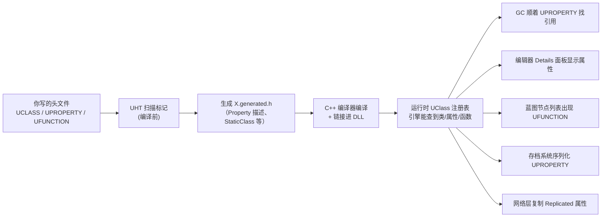

# K05 反射宏 UPROPERTY/UFUNCTION/UCLASS

## 0. 一句话结论
K04 讲过：`UObject` 是给 C++ 类上的"户口"。但光在类头上写个 `UCLASS()` 并不会自动生效——真正干活的是**一套写在代码里的"标记宏"**（`UCLASS` / `UPROPERTY` / `UFUNCTION` / `USTRUCT` / `UENUM`）。编译前，一个叫 **UHT（UnrealHeaderTool，虚幻头文件工具）** 的"自动填表员"会扫描这些标记，替你生成一大坨 C++ 代码（放进 `*.generated.h`），把"你有哪些类、哪些成员变量、哪些函数"登记进引擎的**反射系统**。**登记了，引擎才看得见、GC 才敢管、编辑器才显示、蓝图才调得到、存档才存得下、网络才复制得了。**

> 本单元配套总纲：`00-项目目录地图.md`。本单元**不新建文件**，用你已经写好的 `UGameDevAssetManager` / `UGameDevGameInstance` 当活教材，再配"示意代码"讲解。

## 1. 为什么需要它
- **场景**：从 K06 开始，你要在编辑器里给角色调数值（血量、移速）、要在蓝图里连节点调用你写的 C++ 函数、要让服务端把某个变量"抄送"给客户端、要让存档系统把玩家的金币存下来。这四件事（编辑器可见、蓝图可调、网络可复制、可存档）**全都靠反射宏**。也就是说，接下来每一行"能被引擎理解"的成员，几乎都要贴标记。
- **不学它会导致什么问题（具体反例）**：
  1. **忘记 `UPROPERTY`**：你写 `UMyAbility* CurrentAbility;` 当成员变量保存一个技能对象。它没被任何 `UPROPERTY` 引用，GC 走一遍就把它当垃圾清掉，`CurrentAbility` 变成野指针——下次用直接崩溃。K04 讲的"护身符"指的就是这个宏。
  2. **忘记 `UFUNCTION`**：你在 C++ 里写好 `float GetHealthPercent() const`，想在蓝图里拿它做血条。结果蓝图搜不到这个函数——因为 UHT 没生成对应的蓝图调用入口。你只能干瞪眼。
  3. **specifier 写反**：把只读数据写成 `BlueprintReadWrite`，让策划在蓝图里随便改血量上限，埋下"数值对不上"的玄学 bug；或者反了——想给策划调的数值写成 `VisibleAnywhere`，编辑器里灰的改不了。
  4. **乱贴 `Replicated`/`Server`**：把本该服务端权威的血量做成客户端随意改，联机时作弊/回滚崩坏（K02 已埋下伏笔，M04 详讲）。
- **一句话**：K04 让你"认识户口系统"，K05 教你"怎么办户口、填哪些表"。不会填表，你的类对引擎来说就是透明的。

## 2. 前置知识
- 前置单元：[K04 C++ 类与 UObject 体系](K04-C++类与UObject体系.md)。必须先懂：`UObject` 是什么、"反射"和"GC"为什么要存在、`UCLASS`/`GENERATED_BODY` 是"上户口"的入口。
- 需要先搞懂的 3 个概念（生活化的话）：
  1. **宏（Macro）**：C++ 里的"复制粘贴替身"。你写一个短词（如 `UPROPERTY`），预处理器/工具会在编译前把它替换成一大段真正的代码。它像"快捷短语"，输入短、展开长。
  2. **代码生成（Code Generation）**：不是人写代码，而是**工具按你的标记自动写代码**。像填表后，系统自动根据你填的内容打印出一份正式文件。
  3. **元数据（Metadata）**：关于"数据本身"的说明信息。比如"这个变量叫 `Health`、类型是 `float`、可编辑、放在 Health 分类下"——这些描述就是元数据。反射系统靠元数据工作。

## 3. UE 里的相关概念（术语表）

| 术语 | 生活化类比（它在现实里像什么） | 在本项目里具体指什么 | 官方一句话定义（可后置） |
|---|---|---|---|
| `UCLASS` | 给整个班级挂的"户口门牌" | 贴在类上，声明"这个类要被反射系统接管"；`UGameDevAssetManager` 就贴了 | 反射类标记宏 |
| `UPROPERTY` | 贴在每个成员变量上的"登记标签" | 声明"这个成员要被引擎看见"（保引用、可编辑、可存档、可复制） | 反射属性标记宏 |
| `UFUNCTION` | 贴在函数上的"可对外通知贴纸" | 声明"这个函数能被蓝图调用 / 能做 RPC" | 反射函数标记宏 |
| `USTRUCT` | 一张"数据卡片"的模板说明 | 声明"这个结构体要被反射"（如伤害信息、装备词条） | 反射结构体标记宏 |
| `UENUM` | 一份"选项清单"的说明 | 声明"这个枚举要能被蓝图/编辑器识别" | 反射枚举标记宏 |
| `GENERATED_BODY()` | "自动生成代码"的插座 | 贴进类体第一行，把 UHT 生成的代码接进来 | 生成代码注入宏 |
| `UHT`（UnrealHeaderTool） | 会读心的"自动填表员" | 编译前扫描你的头文件，生成 `*.generated.h` | 虚幻头文件工具 |
| `*.generated.h` | 自动打印出的正式文件 | 每个 `UCLASS` 头文件末尾必须 include 的生成文件 | 生成头文件 |
| `GAMEDEV_API` | 出口报关章 | 标注"这个类/函数要导出到 DLL 外可见"，跨模块才能用 | 模块导出宏 |
| 说明符（Specifier） | 勾选表的勾选项 | 写在宏括号里的开关，如 `EditAnywhere`、`BlueprintCallable` | 反射标记参数 |
| `meta=(...)` | 备注栏（给编辑器看的小提示） | 补充信息，如 `meta=(ClampMin="0")` 让编辑器限制最小值 | 元数据键值 |
| `UPROPERTY(Config)` | 勾了"从配置文件读" | 让变量的值从 `Config/*.ini` 里读写（本项目给策划调参用） | 配置序列化标记 |
| `UPROPERTY(Replicated)` | 勾了"总部抄送" | 服务端把该变量同步给客户端（M04 用） | 网络复制标记 |
| CDO | 每个物种的"标准像" | 每个类的默认实例，`GetDefault<T>()` 拿到的就是它 | 类默认对象 |

> **一句话记住**：**UHT 是"填表员"，`UCLASS`/`UPROPERTY`/`UFUNCTION` 是"表格"，`*.generated.h` 是"填出来的正式文件"**；引擎在运行时读这些文件里的登记，才决定谁被 GC、谁出现在编辑器、谁被复制。

## 4. 物理落位（物理模块 ↔ 逻辑层 ↔ 具体文件）
> 三维同时标注：**物理模块（DLL）** / **逻辑层** / **具体文件**。物理模块规划见 `00-项目目录地图.md` 第 1.5 节。
> **本单元不新建任何文件**，只读已存在的类作为"反射宏范例"。

**本单元涉及的类（均已存在，不新增）：**

| 类 / 文件 | 物理模块（DLL） | 逻辑层（子目录） | 具体文件 | 新增/修改 |
|---|---|---|---|---|
| `UGameDevAssetManager` | `GameDev` | 基础设施层 | `Source/GameDev/Framework/GameDevAssetManager.h` | 只读（K01 建） |
| `UGameDevGameInstance` | `GameDev` | 基础设施层 | `Source/GameDev/Framework/GameDevGameInstance.h` | 只读（K01 建） |
| `FGameDevModule` | `GameDev` | 模块入口 | `Source/GameDev/GameDev.h` | 只读（K01 建，**无**反射宏，对照用） |

**物理模块 ↔ 逻辑层 ↔ 物理目录 对照树（本单元涉及）：**

```text
Source/
├── GameDevCore/
│   └── GameDevCore.h / .cpp      ← FGameDevCoreModule（无 UCLASS，对照组）
└── GameDev/
    ├── GameDev.h / .cpp          ← FGameDevModule（无 UCLASS，对照组的另一个）
    └── Framework/
        ├── GameDevAssetManager.h / .cpp   ← UGameDevAssetManager（有 UCLASS + GENERATED_BODY）
        └── GameDevGameInstance.h / .cpp   ← UGameDevGameInstance（有 UCLASS + GENERATED_BODY）
```

- **为什么本单元没有"新增文件"**：反射宏是"往已有类上贴的标记"，本身不产生新系统。K04 讲完 `UObject` 家族，K05 把"贴标记"这件事讲透；**第一个真正新增的反射类从 K06 开始**（GameMode/GameState/PlayerController/Pawn）。
- **判断口诀**：先问"这是新类还是给旧类加标记？"——加标记不改物理位置；只有新类才按第 3 节决策规则落位。
- 本单元不新增目录、不新增文件，**无需更新 `00-项目目录地图.md`**。
- 注意区分：`00-项目目录地图.md` 里 `NN-模块名/`（笔记内容目录）≠ 物理模块（DLL）。

## 5. 涉及的 UE 类与函数
> 这里指"引擎自带"的宏 / 函数，不是我们自写的类。每个都给头文件与生活化作用。
> 本表**不填物理模块列**（引擎内容不属于我们的 DLL）；自写类的物理模块归属见第 4 节。

| 类 / 函数 | 头文件 | 用大白话讲它是干嘛的 |
|---|---|---|
| `UCLASS` | `UObject/ObjectMacros.h` | 给类挂"反射户口"的标记宏 |
| `USTRUCT` | `UObject/ObjectMacros.h` | 给结构体挂"反射户口"的标记宏 |
| `UENUM` | `UObject/ObjectMacros.h` | 给枚举挂"反射户口"的标记宏 |
| `UPROPERTY` | `UObject/ObjectMacros.h` | 给成员变量贴"登记标签"的标记宏 |
| `UFUNCTION` | `UObject/ObjectMacros.h` | 给函数贴"可对外通知"的标记宏 |
| `GENERATED_BODY()` | 由 UHT 生成的 `*.generated.h` | 把自动生成的反射代码接进类体 |
| `GENERATED_BODY` 展开出的 `StaticClass()` | `UObject/Object.h` | 拿到本类对应的 `UClass*`（反射入口） |
| `UObject::GetClass()` | `UObject/Object.h` | 对象反查自己属于哪个 `UClass` |
| `FindObject<T>(...)` | `UObject/UObjectGlobals.h` | 按名字在已加载对象里"捞"一个对象 |
| `GetDefault<T>()` | `UObject/UObjectGlobals.h` | 拿到某类的 CDO（默认值表，读取 Config 默认值常用） |
| `TObjectPtr<T>` | `UObject/ObjectPtr.h` | UE5 推荐的 UObject 指针包装，配合 `UPROPERTY` 使用 |
| `TSubclassOf<T>` | `Templates/SubclassOf.h` | "安全存一个类"的包装，编辑器里可选类，配合 `UPROPERTY` |
| `UDeveloperSettings` | `Engine/DeveloperSettings.h` | 官方"项目设置"基类，天然支持 `UPROPERTY(Config)`（K05 之后按需接入，不本单元落地） |

## 6. 架构设计

### 6.1 反射宏从"贴标签"到"引擎认识"的全流程


- **关键点**：这五条消费线（GC / 编辑器 / 蓝图 / 存档 / 网络）**共用同一份登记**。所以贴宏的收益是"一处登记，处处能用"；漏贴的代价是"这条链断掉"。

### 6.2 客户端 / 服务端职责（本单元只介绍"标记"，细节留 M04）
| 标记 | 放在哪 | 作用 | 本单元是否落地 |
|---|---|---|---|
| `UPROPERTY(Replicated)` | 成员变量 | 服务端 → 客户端同步该变量 | 否（M04 K20–K23） |
| `UPROPERTY(ReplicatedUsing=OnRep_Xxx)` | 成员变量 + 回调函数 | 复制到客户端后触发回调 | 否（M04） |
| `UFUNCTION(Server, Reliable)` | 函数 | 客户端调用 → 服务端执行（RPC） | 否（M04） |
| `UFUNCTION(Client, Reliable)` | 函数 | 服务端调用 → 指定客户端执行 | 否（M04） |
| `UFUNCTION(NetMulticast, Reliable)` | 函数 | 服务端调用 → 所有客户端执行 | 否（M04） |

> **Authority 提醒**（K02 的延续）：凡带 `Replicated` / `Server` / `Client` 的成员，逻辑上都要回答"谁是权威"。K05 先认识这些"标记开关"，M04 再教你"怎么把线接通"。

### 6.3 数据结构骨架（示意，非本单元落地）
```cpp
// 【示意】三类标记齐上：UCLASS 给类上户口，UPROPERTY 管数据，UFUNCTION 管调用。
UCLASS(BlueprintType)                          // 让这个类能被蓝图当类型使用
class GAMEDEV_API UMyReflectionDemo : public UObject
{
    GENERATED_BODY()                           // 把 UHT 生成的反射代码注入进来（必须在类体第一行）

public:
    // ① 数值：编辑器可编辑 + 蓝图可读写 + 分类到 "Demo"
    UPROPERTY(EditAnywhere, BlueprintReadWrite, Category="Demo")
    float Health = 100.f;

    // ② 对象引用：用 TObjectPtr 包一层，UPROPERTY 保住引用不被 GC
    UPROPERTY(EditAnywhere, BlueprintReadWrite, Category="Demo")
    TObjectPtr<UObject> Payload = nullptr;

    // ③ 纯查询函数：蓝图里可当"取值节点"（不进蓝图执行线，故用 Pure）
    UFUNCTION(BlueprintPure, Category="Demo")
    float GetHealthPercent() const;

    // ④ 可执行函数：蓝图里可当"动作节点"调用
    UFUNCTION(BlueprintCallable, Category="Demo")
    void ApplyDamage(float Amount);
};
```

### 6.4 与"没有反射宏"的对照组
| 维度 | 贴了宏（如 `UGameDevGameInstance`） | 没贴宏（如 `FGameDevModule`） |
|---|---|---|
| 类头标记 | `UCLASS()` + `GENERATED_BODY()` | 无 |
| 进反射系统 | 是（Class Viewer 搜得到） | 否 |
| 能被 GC 管理 | 是 | 否（普通 C++ 生命周期） |
| 成员能在编辑器显示 | 是（若贴 `UPROPERTY`） | 否 |
| 能被蓝图调用 | 是（若贴 `UFUNCTION`） | 否 |
| 创建方式 | `NewObject<T>()` | `new` / 栈上 |

## 7. 函数逐个设计
> 本单元的核心"东西"是**宏**（不是普通函数），因此每个宏按"宏形态签名 / 参数（说明符）/ 生成物 / 常见坑"来设计。

### 7.1 `UCLASS(...)`
- **签名（宏形态）**：`UCLASS(Specifier1, Specifier2, ...) class GAMEDEV_API UXxx : public UBase { GENERATED_BODY() ... };`
- **所属文件**：宏定义在引擎 `UObject/ObjectMacros.h`；使用点在你自写的头文件（如 `Source/GameDev/Framework/GameDevAssetManager.h`）。
- **参数表（常用说明符）**：
  | 说明符 | 类型 | 含义 | 本项目用例 |
  |---|---|---|---|
  | `Blueprintable` | 开关 | 允许在蓝图里继承这个类 | 之后的自定义 GameMode/Ability |
  | `BlueprintType` | 开关 | 允许在蓝图里把这个类当变量类型 | 数据结构类 |
  | `Abstract` | 开关 | 抽象类，不可直接实例化 | 技能基类 |
  | `Config` | 开关 | 允许类内用 `UPROPERTY(Config)` 读写 ini | 项目设置类 |
  | `MinimalAPI` | 开关 | 只导出 `StaticClass()`，减小导出面 | 内部类 |
  | `meta=(...)` | 键值 | 附加元数据（如 `ShortType`） | 类名简洁显示 |
- **返回值**：无（编译期宏，不产生运行时返回值）。
- **调用时机**：每个"要被引擎/反射接管的类"都写一次，紧贴在 `class` 关键字前面。
- **生成物（UHT 会做什么）**：在 `*.generated.h` 里生成该类的 `UClass` 注册结构；展开后 `StaticClass()` 能返回它。运行时引擎在模块加载时把 `UClass` 注册进全局表。
- **常见坑**：
  1. `UCLASS` 和 `class` 之间**不能**夹别的东西（不能插注释外的代码）。
  2. 必须同时写 `GENERATED_BODY()`，否则生成的代码没接进类里，编译报错。
  3. 接口类要用 `UINTERFACE` + `I` 前缀，不是 `UCLASS`（K51 `IInteractable` 会用到）。

### 7.2 `GENERATED_BODY()`
- **签名（宏形态）**：`GENERATED_BODY()`（无参数）。
- **所属文件**：真正内容由 UHT 生成，落在 `Xxx.generated.h`；写在你头文件类体第一行。
- **参数表**：无。
- **返回值**：无。
- **调用时机**：每个 `UCLASS` / `USTRUCT` 类体的**第一行**（在 `public:` 之前）。
- **生成物 / 内部步骤**：
  1. `#include "Xxx.generated.h"` 把生成文件接进来（该 include 放在头文件**最后**）。
  2. 展开后声明本类的 `StaticClass()`、`GetPrivateStaticClass()` 等。
  3. 为每个 `UPROPERTY`/`UFUNCTION` 生成对应的 `FProperty`/`UFunction` 描述并在注册时挂到 `UClass` 上。
- **常见坑**：
  1. 一个类**只能**出现一次，多了或少了都编译不过。
  2. 头文件末尾的 `#include "Xxx.generated.h"` 必须是**最后一个 include**；且文件名（去掉 `U`/`A` 前缀）要和类名一致。
  3. 老代码里的 `GENERATED_UCLASS_BODY()` 是历史写法，新项目统一用 `GENERATED_BODY()`。

### 7.3 `UPROPERTY(...)`
- **签名（宏形态）**：`UPROPERTY(Specifier1, Specifier2, ..., meta=(Key=Value)) 类型 变量名;`
- **所属文件**：宏定义在引擎 `UObject/ObjectMacros.h`；使用点在自写头文件成员声明前。
- **参数表（常用说明符）**：
  | 说明符 | 类型 | 含义 | 取值范围 / 备注 |
  |---|---|---|---|
  | `EditAnywhere` | 开关 | 编辑器可在实例和默认值里改 | — |
  | `EditDefaultsOnly` | 开关 | 只能在类默认值（CDO）里改 | — |
  | `VisibleAnywhere` | 开关 | 编辑器只读显示 | — |
  | `BlueprintReadWrite` | 开关 | 蓝图里可读可写 | 需注意权威性 |
  | `BlueprintReadOnly` | 开关 | 蓝图里只读 | 推荐用于服务端权威数据 |
  | `Category="X"` | 字符串 | Details 面板的分组名 | 必填才有整洁分组 |
  | `Config` | 开关 | 值来自 `Config/*.ini`，随 `UCLASS(Config)` 生效 | 策划调参用 |
  | `Replicated` | 开关 | 服务端复制给客户端 | 需 `GetLifetimeReplicatedProps` |
  | `ReplicatedUsing=OnRep_X` | 键值 | 复制后回调 | 回调须为 `UFUNCTION()` |
  | `Transient` | 开关 | 不序列化（存档不存） | 运行时临时数据 |
  | `meta=(...)` | 键值 | 附加约束，如 `ClampMin="0"`、`AllowPrivateAccess` | — |
- **返回值**：无（编译期宏）。
- **调用时机**：任何需要"引擎看得见"的成员变量（尤其**持有 UObject 引用的成员必须贴**，否则被 GC）。
- **生成物 / 内部步骤**：
  1. UHT 为变量生成 `FProperty` 描述（名字、类型、偏移量）。
  2. GC 扫描时按 `FProperty` 找到该引用并标记存活。
  3. 序列化 / 复制 / 编辑器 Details 面板都读同一份 `FProperty`。
- **常见坑**：
  1. `UObject*` 成员**忘贴** → 被 GC（K04 已警告）。
  2. `BlueprintReadWrite` 用在服务端权威变量上 → 客户端能乱改（联机隐患）。
  3. `Category` 漏写 → 属性没分组，Details 面板难看又难找。
  4. `Config` 变量需要类上也标 `UCLASS(Config=...)` 才稳定生效。

### 7.4 `UFUNCTION(...)`
- **签名（宏形态）**：`UFUNCTION(Specifier1, ..., meta=(Key=Value)) 返回类型 函数名(参数表);`
- **所属文件**：宏定义在引擎 `UObject/ObjectMacros.h`；使用点在自写头文件函数声明前。
- **参数表（常用说明符）**：
  | 说明符 | 类型 | 含义 | 备注 |
  |---|---|---|---|
  | `BlueprintCallable` | 开关 | 蓝图里能当"动作节点"调用 | 有副作用时用 |
  | `BlueprintPure` | 开关 | 蓝图里当"取值节点"，无副作用 | 隐式 `const`，不生成执行引脚 |
  | `BlueprintImplementableEvent` | 开关 | C++ 只声明，蓝图实现 | 表现层钩子 |
  | `BlueprintNativeEvent` | 开关 | C++ 提供默认实现 `_Implementation`，蓝图可覆盖 | 行为扩展点 |
  | `Server` / `Client` / `NetMulticast` | 开关 | 网络 RPC 归属与方向 | 需配 `Reliable`/`Unreliable`（M04） |
  | `Reliable` | 开关 | 保证送达 | 重要指令用 |
  | `Exec` | 开关 | 可在控制台执行 | 调试命令 |
  | `CallInEditor` | 开关 | 编辑器中按钮式调用 | 工具函数 |
  | `Category="X"` | 字符串 | 蓝图节点分类 | 建议都写 |
- **返回值**：无（编译期宏）；被标记的函数本身可有任意可反射的返回类型。
- **调用时机**：需要蓝图调用、需要被引擎回调（如 `OnRep_`）、需要走 RPC 的函数。
- **生成物 / 内部步骤**：UHT 生成 `UFunction` 描述并登记到 `UClass`；蓝图虚拟机、RPC 派发、控制台命令都通过这张表找到该函数。
- **常见坑**：
  1. `BlueprintPure` 的函数不应修改状态（否则插件编译会警告）。
  2. 参数/返回类型必须"可反射"（`UObject*`、`FName`、`FString`、`FStruct`、基础类型等）；裸 C++ 模板类型不可。
  3. `Server`/`Client` 函数要有 `Reliable` 或 `Unreliable`；且函数名常加 `Server_`/`Client_` 前缀便于阅读。
  4. `BlueprintNativeEvent` 的实际实现写在 `函数名_Implementation` 里，别写错后缀。

### 7.5 `UObject::FindObject<T>()` 与 `GetDefault<T>()`（反射运行期读取）
- **签名**：
  - `template<class T> T* FindObject(UObject* Outer, const TCHAR* Name, bool ExactClass = false);`
  - `template<class T> const T* GetDefault();`
- **所属文件**：引擎 `UObject/UObjectGlobals.h`。
- **参数表（FindObject）**：
  | 参数 | 类型 | 含义 | 取值范围 |
  |---|---|---|---|
  | Outer | `UObject*` | 搜索范围（传 `nullptr` 表示全局） | 有效对象或 `nullptr` |
  | Name | `const TCHAR*` | 目标对象全名 | 对象路径字符串 |
  | ExactClass | `bool` | 是否要求精确类匹配 | true/false |
- **参数表（GetDefault）**：无（模板参数 `T` 指定类）。
- **返回值**：`FindObject` 返回找到的对象指针（找不到为 `nullptr`）；`GetDefault` 返回该类的 CDO 常量指针。
- **调用时机**：需要"按名字捞对象"或"读取类默认值（含 Config 默认值）"时。
- **内部步骤（FindObject）**：
  1. 在全局对象表 / 指定 Outer 下查找名字。
  2. 做类型校验（模板 `T` 对不上则返回 `nullptr`）。
  3. 返回指针（**调用方仍需自行保证其被 UPROPERTY 持有，否则会被 GC**）。
- **常见坑**：
  1. `FindObject` 是"捞已存在对象"，不创建对象——创建用 `NewObject`（K04）。
  2. `GetDefault` 读到的可能只是 ini 里写的默认值，运行时改动过的实例不会体现。
  3. `FindObject` 按字符串名查找较慢，别放进每帧 Tick。

## 8. 完整代码示例

> ⚠️ 本单元为**纯文档**（与 K04 同为"UObject 理论块"）。下面 8.1 是**示意代码**，用于理解宏，**不写入工程**；8.2/8.3 是**读你工程里已存在的文件**。

### 8.1 一个"三类标记齐上"的示意类（逐行注释）
```cpp
// ================= 示意代码（不写入工程） =================
#pragma once

#include "CoreMinimal.h"
#include "UObject/Object.h"
#include "MyReflectionDemo.generated.h"          // 必须最后 include；文件名 = 类名去掉 U 前缀

// UCLASS 给类挂反射户口；BlueprintType 允许蓝图把它当变量类型
UCLASS(BlueprintType)
class GAMEDEV_API UMyReflectionDemo : public UObject
{
    GENERATED_BODY()                              // 第一行；把 UHT 生成的反射代码接进类体

public:
    // —— 数据成员：全部要贴 UPROPERTY，否则引擎看不见 ——

    // EditAnywhere=编辑器实例与默认值都能改；BlueprintReadWrite=蓝图可读写；Category=面板分组
    UPROPERTY(EditAnywhere, BlueprintReadWrite, Category="Demo")
    float Health = 100.f;                         // 血量的默认值（会进 CDO）

    // TObjectPtr 是 UE5 推荐的 UObject 指针包装；UPROPERTY 让它“保住引用”，不被 GC
    UPROPERTY(EditAnywhere, BlueprintReadWrite, Category="Demo")
    TObjectPtr<UObject> Payload = nullptr;        // 指向某个被打包的数据对象

    // meta=(ClampMin="0") 让 Details 面板最小只能填 0，防止策划填出负数
    UPROPERTY(EditAnywhere, BlueprintReadWrite, Category="Demo", meta=(ClampMin="0"))
    int32 Level = 1;                              // 等级

    // Config 标记：值从 Config/*.ini 读（配合 UCLASS(Config=...)）；用于策划调参
    UPROPERTY(EditAnywhere, Config, Category="Demo")
    float GlobalDamageMul = 1.f;                  // 全局伤害倍率

    // —— 函数：想让蓝图调用，必须贴 UFUNCTION ——

    // BlueprintPure：蓝图里当“取值节点”，不产生执行线；const 表示不改状态
    UFUNCTION(BlueprintPure, Category="Demo")
    float GetHealthPercent() const                // 声明；实现在 .cpp
    {
        return Health / 100.f;                    // 示意：假设满血 100
    }

    // BlueprintCallable：蓝图里当“动作节点”调用，可以带副作用
    UFUNCTION(BlueprintCallable, Category="Demo")
    void ApplyDamage(float Amount);               // 实现在 .cpp
};
```

### 8.2 逐个读你工程里已存在的"反射宏范例"
- `Source/GameDev/Framework/GameDevAssetManager.h`：
  - 第 9 行 `UCLASS()` —— 给这个类挂反射户口；括号里为空表示用默认行为。
  - 第 10 行 `class GAMEDEV_API UGameDevAssetManager : public UAssetManager` —— `GAMEDEV_API` 是跨 DLL 导出章，保证别的模块能用它。
  - 第 12 行 `GENERATED_BODY()` —— 反射代码入口，位置在类体第一行。
  - 第 5 行 `#include "GameDevAssetManager.generated.h"` —— 生成头文件，且是**最后一个** include。
  - **观察**：这个类只有一个 `virtual void StartInitialLoading() override;`，**没贴** `UFUNCTION`。为什么能工作？因为它是被引擎（C++ 层）直接调用的虚函数，不需要蓝图可见——**不是所有函数都要贴宏，只有需要"对外（蓝图/网络/编辑器）"的才贴**。
- `Source/GameDev/Framework/GameDevGameInstance.h`：
  - 结构与上面同款：`UCLASS()` + `GAMEDEV_API` + `GENERATED_BODY()` + `generated.h`。
  - 第 16 行 `virtual void Init() override;` 同样**没贴宏**，因为它是引擎 C++ 生命周期回调（K07 会讲生命周期）。

### 8.3 对照组：为什么 `FGameDevModule` 一个宏都没有
- `Source/GameDev/GameDev.h`：
  - `class FGameDevModule : public FDefaultGameModuleImpl` —— 普通 C++ 类，**无** `UCLASS`、**无** `GENERATED_BODY`、**无** `generated.h`。
  - 它由引擎在加载模块时用 C++ 直接 `new`，不需要反射、不进 GC、不进蓝图。这正好反证：**反射宏是"需要被引擎元系统管理的类"才贴的**。

## 9. 验证方法
- **怎么运行**：本单元无代码改动，直接在编辑器里验证"你分辨反射宏"的能力。
- **预期观察**：
  1. `Window > Developer Tools > Class Viewer` 搜索 `GameDevAssetManager` / `GameDevGameInstance` → 应能搜到（因为它们贴了 `UCLASS`）；搜索 `GameDevModule` / `GameDevCoreModule` → 搜不到（没贴宏）。
  2. 双击搜到的 `UGameDevGameInstance`，查看右侧"函数"列表 → 能看到从 `UObject` 继承来的反射函数，但看不到你写的 `Init()`（因为它没贴 `UFUNCTION`，不进反射表）。
- **断点看变量**（可选）：
  1. 在 `UGameDevAssetManager::StartInitialLoading` 打断点。
  2. Watch 输入 `this->GetClass()->GetName()` → 返回 `"GameDevAssetManager"`，证明"对象能反查自己的反射类"。
  3. Watch 输入 `GetDefault<UGameDevGameInstance>()` → 返回 CDO 指针（不为空），证明"每个 UCLASS 都有默认实例"。

## 10. 常见错误与排查
| 现象 | 原因 | 解决 |
|---|---|---|
| 编译报 `Xxx.generated.h` 找不到 | ① 漏了末尾 include；② 文件名 ≠ 类名去前缀；③ 文件没被 UHT 处理 | 保证 `#include "Xxx.generated.h"` 是**最后一个** include，且 `Xxx` = 类名去掉 `U` |
| 报错 `GENERATED_BODY` 相关 | 漏写 / 写了两次 / 不在类体第一行 | 每个 `UCLASS`/`USTRUCT` 恰好一次，且在类体最前 |
| 蓝图里搜不到我写的函数 | 函数没贴 `UFUNCTION` | 加 `UFUNCTION(BlueprintCallable/BlueprintPure=...)` |
| 编辑器 Details 面板看不到我的变量 | 变量没贴 `UPROPERTY` | 加 `UPROPERTY(EditAnywhere, Category="...")` |
| 对象成员莫名变空/野指针 | 持有 `UObject*` 的成员没贴 `UPROPERTY`，被 GC | 成员改 `UPROPERTY()`，或改用 `TObjectPtr<T>` + `UPROPERTY()` |
| 蓝图里能随便改服务端权威数据 | 贴成了 `BlueprintReadWrite` | 改 `BlueprintReadOnly`，只让服务端写 |
| 联机时该同步的变量不同步 | 漏了 `UPROPERTY(Replicated)` 与 `GetLifetimeReplicatedProps` | M04（K20–K23）补；本单元先知道有这回事 |
| `Config` 变量改了 ini 不生效 | 类上没写 `UCLASS(Config=...)` | 给类补 `UCLASS(Config=Game)` 之类 |

## 11. 动手练习
- **练习 A（只读，必做）**：并排打开 `GameDevAssetManager.h`、`GameDevGameInstance.h`、`GameDev.h`，为每个文件画一张表：类名 / 有无 `UCLASS` / 有无 `GENERATED_BODY` / 每个成员函数有无 `UFUNCTION`。用第 9 节的 Class Viewer 结果验证你的表。
- **练习 B（心智推演，必做）**：假设给 `UGameDevGameInstance` 加一个成员 `int32 DebugDrawCount = 0;`：
  1. 若贴 `UPROPERTY(EditAnywhere, Category="Debug")`，编辑器会出现什么？
  2. 若**不贴**，编辑器还会显示吗？GC 会管吗？（把答案写进你的笔记，不要改工程）
- **练习 C（可选落地）**：若你想真实体验，给 `UGameDevGameInstance` 加一个**有实际用途**的配置项
  `UPROPERTY(EditAnywhere, Config, Category="Debug") bool bShowDebugHUD = false;`，
  并在 `Config/DefaultGame.ini` 写 `[/Script/GameDev.GameDevGameInstance]` 段设置它，重启编辑器观察 Details 面板里选中实例后该项被 ini 覆盖。**这是永久有用的调试开关，不是"学完删"的练习物。**

## 12. 关联单元
- 上游：K04 C++ 类与 UObject 体系（本单元是它的"操作篇"）。
- 下游：K06 Gameplay 框架核心类（GameMode/GameState/PlayerController/Pawn，第一批真正新增的反射类）、K07 Actor 与 Component 生命周期、M04 网络同步（K20–K23 的 `Replicated` / RPC 标记）、K15 GameplayTags（`USTRUCT`/`UENUM` 反射）。
- 相关：K01/K02（配置类与网络 RPC 的标记痕迹）。

## 13. 参考
- 本项目 `00-项目目录地图.md`、`01-总览/K01-整体技术架构.md`、`02-引擎基础/K04-C++类与UObject体系.md`
- Epic Games, *Unreal Engine UPROPERTY Reference*（官方属性说明符清单）
- Epic Games, *Unreal Engine UFUNCTION Reference*（官方函数说明符清单）
- Epic Games, *Unreal Engine Reflection / Unreal Header Tool*（官方反射与 UHT 说明）
- Epic Games, *UDeveloperSettings*（官方项目设置基类文档）
