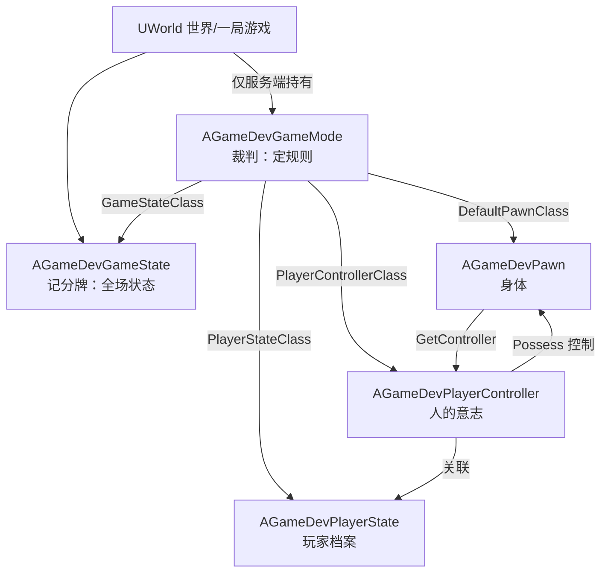
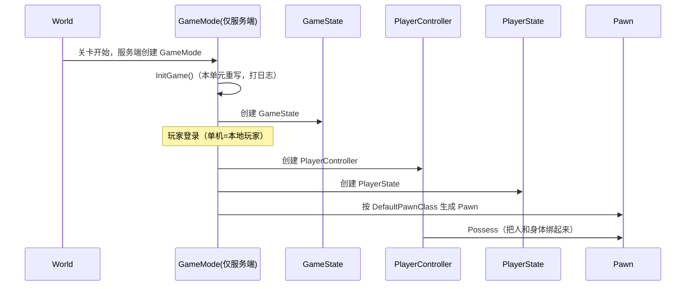

# K06 Gameplay 框架核心类（GameMode/GameState/PlayerController/Pawn）

## 0. 一句话结论
UE 一局游戏不是"一个类管到底"，而是引擎在你进入关卡时，按固定顺序自动创建**五个"骨架官员"**，各管一摊、互相挂钩：

| 骨架官员 | 生活化角色 | 一句话职责 | 存在于 |
|---|---|---|---|
| **GameMode** | 赛场裁判 + 规则手册 | 决定怎么开局、怎么算分、谁做主；**只有权威端有** | 仅服务端 |
| **GameState** | 大屏记分牌 | 记录"这局现在什么状态"，所有玩家看到的都应一致 | 所有端（复制） |
| **PlayerController** | 玩家的"意志替身" | 代表一个玩家的输入与视角，一个玩家一个 | 各端各有一份 |
| **PlayerState** | 玩家档案卡 | 记录这个玩家的名字、分数等可公开信息 | 所有端（复制） |
| **Pawn** | 玩家操控的"肉身" | 能被控制的角色实体（死了可以换一具） | 所有端（复制） |

**关键心智模型**：**GameMode 只在服务端存在**（所以客户端拿不到它），**PlayerController 代表"人"，Pawn 代表"身体"**（人可以暂时没有身体、也可以换身体）。本项目所有类都继承官方 **ModularGameplayActors** 插件的模块化版本，为后面 GameFeatures/模块化做准备（K01 技术基准）。

> 本单元配套总纲：`00-项目目录地图.md`。本单元是**第一个真正新增玩法类的单元**（K04/K05 是理论块）。

## 1. 为什么需要它
- **场景**：你今天要做"俯视角 ARPG 进关卡能有一个可控角色"。这件事拆开是五问：
  1. 进入关卡时，谁来**决定出生点、决定用哪个角色类**？→ GameMode。
  2. 当前这局"第几波怪、进度如何"这种**全场共享状态**放哪？→ GameState。
  3. 玩家的鼠标点击、键盘按键**从哪个对象进来**？→ PlayerController。
  4. 玩家的名字、等级、击杀数这些**属于玩家且别人要看**的数据放哪？→ PlayerState。
  5. 屏幕上那具**能被你操控、会被怪打的肉身**是什么？→ Pawn。
- **不学它会导致什么问题（具体反例）**：
  - **把开局逻辑写在关卡蓝图/随便一个 Actor 里**：项目一大，没人知道"游戏到底从哪开始"，改一处崩三处。
  - **在客户端去拿 GameMode**：`GetWorld()->GetAuthGameMode()` 在客户端返回 `nullptr`，一用就崩——因为 GameMode 根本不复制到客户端。
  - **把玩家血量塞进 Pawn**：Pawn 死了要销毁重生，血量数据跟着丢。正确做法是玩家数据放 PlayerState/AttributeSet（K12/K19 会接）。
  - **控制器和身体不分**：玩家掉线重连/切换形态时，逻辑全乱。分清"人（Controller）"和"身体（Pawn）"是 UE 网络模型的地基。
  - **直接继承引擎基类**：`AGameModeBase`/`APawn` 虽然能用，但接不了 ModularGameplay 的组件注入，违背 K01 技术基准。

## 2. 前置知识
- 前置单元：[K04 C++ 类与 UObject 体系](K04-C++类与UObject体系.md)、[K05 反射宏 UPROPERTY/UFUNCTION/UCLASS](K05-反射宏UPROPERTY-UFUNCTION-UCLASS.md)。必须先懂 `UCLASS`/`GENERATED_BODY`/`UPROPERTY`，本单元的每个类都要贴这些宏。
- 相关前置：[K02 客户端与服务端职责划分](../01-总览/K02-客户端与服务端职责划分.md)（Authority 概念，本单元会反复用到）。
- 需要先搞懂的 3 个概念（生活化的话）：
  1. **关卡 / World（世界）**：一局正在跑的游戏场景（`L_xxx` 地图加载后形成的运行环境）。像"一场正在进行的比赛"，Actor 都活在里面。
  2. **Authority（权威）**：谁说的话算数。联机时**服务端**是权威（裁判），客户端只是"提出请求 + 看回放"。单机时本机同时扮演权威。
  3. **Possess（控制/附身）**：把"人（Controller）"和"身体（Pawn）"绑起来，让人的输入驱动身体。像"驾驶员坐进车"。

## 3. UE 里的相关概念（术语表）

| 术语 | 生活化类比 | 在本项目里具体指什么 | 官方一句话定义 |
|---|---|---|---|
| `AGameModeBase` | 裁判的通用手册 | 引擎官方 GameMode 基类（只管框架流程） | Game Mode 基础实现 |
| `AModularGameModeBase` | 会插零件的裁判 | 官方插件版 GameMode 基类，支持组件注入 | 模块化 GameMode |
| `AGameDevGameMode` | **本项目**的裁判 | 我们自写的 GameMode，定出生/各类默认类 | 自写 GameMode |
| `AGameStateBase` / `AModularGameStateBase` | 记分牌 / 会插零件的记分牌 | 全场共享状态基类 | Game State 基类 |
| `AGameDevGameState` | **本项目**的记分牌 | 我们自写的 GameState | 自写 GameState |
| `APlayerController` / `AModularPlayerController` | 人的意志替身 | 处理某玩家的输入、possess 一个 Pawn | 玩家控制器 |
| `AGameDevPlayerController` | **本项目**的意志替身 | 我们自写的 PlayerController | 自写 PlayerController |
| `APlayerState` / `AModularPlayerState` | 玩家档案卡 | 记录某玩家可复制信息（名字/分数） | 玩家状态 |
| `AGameDevPlayerState` | **本项目**的档案卡 | 我们自写的 PlayerState | 自写 PlayerState |
| `APawn` / `AModularPawn` | 肉身 | 可被 Controller 控制的实体 | 可占有对象 |
| `AGameDevPawn` | **本项目**的肉身 | 我们自写的 Pawn 基类 | 自写 Pawn |
| `DefaultPawnClass` | "新玩家发哪具身体" | GameMode 里指定默认 Pawn 类 | 默认 Pawn 类 |
| `Possess` | 驾驶员坐进车 | 让 Controller 控制某个 Pawn | 占有 |
| Authority | 裁判权 | 服务端权威（`HasAuthority()`） | 网络权威 |
| `GetWorld()` | 拿到"这场比赛的场地" | 任何 Actor 都能取到所在 World | 获取世界 |

> **一句话记住**：**GameMode 定规则（仅服务端）、GameState 记全局、Controller 代表人、PlayerState 存玩家档案、Pawn 是身体**；它们由引擎自动创建并互相挂钩，你只需继承并"填空"。

## 4. 物理落位（物理模块 ↔ 逻辑层 ↔ 具体文件）
> 三维同时标注：**物理模块（DLL）** / **逻辑层** / **具体文件**。物理模块规划见 `00-项目目录地图.md` 第 1.5 节。

**本单元新建/修改的文件：**

| 类 / 文件 | 物理模块（DLL） | 逻辑层（子目录） | 具体文件 | 新增/修改 |
|---|---|---|---|---|
| `AGameDevGameMode` | `GameDev` | 基础设施层 | `Source/GameDev/Framework/GameDevGameMode.h` + `.cpp` | 新增 |
| `AGameDevGameState` | `GameDev` | 基础设施层 | `Source/GameDev/Framework/GameDevGameState.h` + `.cpp` | 新增 |
| `AGameDevPlayerController` | `GameDev` | 基础设施层 | `Source/GameDev/Framework/GameDevPlayerController.h` + `.cpp` | 新增 |
| `AGameDevPlayerState` | `GameDev` | 角色层 | `Source/GameDev/Character/GameDevPlayerState.h` + `.cpp` | 新增 |
| `AGameDevPawn` | `GameDev` | 角色层 | `Source/GameDev/Character/GameDevPawn.h` + `.cpp` | 新增 |
| 默认 GameMode 指向 | —（非代码） | — | `Config/DefaultEngine.ini` | 修改 |

**物理模块 ↔ 逻辑层 ↔ 物理目录 对照树（只画本单元涉及的）：**

```text
Source/
└── GameDev/                       ← DLL：玩法实现（GameDevCore 本单元不涉及）
    ├── GameDev.h / .cpp           ← 模块入口（已有）
    ├── Framework/                 ← 基础设施层
    │   ├── GameDevGameInstance.h / .cpp         ← 已有（K01）
    │   ├── GameDevAssetManager.h / .cpp         ← 已有（K01）
    │   ├── GameDevGameMode.h / .cpp             ← 本单元新增
    │   ├── GameDevGameState.h / .cpp            ← 本单元新增
    │   └── GameDevPlayerController.h / .cpp     ← 本单元新增
    └── Character/                 ← 角色层（本单元首次创建该目录）
        ├── GameDevPawn.h / .cpp                 ← 本单元新增
        └── GameDevPlayerState.h / .cpp          ← 本单元新增
```

- **为什么 GameMode/GameState/PlayerController 放 `Framework/`（GameDev）**：它们属于**全局流程/基础设施**，不是某个具体角色或某个战斗系统；且它们依赖玩法实现（引用 Pawn 等），所以物理模块是 `GameDev` 而非 `GameDevCore`。
- **为什么 Pawn/PlayerState 放 `Character/`（GameDev）**：它们是"角色实体"相关，按 `00-项目目录地图.md` 第 2 节，Character 层存放玩家/NPC 的 Pawn、PlayerState、AttributeSet。
- **判断口诀**：先问"属于哪个 DLL"（都依赖玩法 → `GameDev`），再问"属于哪一层"（流程 → Framework；角色实体 → Character）。
- **本单元新建了 `Source/GameDev/Character/` 子目录**：按 AGENTS「生成完成后」要求，已同步更新 `00-项目目录地图.md` 第 2 节示例文件。
- 注意区分：`00-项目目录地图.md` 里 `NN-模块名/`（笔记内容目录）≠ 物理模块（DLL）。
- **命名前缀**：`A` = Actor 子类（本单元五个类都是 Actor），与 K04 的 `U`（UObject）区分。

> ⚠️ **模块化基类说明**：本单元继承的 `AModularGameModeBase` / `AModularGameStateBase` / `AModularPlayerController` / `AModularPlayerState` / `AModularPawn` 由已安装的 **ModularGameplayActors** 插件提供（见 `_state/PLUGINS.md` §1）。若你的插件版本里类名或头文件名与此不同，以编辑器里该插件 `Public/` 下的真实头文件为准，并回填 `_state/PLUGINS.md`；**禁止**因命名不符就改成自研基类。

## 5. 涉及的 UE 类与函数
> 这里指"引擎/插件自带"的类与函数，不是我们自写的。每个都给头文件与生活化作用。
> 本表**不填物理模块列**（引擎类不属于我们的 DLL）；自写类的物理模块归属见第 4 节。

| 类 / 函数 | 头文件 | 用大白话讲它是干嘛的 |
|---|---|---|
| `AModularGameModeBase` | `ModularGameMode.h` | 模块化版 GameMode 基类（支持组件注入） |
| `AModularGameStateBase` | `ModularGameState.h` | 模块化版 GameState 基类 |
| `AModularPlayerController` | `ModularPlayerController.h` | 模块化版 PlayerController 基类 |
| `AModularPlayerState` | `ModularPlayerState.h` | 模块化版 PlayerState 基类 |
| `AModularPawn` | `ModularPawn.h` | 模块化版 Pawn 基类 |
| `AGameModeBase` | `GameFramework/GameModeBase.h` | 上面模块化基类的底层父类 |
| `AGameStateBase` | `GameFramework/GameStateBase.h` | 全局状态基类 |
| `APlayerController` | `GameFramework/PlayerController.h` | 玩家控制器基类 |
| `APlayerState` | `GameFramework/PlayerState.h` | 玩家档案基类 |
| `APawn` | `GameFramework/Pawn.h` | 可被控制的实体基类 |
| `AActor::GetWorld()` | `GameFramework/Actor.h` | 拿到所在世界（World） |
| `UWorld::GetAuthGameMode<T>()` | `Engine/World.h` | **仅服务端**取 GameMode（客户端返回空） |
| `UWorld::GetGameState<T>()` | `Engine/World.h` | 所有端取 GameState |
| `AActor::HasAuthority()` | `GameFramework/Actor.h` | 判断"我是不是权威端" |
| `APlayerController::Possess(APawn*)` | `GameFramework/PlayerController.h` | 让控制器控制某个 Pawn |
| `APawn::SetupPlayerInputComponent` | `GameFramework/Pawn.h` | 绑输入的钩子（K08 实现） |
| `APlayerController::SetupInputComponent` | `GameFramework/PlayerController.h` | 绑输入的钩子（K08 实现） |
| `AGameModeBase::InitGame` | `GameFramework/GameModeBase.h` | GameMode 初始化时的虚函数（可重写） |

## 6. 架构设计

### 6.1 五个骨架官员的关系与归属


- **GameMode 的"三个默认类"属性**：`DefaultPawnClass`、`PlayerControllerClass`、`PlayerStateClass`、`GameStateClass`。GameMode 构造时把它们指向我们的类，引擎就会用它们来创建对应对象。
- **GameMode 只在服务端**：图上 GameMode 只从 World 直连且标注"仅服务端"。客户端永远拿不到它。
- **Controller ↔ Pawn ↔ PlayerState 三者挂钩**：一个 Controller possess 一个 Pawn，同时关联一个 PlayerState。这是 UE 网络模型的固定三角关系。

### 6.2 开局创建顺序（谁先谁后）


- **单机**：以上全部发生在同一台机器（它同时是"服务端"）。
- **联机（M04 再细讲）**：GameMode 在服务端跑；GameState/PlayerState/Pawn 会复制到客户端；PlayerController 每端各有一份（本地那份标记为"本地控制"）。

### 6.3 客户端 / 服务端职责对照（本单元类）
| 类 | 服务端 | 客户端 | 说明 |
|---|---|---|---|
| `AGameDevGameMode` | ✅ 存在 | ❌ 不存在（`GetAuthGameMode` 返回 null） | 规则只由权威端执行 |
| `AGameDevGameState` | ✅ 权威 | ✅ 复制副本 | 全局状态人人可见 |
| `AGameDevPlayerController` | ✅ | ✅ 各端一份（本地/远程） | 代表玩家意志 |
| `AGameDevPlayerState` | ✅ 权威 | ✅ 复制副本 | 玩家公开档案 |
| `AGameDevPawn` | ✅ 权威 | ✅ 复制副本 | 身体位置/状态同步 |

> **Authority 判定口诀**（K02 的延续）：**"改世界的事，只在 `HasAuthority()` 为真时做"**。本单元构造函数与 `InitGame` 天然只在服务端/初始化期跑，安全；真正的玩法逻辑等 M04/K19 再补 Authority 检查。

### 6.4 数据结构骨架（本单元落地）
```cpp
// 五个类都遵循同一模板：继承 ModularGameplayActors 的基类 + UCLASS + GENERATED_BODY。
// GameMode 额外在构造里“接线”，把四个默认类指向本项目实现。
```
（完整代码见第 8 节，此处不重复。）

## 7. 函数逐个设计

### 7.1 `AGameDevGameMode::AGameDevGameMode()`
- **签名**：`AGameDevGameMode::AGameDevGameMode();`（构造函数，写在 `.cpp`）
- **所属文件**：`Source/GameDev/Framework/GameDevGameMode.cpp`
- **参数表**：无。
- **返回值**：无（构造函数）。
- **调用时机**：引擎创建 GameMode 时自动调用一次（仅服务端，关卡开始阶段）。
- **内部步骤（伪代码）**：
  ```
  AGameDevGameMode::AGameDevGameMode()
  {
      // ① 告诉引擎：新玩家默认用我们的 Pawn 类
      DefaultPawnClass = AGameDevPawn::StaticClass();
      // ② 用我们的 PlayerController 类
      PlayerControllerClass = AGameDevPlayerController::StaticClass();
      // ③ 用我们的 PlayerState 类
      PlayerStateClass = AGameDevPlayerState::StaticClass();
      // ④ 用我们的 GameState 类
      GameStateClass = AGameDevGameState::StaticClass();
  }
  ```
- **对应 UE 源码位置**：`Engine/Source/Runtime/Engine/Private/GameModeBase.cpp`（非必读）。
- **常见坑**：
  1. `StaticClass()` 需要 `#include` 对应类的头文件，否则编译不过。
  2. 这些赋值只是"默认值"，蓝图子类可在 Class Defaults 里覆盖；所以要保证 C++ 默认也正确。
  3. **不要在构造函数里 `GetWorld()`**——此时 World 可能还没准备好（K07 会讲生命周期）。

### 7.2 `AGameDevGameMode::InitGame(...)`
- **签名**：`virtual void AGameDevGameMode::InitGame(const FString& MapName, const FString& Options, FString& ErrorMessage) override;`
- **所属文件**：`Source/GameDev/Framework/GameDevGameMode.cpp`
- **参数表**：
  | 参数 | 类型 | 含义 | 取值范围 |
  |---|---|---|---|
  | MapName | `const FString&` | 本次加载的地图名 | 有效地图路径 |
  | Options | `const FString&` | 启动命令行选项 | 任意字符串 |
  | ErrorMessage | `FString&` | 出参：若填内容则开局失败 | 空串=成功 |
- **返回值**：无。
- **调用时机**：GameMode 创建后、正式开局前（仅服务端）。
- **内部步骤（伪代码）**：
  ```
  InitGame(...)
  {
      Super::InitGame(MapName, Options, ErrorMessage);   // 先做官方默认初始化
      UE_LOG(LogTemp, Log, TEXT("GameDev GameMode 已初始化，地图=%s"), *MapName);
      // 后续单元在此做“全局规则初始化”（读配置、建全局服务）
  }
  ```
- **常见坑**：忘记 `Super::InitGame(...)` 会导致父类初始化缺失、行为异常。

### 7.3 `AGameDevPlayerController::SetupInputComponent()`
- **签名**：`virtual void AGameDevPlayerController::SetupInputComponent() override;`
- **所属文件**：`Source/GameDev/Framework/GameDevPlayerController.cpp`
- **参数表**：无。
- **返回值**：无。
- **调用时机**：Controller 初始化时由引擎调用（用于绑定输入）。
- **内部步骤（伪代码）**：
  ```
  SetupInputComponent()
  {
      Super::SetupInputComponent();     // 保留父类默认绑定（如 EnableCheats）
      // 【K06 仅占位】K08 会在这里用 Enhanced Input 的
      //   UEnhancedInputComponent + UInputAction 绑定具体操作。
  }
  ```
- **常见坑**：**必须**先 `Super::SetupInputComponent()`，否则会丢掉父类（含 Cheats/调试）的默认绑定。

### 7.4 `AGameDevPawn::SetupPlayerInputComponent(UInputComponent*)`
- **签名**：`virtual void AGameDevPawn::SetupPlayerInputComponent(UInputComponent* PlayerInputComponent) override;`
- **所属文件**：`Source/GameDev/Character/GameDevPawn.cpp`
- **参数表**：
  | 参数 | 类型 | 含义 | 取值范围 |
  |---|---|---|---|
  | PlayerInputComponent | `UInputComponent*` | 引擎交给你绑定的输入组件 | 有效指针 |
- **返回值**：无。
- **调用时机**：Pawn 被 possess 后由引擎调用。
- **内部步骤（伪代码）**：
  ```
  SetupPlayerInputComponent(UInputComponent* PlayerInputComponent)
  {
      Super::SetupPlayerInputComponent(PlayerInputComponent);
      // 【K06 仅占位】K08/K10 在此绑定“移动/技能”等操作。
  }
  ```
- **常见坑**：与 PlayerController 的绑定点二者选一即可（本项目统一在 Pawn 里绑 gameplay 输入，Controller 里绑 UI/系统输入），别重复绑定导致触发两次。

### 7.5 `AGameDevPawn::PossessedBy(AController*)`
- **签名**：`virtual void AGameDevPawn::PossessedBy(AController* NewController) override;`
- **所属文件**：`Source/GameDev/Character/GameDevPawn.cpp`
- **参数表**：
  | 参数 | 类型 | 含义 | 取值范围 |
  |---|---|---|---|
  | NewController | `AController*` | 即将控制本 Pawn 的控制器 | 有效控制器 |
- **返回值**：无。
- **调用时机**：**仅服务端**，当有 Controller 占有本 Pawn 时。
- **内部步骤（伪代码）**：
  ```
  PossessedBy(AController* NewController)
  {
      Super::PossessedBy(NewController);
      UE_LOG(LogTemp, Log, TEXT("Pawn 被控制：%s"), *GetNameSafe(NewController));
      // K19 会在此初始化 GAS 的 Owner/Avatar 绑定
  }
  ```
- **常见坑**：`PossessedBy` 只在服务端调用；客户端对应的钩子是 `OnRep_Controller`/`AcknowledgePossession`（M04 再讲），别把客户端要跑的逻辑写这里。

## 8. 完整代码示例

> 以下代码保存到第 4 节列出的对应文件。全部带逐行中文注释。

### 8.1 `Source/GameDev/Framework/GameDevGameMode.h`
```cpp
// 【保存到 Source/GameDev/Framework/GameDevGameMode.h】
#pragma once

#include "CoreMinimal.h"
#include "ModularGameMode.h"              // 官方插件基类 AModularGameModeBase
#include "GameDevGameMode.generated.h"    // 反射生成头，必须最后 include

// 本项目 GameMode：只跑在服务端，负责“开局规则 + 指定各类默认类”。
UCLASS()
class GAMEDEV_API AGameDevGameMode : public AModularGameModeBase
{
    GENERATED_BODY()

public:
    // 构造函数：把 GameMode 的“默认类接线表”指向本项目实现。
    AGameDevGameMode();

    // 开局初始化钩子（仅服务端）；本单元只打日志 + 预留给后续全局规则。
    virtual void InitGame(const FString& MapName, const FString& Options, FString& ErrorMessage) override;
};
```

### 8.2 `Source/GameDev/Framework/GameDevGameMode.cpp`
```cpp
// 【保存到 Source/GameDev/Framework/GameDevGameMode.cpp】
#include "GameDevGameMode.h"
#include "GameDevPawn.h"                  // 为了 DefaultPawnClass
#include "GameDevPlayerController.h"      // 为了 PlayerControllerClass
#include "GameDevGameState.h"             // 为了 GameStateClass
#include "GameDevPlayerState.h"           // 为了 PlayerStateClass

AGameDevGameMode::AGameDevGameMode()
{
    // 新玩家若没有指定 Pawn 类，就用我们的 Pawn 基类。
    DefaultPawnClass = AGameDevPawn::StaticClass();
    // 每个玩家用我们的 PlayerController 类。
    PlayerControllerClass = AGameDevPlayerController::StaticClass();
    // 每个玩家用我们的 PlayerState 类。
    PlayerStateClass = AGameDevPlayerState::StaticClass();
    // 本局用我们的 GameState 类。
    GameStateClass = AGameDevGameState::StaticClass();
}

void AGameDevGameMode::InitGame(const FString& MapName, const FString& Options, FString& ErrorMessage)
{
    // 先执行父类的默认初始化，避免破坏官方流程。
    Super::InitGame(MapName, Options, ErrorMessage);

    // 打一条日志，便于在 Output Log 里确认 GameMode 生效（验证方法见第 9 节）。
    UE_LOG(LogTemp, Log, TEXT("[GameDev] GameMode 初始化完成，地图=%s"), *MapName);
}
```

### 8.3 `Source/GameDev/Framework/GameDevGameState.h`
```cpp
// 【保存到 Source/GameDev/Framework/GameDevGameState.h】
#pragma once

#include "CoreMinimal.h"
#include "ModularGameState.h"               // 官方插件基类 AModularGameStateBase
#include "GameDevGameState.generated.h"

// 本项目 GameState：记录“本局全场共享状态”。K06 先建空壳，后续单元往里加数据。
UCLASS()
class GAMEDEV_API AGameDevGameState : public AModularGameStateBase
{
    GENERATED_BODY()

public:
    AGameDevGameState();
};
```

### 8.4 `Source/GameDev/Framework/GameDevGameState.cpp`
```cpp
// 【保存到 Source/GameDev/Framework/GameDevGameState.cpp】
#include "GameDevGameState.h"

AGameDevGameState::AGameDevGameState()
{
    // 本单元保持默认：先保证类存在且可被引擎创建。
    // 后续（如波次/进度/全局 Buff）在此类里加 UPROPERTY(Replicated) 数据。
}
```

### 8.5 `Source/GameDev/Framework/GameDevPlayerController.h`
```cpp
// 【保存到 Source/GameDev/Framework/GameDevPlayerController.h】
#pragma once

#include "CoreMinimal.h"
#include "ModularPlayerController.h"        // 官方插件基类 AModularPlayerController
#include "GameDevPlayerController.generated.h"

// 本项目 PlayerController：代表“玩家意志”，管输入与视角。K06 先建壳 + 留输入钩子。
UCLASS()
class GAMEDEV_API AGameDevPlayerController : public AModularPlayerController
{
    GENERATED_BODY()

public:
    AGameDevPlayerController();

protected:
    // 引擎初始化输入时调用；K08 在此绑定 Enhanced Input。
    virtual void SetupInputComponent() override;

    // 进入游戏时调用（每个端都会跑本地那一份）。
    virtual void BeginPlay() override;
};
```

### 8.6 `Source/GameDev/Framework/GameDevPlayerController.cpp`
```cpp
// 【保存到 Source/GameDev/Framework/GameDevPlayerController.cpp】
#include "GameDevPlayerController.h"

AGameDevPlayerController::AGameDevPlayerController()
{
    // 本单元保持默认。后续可在此设置“只允许本地玩家控制”等标志。
}

void AGameDevPlayerController::BeginPlay()
{
    Super::BeginPlay();                   // 先做父类工作

    // 每个客户端只会为“本地玩家”的那份 Controller 走到这里做表现相关逻辑（M04 再区分）。
    UE_LOG(LogTemp, Log, TEXT("[GameDev] PlayerController BeginPlay：%s"), *GetName());
}

void AGameDevPlayerController::SetupInputComponent()
{
    // 必须先调用父类，保留引擎默认绑定（含调试命令绑定）。
    Super::SetupInputComponent();

    // 【K06 占位】K08 会在此处：
    //   UEnhancedInputComponent* EIC = Cast<UEnhancedInputComponent>(InputComponent);
    //   EIC->BindAction(MoveAction, ETriggerEvent::Triggered, this, &ThisClass::OnMove);
}
```

### 8.7 `Source/GameDev/Character/GameDevPawn.h`
```cpp
// 【保存到 Source/GameDev/Character/GameDevPawn.h】
#pragma once

#include "CoreMinimal.h"
#include "ModularPawn.h"                    // 官方插件基类 AModularPawn
#include "GameDevPawn.generated.h"

// 本项目 Pawn 基类：一切“可被操控的肉身”的父类（玩家/后续 NPC 形态都可继承）。
UCLASS()
class GAMEDEV_API AGameDevPawn : public AModularPawn
{
    GENERATED_BODY()

public:
    AGameDevPawn();

protected:
    // 被 possess 后引擎调用：在此绑定 gameplay 输入（K08/K10 实现）。
    virtual void SetupPlayerInputComponent(UInputComponent* PlayerInputComponent) override;

    // 仅服务端：被 Controller 占有时调用（K19 在此做 GAS 初始化）。
    virtual void PossessedBy(AController* NewController) override;
};
```

### 8.8 `Source/GameDev/Character/GameDevPawn.cpp`
```cpp
// 【保存到 Source/GameDev/Character/GameDevPawn.cpp】
#include "GameDevPawn.h"
#include "GameFramework/Controller.h"       // AController，用于 PossessedBy 打日志

AGameDevPawn::AGameDevPawn()
{
    // 本单元保持默认。K09 会在此加 SpringArm/Camera，K07 会讲组件生命周期。
}

void AGameDevPawn::SetupPlayerInputComponent(UInputComponent* PlayerInputComponent)
{
    Super::SetupPlayerInputComponent(PlayerInputComponent);
    // 【K06 占位】K08/K10 在此绑定“移动/技能”等操作。
}

void AGameDevPawn::PossessedBy(AController* NewController)
{
    Super::PossessedBy(NewController);
    // 仅服务端会走到这里；打印便于确认“人车绑定”成功。
    UE_LOG(LogTemp, Log, TEXT("[GameDev] Pawn 被控制：%s"), *GetNameSafe(NewController));
}
```

### 8.9 `Source/GameDev/Character/GameDevPlayerState.h`
```cpp
// 【保存到 Source/GameDev/Character/GameDevPlayerState.h】
#pragma once

#include "CoreMinimal.h"
#include "ModularPlayerState.h"             // 官方插件基类 AModularPlayerState
#include "GameDevPlayerState.generated.h"

// 本项目 PlayerState：记录“玩家公开档案”（名字/等级/分数）。K06 先建壳。
UCLASS()
class GAMEDEV_API AGameDevPlayerState : public AModularPlayerState
{
    GENERATED_BODY()

public:
    AGameDevPlayerState();
};
```

### 8.10 `Source/GameDev/Character/GameDevPlayerState.cpp`
```cpp
// 【保存到 Source/GameDev/Character/GameDevPlayerState.cpp】
#include "GameDevPlayerState.h"

AGameDevPlayerState::AGameDevPlayerState()
{
    // 本单元保持默认。后续（等级/经验/击杀）在此加 UPROPERTY(Replicated)。
}
```

### 8.11 `Config/DefaultEngine.ini`（追加/修改）
```ini
; 【保存到 Config/DefaultEngine.ini 的 [/Script/EngineSettings.GameMapsSettings] 段】
; 让所有未单独指定 GameMode 的地图默认使用我们的 GameMode。
; 该段已存在（含 GameDefaultMap/GameInstanceClass），只新增下面一行即可。
GlobalDefaultGameMode=/Script/GameDev.GameDevGameMode
```

> 说明：`/Script/GameDev.GameDevGameMode` 的格式是 `/Script/<模块名>.<类名去掉A前缀>`。若你另外创建了蓝图子类 `BP_GameDevGameMode`，也可把这一行改成蓝图路径，但 C++ 类足够本项目先用。

## 9. 验证方法
- **怎么运行**：
  1. 按第 8 节创建 10 个文件与 ini 修改，编译（Live Coding 或重新构建）。
  2. 打开 `Content/test` 地图（当前 `GameDefaultMap=/Game/test.test`），点 Play（PIE）。
- **预期输出/画面**：
  1. **Output Log** 出现 `[GameDev] GameMode 初始化完成，地图=...` → 证明 GameMode 生效。
  2. **Output Log** 出现 `[GameDev] PlayerController BeginPlay：...` → 证明 Controller 被创建。
  3. **Output Log** 出现 `[GameDev] Pawn 被控制：...` → 证明人车绑定成功。
  4. 若地图里已有默认 Pawn 出生点，会看到一具默认 Pawn（K09 才给它加相机，此时画面可能无视角，属正常）。
- **断点看变量**：
  1. 在 `AGameDevGameMode::InitGame` 打断点，Watch 输入 `GetWorld()->GetAuthGameMode()`，应指向本 GameMode。
  2. 在 `AGameDevPlayerController::BeginPlay` 打断点，Watch 输入 `GetPawn()`（应为我们的 `AGameDevPawn`）、`PlayerState`（应为 `AGameDevPlayerState`）。
  3. 用 `DisplayAll AGameDevGameState`（控制台）或 World Outliner 搜索，确认 GameState/PlayerState 类别正确。

## 10. 常见错误与排查
| 现象 | 原因 | 解决 |
|---|---|---|
| 进关卡没有我们的 Pawn/Controller | `GlobalDefaultGameMode` 没配，或地图 override 了别的 GameMode | 确认 ini 行存在；World Settings 里 `GameMode Override` 设为 None |
| 客户端拿到 GameMode 为 null 后崩溃 | 在客户端调 `GetAuthGameMode` | 客户端改用 `GetGameState`；GameMode 逻辑加 `HasAuthority()` 判断 |
| 编译报找不到 `ModularGameMode.h` | 依赖/插件名不符或未登记 | 确认 `Build.cs` 有 `ModularGameplayActors`（已有），且插件在 `.uproject` 启用（见 PLUGINS.md） |
| 报 `GENERATED_BODY` 相关错误 | 漏写/位置错/文件名≠类名 | 见 K05 §10；确保 `Xxx.generated.h` 最后 include |
| 输入没反应 | K06 尚未实现输入（占位） | 属预期；K08 才实现 Enhanced Input |
| `SetupInputComponent` 后官方调试命令失效 | 忘了 `Super::SetupInputComponent()` | 加上父类调用 |
| 两处绑同一输入触发两次 | Controller 与 Pawn 重复绑定 | gameplay 输入统一在 Pawn，系统/UI 在 Controller |
| ini 改了没生效 | 改错段名或工程没重启 | 确认段为 `[/Script/EngineSettings.GameMapsSettings]`，重启编辑器 |

## 11. 动手练习
1. **必做（观察）**：Play PIE，在 World Outliner 里找到 GameMode/GameState/PlayerController/PlayerState/Pawn，逐个对照第 6.3 节表格，确认哪些在客户端可见。用 `net.PktLag` 无关；先单机理解即可。
2. **必做（改一处）**：在 `AGameDevGameMode` 构造函数里把 `DefaultPawnClass` **临时**改回 `nullptr`，Play 一次，观察日志里 `PossessedBy` 是否还出现、World Outliner 是否还有 Pawn；理解后**改回** `AGameDevPawn::StaticClass()`。（这是理解"GameMode 决定生成什么"的实验，改动会还原。）
3. **可选（永久有用）**：给 `AGameDevGameState` 加一个 `UPROPERTY(Replicated, BlueprintReadOnly, Category="Game")  int32 WaveNumber = 0;`，并实现 `GetLifetimeReplicatedProps`（K20 才细讲复制，可先只加属性）。这是本项目"波次"系统的真实起点，不是练习物。
4. **思考题（写进笔记）**：为什么"玩家血量"不该放 Pawn 而应放 PlayerState/AttributeSet？（提示：Pawn 会死会换，玩家数据要跨身体存活）

## 12. 关联单元
- 上游：K04 C++ 类与 UObject 体系、K05 反射宏 UPROPERTY/UFUNCTION/UCLASS、K02 客户端与服务端职责划分。
- 下游：K07 Actor 与 Component 生命周期（这些类的生命周期细节）、K08 Enhanced Input 输入系统（`SetupInputComponent` 落地）、K09 俯视角相机与角色（`AGameDevPawn` 加相机）、K19 GAS 初始化与 Owner/Avatar 绑定（`PossessedBy` 落地）、M04 网络同步（GameState/PlayerState/Pawn 的复制）。
- 相关：K01 整体技术架构（模块化/GameFeatures 基准）。

## 13. 参考
- 本项目 `00-项目目录地图.md`、`_state/PLUGINS.md`、`01-总览/K02-客户端与服务端职责划分.md`、`02-引擎基础/K04-C++类与UObject体系.md`、`02-引擎基础/K05-反射宏UPROPERTY-UFUNCTION-UCLASS.md`
- Epic Games, *Gameplay Framework*（官方 GameMode/GameState/PlayerController/Pawn 总览）
- Epic Games, *Game Mode and Game State*、*PlayerController*、*Pawn*（官方类文档）
- Epic Games, *Modular Gameplay / ModularGameplayActors*（官方模块化 Actor 插件说明）
