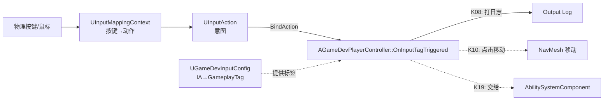
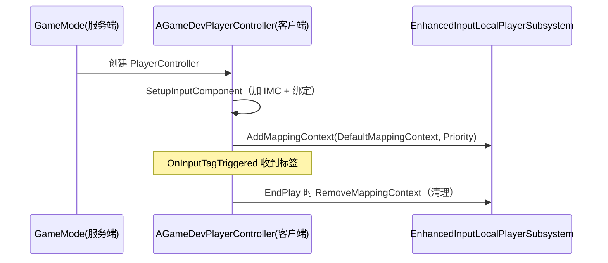
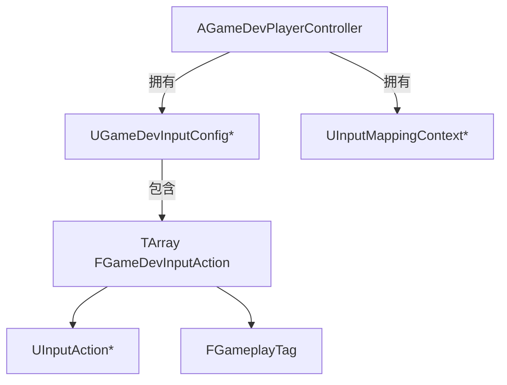

# K08 Enhanced Input 输入系统

## 0. 一句话结论
UE 旧输入（`InputCore` 的字符串轴/动作映射）像"手写一张按键对照表"，键名靠字符串拼、改键难、按情境切换更难。**Enhanced Input** 把输入拆成三件套：**输入动作 `UInputAction`（"我要做什么"，如"移动/施法"）+ 输入映射上下文 `UInputMappingContext`（"哪些键触发哪些动作"）+ 触发器/修饰器（"怎么算触发"）**，"按键"与"意图"彻底解耦。本单元在此之上再做一层**数据驱动**：用 `UGameDevInputConfig`（DataAsset）把"输入动作 → GameplayTag 意图"登记成一张表，**`AGameDevPlayerController` 只写一份通用绑定代码**，按标签分发，改玩法/加技能不改绑定代码。

> 本单元配套总纲：`00-项目目录地图.md`。

> 🏭 **工业目标 / 架构决策（重要）**：输入绑定放在 **`AGameDevPlayerController`**，不放 Pawn。原因：① 鼠标/视角/输入本质是"玩家"的事，归控制器；② K09 的玩家实体是 `AModularCharacter`（必须继承 `ACharacter` 才有移动），它与 K06 的 `AGameDevPawn`（`AModularPawn`）**不同继承分支**，若把输入绑在 Pawn 上会"接不到"真正的玩家角色；③ 控制器跨 Pawn 切换而存活，输入只需绑一次。**此处按工业做法一次性定好，避免 K09/K10 返工。**

## 1. 为什么需要它
- **场景**：俯视角 ARPG 的输入需求：**鼠标点击移动**（K10）、技能热键、相机缩放、拾取、打开面板；且要能改键、按情境切换（战斗/UI 打开时禁用移动）、区分"点按/长按"。
- **旧输入（`InputCore`）反例**：字符串键名拼错不报错、运行静默失效；改键要改 ini；一个键在不同情境行为不同要写一堆 `if`；手柄/移动端支持另做一套。
- **不学 Enhanced Input 会导致的问题**：输入硬编码、加技能要改代码重编译；输入直接调具体系统（违背"用 GameplayTags/消息解耦"）；无法数据驱动；情境切换困难。

## 2. 前置知识
- 前置单元：[K06 Gameplay 框架核心类](K06-Gameplay框架核心类.md)（PlayerController）、[K07 Actor 与 Component 生命周期](K07-Actor与Component生命周期.md)（`SetupInputComponent`/`EndPlay` 时机）。
- 需要先搞懂的 3 个概念（生活化的话）：
  1. **输入动作（Input Action）**：一个"意图"（移动/跳跃/施法），不关心具体是哪个键。
  2. **映射上下文（Input Mapping Context）**：一本"当前生效的按键对照表"，可叠加多本。
  3. **优先级（Priority）**：多本表冲突时谁说了算，数字越大越优先；高优先级可"吃掉"输入。

## 3. UE 里的相关概念（术语表）

| 术语 | 生活化类比 | 在本项目里具体指什么 | 官方一句话定义 |
|---|---|---|---|
| Enhanced Input | 智能遥控系统 | UE5 推荐的新输入插件（`EnhancedInput`，已启用） | 增强输入系统 |
| `UInputAction` | 遥控器上的"功能按钮" | "移动/施法/相互作用"等意图资产 | 输入动作 |
| `UInputMappingContext` | 当前的"按键对照表" | "鼠标左键→点击移动、1→技能一" | 输入映射上下文 |
| `UEnhancedInputComponent` | 支持智能输入的员工 | 实际执行绑定的组件 | 增强输入组件 |
| `UEnhancedInputLocalPlayerSubsystem` | 每个玩家的"遥控设置" | 管理当前生效的映射上下文 | 增强输入子系统 |
| `ETriggerEvent` | 触发时机 | Started/Triggered/Completed/Canceled | 触发事件类型 |
| Trigger / Modifier | 判定条件 / 修正器 | 点按、长按、死区、取反 | 触发器/修饰器 |
| `FInputActionValue` | 按钮/摇杆的"读数" | 轴值、布尔值等 | 输入动作数值 |
| `UGameDevInputConfig` | **本项目的"意图登记表"** | DataAsset：输入动作 ↔ GameplayTag | 自写输入配置资产 |
| GameplayTag | 统一的"意图暗号" | 如 `Input.Move`、`Input.Skill.FireBolt` | 游戏标签 |

> **一句话记住**：**按键 → `UInputMappingContext` → `UInputAction` →（本项目的 `UGameDevInputConfig`）→ GameplayTag → 分发到系统**。绑定代码只认"标签"，不认具体键。

## 4. 物理落位（物理模块 ↔ 逻辑层 ↔ 具体文件）
> 三维同时标注：**物理模块（DLL）** / **逻辑层** / **子目录**。物理模块规划见 `00-项目目录地图.md` 第 1.5 节。

**本单元新建/修改的文件：**

| 类 / 文件 | 物理模块（DLL） | 逻辑层（子目录） | 具体文件 | 新增/修改 |
|---|---|---|---|---|
| `UGameDevInputConfig`（+ `FGameDevInputAction`） | `GameDev` | 输入层 | `Source/GameDev/Input/GameDevInputConfig.h` + `.cpp` | 新增 |
| `AGameDevPlayerController`（加输入绑定） | `GameDev` | 基础设施层 | `Source/GameDev/Framework/GameDevPlayerController.h` + `.cpp` | 修改 |
| 输入资产（IMC/IA） | —（非代码） | — | `Content/Input/IMC_GameDevDefault.uasset`、`IA_*.uasset` | 新增（编辑器内建） |
| 输入配置资产 | —（非代码） | — | `Content/Data/DA_GameDevInputConfig.uasset` | 新增（编辑器内建） |
| 默认输入类设置 | —（非代码） | — | `Config/DefaultInput.ini` | 已就绪（无需改） |

**物理模块 ↔ 逻辑层 ↔ 物理目录 对照树（只画本单元涉及的）：**

```text
Source/
└── GameDev/                      ← DLL：玩法实现
    ├── Input/                    ← 输入层（本单元新建该目录）
    │   └── GameDevInputConfig.h / .cpp      ← 本单元新增
    └── Framework/                ← 基础设施层
        └── GameDevPlayerController.h / .cpp ← 本单元修改（加输入绑定）
```

- **为什么 `UGameDevInputConfig` 放 `GameDev/Input/`**：它依赖 `UInputAction`（EnhancedInput 插件），而 `GameDevCore` 只依赖底层引擎模块（不含 EnhancedInput）；输入配置属**玩法配置**，故归 `GameDev`，并单建 `Input/` 层。
- **为什么绑定写在 PlayerController**：见第 0 节"架构决策"。
- 本单元新建了 `Source/GameDev/Input/` 子目录：已同步更新 `00-项目目录地图.md`。
- 注意区分：`NN-模块名/`（笔记内容目录）≠ 物理模块（DLL）。

## 5. 涉及的 UE 类与函数
> 引擎/插件自带，非我们自写。

| 类 / 函数 | 头文件 | 用大白话讲它是干嘛的 |
|---|---|---|
| `UInputAction` | `InputAction.h` | "意图"资产（移动/施法…） |
| `UInputMappingContext` | `InputMappingContext.h` | "按键→意图"的对照表资产 |
| `UEnhancedInputComponent` | `EnhancedInputComponent.h` | 执行输入绑定的组件 |
| `UEnhancedInputComponent::BindAction(...)` | `EnhancedInputComponent.h` | 把某动作的某事件接到某函数（可带额外参数） |
| `UEnhancedInputLocalPlayerSubsystem` | `EnhancedInputSubsystems.h` | 按 LocalPlayer 管理生效的映射上下文 |
| `AddMappingContext` / `RemoveMappingContext` | `EnhancedInputSubsystems.h` | 增/删当前生效的对照表 |
| `ETriggerEvent` | `InputTriggers.h` | 触发事件枚举 |
| `FInputActionValue` | `InputActionValue.h` | 输入读数 |
| `UDataAsset` | `Engine/DataAsset.h` | 数据资产基类 |
| `FGameplayTag` | `GameplayTagContainer.h` | 统一意图标签 |
| `APlayerController::GetLocalPlayer()` | `GameFramework/PlayerController.h` | 取本控制器对应的本地玩家 |
| `ULocalPlayer::GetSubsystem<T>()` | `Engine/LocalPlayer.h` | 取某 LocalPlayer 的子系统 |

## 6. 架构设计

### 6.1 输入数据流（从按键到系统）


- **绑定只发生一次**：控制器遍历 `InputConfig`，为每个"动作"绑到**同一个** `OnInputTagTriggered`，并把该动作的 `GameplayTag` 作为**附加参数**带上。
- **分发靠标签**：收到的是"意图标签"，与具体按键无关。

### 6.2 映射上下文管理（客户端）


- **只在本地控制端绑定**：`SetupInputComponent` 对每个 `PlayerController` 调用；`GetLocalPlayer()` 只在本地玩家有值，服务端/远程不生效。
- **服务端权威**：输入是"客户端请求"，真正改世界要经服务端（M04/K21）。

### 6.3 类关系


## 7. 函数逐个设计

### 7.1 `UGameDevInputConfig::FindNativeInputActionForTag`
- **签名**：`const UInputAction* FindNativeInputActionForTag(const FGameplayTag& InputTag, bool bLogNotFound = true) const;`
- **所属文件**：`Source/GameDev/Input/GameDevInputConfig.cpp`。
- **参数表**：
  | 参数 | 类型 | 含义 | 取值范围 |
  |---|---|---|---|
  | InputTag | `const FGameplayTag&` | 要查询的意图标签 | 有效标签 |
  | bLogNotFound | `bool` | 找不到时是否打警告 | true/false |
- **返回值**：`const UInputAction*`，找不到返回 `nullptr`。
- **调用时机**：按标签反查动作时（调试/主动触发）。
- **内部步骤**：线性遍历 `NativeInputActions`，`InputTag == Entry.InputTag` 即返回；未命中按需打警告。
- **常见坑**：标签比较层级敏感；`InputAction` 可能为空需判空。

### 7.2 `AGameDevPlayerController::SetupInputComponent`
- **签名**：`virtual void AGameDevPlayerController::SetupInputComponent() override;`
- **所属文件**：`Source/GameDev/Framework/GameDevPlayerController.cpp`。
- **参数表**：无。
- **返回值**：无。
- **调用时机**：控制器初始化输入时，引擎调用一次。
- **内部步骤（伪代码）**：
  ```
  SetupInputComponent()
  {
      Super::SetupInputComponent();
      UEnhancedInputComponent* EIC = Cast<UEnhancedInputComponent>(InputComponent);
      if (!EIC) { UE_LOG(Warning, "非增强输入组件"); return; }
      AddInputMappingContext();
      if (InputConfig)
          for (Entry : InputConfig->NativeInputActions)
              if (Entry.InputAction && Entry.InputTag.IsValid())
                  EIC->BindAction(Entry.InputAction, ETriggerEvent::Triggered,
                                  this, &AGameDevPlayerController::OnInputTagTriggered, Entry.InputTag);
  }
  ```
- **常见坑**：必须 `Super::`；`InputComponent` 需为 `UEnhancedInputComponent`（本项目 `DefaultInput.ini` 已配好）。

### 7.3 `AGameDevPlayerController::OnInputTagTriggered`
- **签名**：`virtual void OnInputTagTriggered(const FInputActionValue& Value, FGameplayTag InputTag);`
- **所属文件**：`Source/GameDev/Framework/GameDevPlayerController.cpp`。
- **参数表**：
  | 参数 | 类型 | 含义 | 取值范围 |
  |---|---|---|---|
  | Value | `const FInputActionValue&` | 本次输入的读数（布尔/轴值） | 由输入动作类型决定 |
  | InputTag | `FGameplayTag` | 被触发输入的意图标签 | 来自 `UGameDevInputConfig` |
- **返回值**：无。
- **调用时机**：某输入动作触发（`Triggered`）时，每帧可能多次。
- **内部步骤（伪代码）**：
  ```
  OnInputTagTriggered(const FInputActionValue& Value, FGameplayTag InputTag)
  {
      // K08：打印，验证链路。
      UE_LOG(Log, "输入触发：%s", *InputTag.ToString());
      // K10：如果 InputTag == Input.Move，执行点击移动；轴类输入用 Value 取值（如相机缩放）。
      // K19：把 InputTag 交给 AbilitySystemComponent。
  }
  ```
- **为什么带 `Value`**：点击移动只用"标签"即可，但**轴类输入（如滚轮缩放）必须读 `Value`**。统一在签名里带上，避免以后为轴输入再加一套绑定（防技术债）。
- **常见坑**：`Triggered` 每帧多次，勿做重活；`Value` 类型要与输入动作的 Value Type 匹配（Boolean 用 `Get<bool>()`，Axis1D 用 `Get<float>()`）。

### 7.4 `AGameDevPlayerController::AddInputMappingContext` / `RemoveInputMappingContext`
- **签名**：`void AddInputMappingContext();` / `void RemoveInputMappingContext();`（私有）
- **所属文件**：`Source/GameDev/Framework/GameDevPlayerController.cpp`。
- **参数表**：无。**返回值**：无。
- **调用时机**：`Add` 在 `SetupInputComponent`；`Remove` 在 `EndPlay`。
- **内部步骤（伪代码）**：
  ```
  AddInputMappingContext()
  {
      ULocalPlayer* LP = GetLocalPlayer();
      if (!LP) return;
      Sub = ULocalPlayer::GetSubsystem<UEnhancedInputLocalPlayerSubsystem>(LP);
      if (Sub && DefaultMappingContext)
          Sub->AddMappingContext(DefaultMappingContext, InputMappingPriority);
  }
  // Remove 同理
  ```
- **常见坑**：`GetLocalPlayer()` 服务端/远程为空，直接返回；不移除会残留。

### 7.5 `AGameDevPlayerController::EndPlay`
- **签名**：`virtual void AGameDevPlayerController::EndPlay(const EEndPlayReason::Type EndPlayReason) override;`
- **内部步骤**：先 `RemoveInputMappingContext()`，再 `Super::EndPlay(Reason)`。
- **常见坑**：清理要对称（配 K07 生命周期）。

## 8. 完整代码示例

> 代码保存到第 4 节列出的文件。全部带逐行中文注释。

### 8.1 `Source/GameDev/Input/GameDevInputConfig.h`
```cpp
// 【保存到 Source/GameDev/Input/GameDevInputConfig.h】
#pragma once

#include "CoreMinimal.h"
#include "Engine/DataAsset.h"        // UDataAsset
#include "GameplayTagContainer.h"    // FGameplayTag
#include "GameDevInputConfig.generated.h"

class UInputAction;                  // 前置声明

// 一条“输入动作 → 意图标签”的登记记录。
USTRUCT(BlueprintType)
struct FGameDevInputAction
{
    GENERATED_BODY()

    // 引擎的输入动作资产（按键在 IMC 里映射到它）。
    UPROPERTY(EditDefaultsOnly, BlueprintReadOnly, Category="Input")
    TObjectPtr<const UInputAction> InputAction = nullptr;

    // 该输入代表的“意图”；用 GameplayTag 表达，便于解耦分发。
    // meta=(Categories="Input") 让编辑器标签选择器只显示 Input.* 下的标签。
    UPROPERTY(EditDefaultsOnly, BlueprintReadOnly, Category="Input", meta=(Categories="Input"))
    FGameplayTag InputTag;
};

// 数据驱动的输入配置：把“有哪些输入动作、各自对应什么意图”从代码挪到资产。
UCLASS(BlueprintType, Const)
class GAMEDEV_API UGameDevInputConfig : public UDataAsset
{
    GENERATED_BODY()

public:
    // 按意图标签查找输入动作；找不到时可选择打日志便于排错。
    const UInputAction* FindNativeInputActionForTag(const FGameplayTag& InputTag, bool bLogNotFound = true) const;

    // 本配置登记的所有“输入动作 → 意图标签”。
    UPROPERTY(EditDefaultsOnly, BlueprintReadOnly, Category="Input")
    TArray<FGameDevInputAction> NativeInputActions;
};
```

### 8.2 `Source/GameDev/Input/GameDevInputConfig.cpp`
```cpp
// 【保存到 Source/GameDev/Input/GameDevInputConfig.cpp】
#include "GameDevInputConfig.h"
#include "InputAction.h"             // UInputAction 定义（.cpp 里才需要）

const UInputAction* UGameDevInputConfig::FindNativeInputActionForTag(const FGameplayTag& InputTag, bool bLogNotFound) const
{
    // 线性查找：条目少，足够；命中即返回。
    for (const FGameDevInputAction& Entry : NativeInputActions)
    {
        if (Entry.InputAction && Entry.InputTag == InputTag)
        {
            return Entry.InputAction;
        }
    }
    // 未命中：按需打警告，帮助定位“配置漏填”。
    if (bLogNotFound)
    {
        UE_LOG(LogTemp, Warning, TEXT("[GameDev] 输入配置中找不到标签 %s 对应的 InputAction"), *InputTag.ToString());
    }
    return nullptr;
}
```

### 8.3 `Source/GameDev/Framework/GameDevPlayerController.h`（修改后完整内容）
```cpp
// 【保存到 Source/GameDev/Framework/GameDevPlayerController.h】
#pragma once

#include "CoreMinimal.h"
#include "ModularPlayerController.h"        // 官方插件基类 AModularPlayerController
#include "GameDevPlayerController.generated.h"

class UInputMappingContext;                 // 前置声明
class UGameDevInputConfig;
struct FInputActionValue;                   // 前置声明（引用参数，无需完整定义）

// 本项目 PlayerController：代表“玩家意志”，管输入与视角。
UCLASS()
class GAMEDEV_API AGameDevPlayerController : public AModularPlayerController
{
    GENERATED_BODY()

public:
    AGameDevPlayerController();

    // 数据驱动输入配置（在蓝图/Details 里指定）。
    UPROPERTY(EditDefaultsOnly, Category="Input")
    TObjectPtr<UGameDevInputConfig> InputConfig;

    // 默认输入映射上下文（本地玩家常驻）。
    UPROPERTY(EditDefaultsOnly, Category="Input")
    TObjectPtr<UInputMappingContext> DefaultMappingContext;

    // 映射上下文优先级（越大越优先）。
    UPROPERTY(EditDefaultsOnly, Category="Input")
    int32 InputMappingPriority = 0;

protected:
    // 引擎初始化输入时调用：加映射上下文 + 绑定输入。
    virtual void SetupInputComponent() override;

    // 进入游戏时调用（每端各跑本地那份）。
    virtual void BeginPlay() override;

    // 控制器离开：清理映射上下文。
    virtual void EndPlay(const EEndPlayReason::Type EndPlayReason) override;

    // 所有输入动作统一入口，按“意图标签”分发（K10 接移动、K19 接 GAS）。
    virtual void OnInputTagTriggered(const FInputActionValue& Value, FGameplayTag InputTag);

private:
    // 增/删默认映射上下文（仅本地玩家有效）。
    void AddInputMappingContext();
    void RemoveInputMappingContext();
};
```

### 8.4 `Source/GameDev/Framework/GameDevPlayerController.cpp`（修改后完整内容）
```cpp
// 【保存到 Source/GameDev/Framework/GameDevPlayerController.cpp】
#include "GameDevPlayerController.h"
#include "GameDev/Input/GameDevInputConfig.h"      // 我们的输入配置
#include "EnhancedInputComponent.h"                // UEnhancedInputComponent / ETriggerEvent
#include "InputActionValue.h"                      // FInputActionValue
#include "InputMappingContext.h"                   // UInputMappingContext
#include "EnhancedInputSubsystems.h"               // UEnhancedInputLocalPlayerSubsystem
#include "Engine/LocalPlayer.h"                    // ULocalPlayer::GetSubsystem

AGameDevPlayerController::AGameDevPlayerController()
{
    // 本单元保持默认。
}

void AGameDevPlayerController::BeginPlay()
{
    Super::BeginPlay();
    UE_LOG(LogTemp, Log, TEXT("[GameDev] PlayerController BeginPlay：%s"), *GetName());
}

void AGameDevPlayerController::SetupInputComponent()
{
    Super::SetupInputComponent();      // 保留引擎默认绑定（含调试命令）

    // 转成增强输入组件；本项目 DefaultInput.ini 已把默认输入组件设为增强版。
    UEnhancedInputComponent* EIC = Cast<UEnhancedInputComponent>(InputComponent);
    if (!EIC)
    {
        UE_LOG(LogTemp, Warning, TEXT("[GameDev] 未取得 UEnhancedInputComponent，输入不可用"));
        return;
    }

    // 1) 让默认映射上下文生效。
    AddInputMappingContext();

    // 2) 按数据配置逐条绑定：全部绑到统一入口，并带上该动作的意图标签。
    if (InputConfig)
    {
        for (const FGameDevInputAction& Entry : InputConfig->NativeInputActions)
        {
            if (Entry.InputAction && Entry.InputTag.IsValid())
            {
                EIC->BindAction(Entry.InputAction, ETriggerEvent::Triggered,
                                this, &AGameDevPlayerController::OnInputTagTriggered, Entry.InputTag);
            }
        }
    }
    else
    {
        UE_LOG(LogTemp, Warning, TEXT("[GameDev] InputConfig 未设置，输入不会绑定"));
    }
}

void AGameDevPlayerController::OnInputTagTriggered(const FInputActionValue& Value, FGameplayTag InputTag)
{
    // K08：只打印，验证“按键→意图标签”链路。
    // K10：这里会判断 Input.Move 并执行点击移动；轴类输入用 Value 取值。
    // K19：这里会把 InputTag 交给 AbilitySystemComponent。
    UE_LOG(LogTemp, Log, TEXT("[GameDev] 输入触发：%s"), *InputTag.ToString());
}

void AGameDevPlayerController::AddInputMappingContext()
{
    // 仅本地玩家能拿到 LocalPlayer；服务端/远程会在此直接返回。
    ULocalPlayer* LP = GetLocalPlayer();
    if (!LP)
    {
        return;
    }
    UEnhancedInputLocalPlayerSubsystem* Sub = ULocalPlayer::GetSubsystem<UEnhancedInputLocalPlayerSubsystem>(LP);
    if (Sub && DefaultMappingContext)
    {
        Sub->AddMappingContext(DefaultMappingContext, InputMappingPriority);
    }
}

void AGameDevPlayerController::RemoveInputMappingContext()
{
    ULocalPlayer* LP = GetLocalPlayer();
    if (!LP)
    {
        return;
    }
    UEnhancedInputLocalPlayerSubsystem* Sub = ULocalPlayer::GetSubsystem<UEnhancedInputLocalPlayerSubsystem>(LP);
    if (Sub && DefaultMappingContext)
    {
        Sub->RemoveMappingContext(DefaultMappingContext);
    }
}

void AGameDevPlayerController::EndPlay(const EEndPlayReason::Type EndPlayReason)
{
    RemoveInputMappingContext();       // 先清理
    Super::EndPlay(EndPlayReason);     // 再交给父类收尾
}
```

### 8.5 编辑器内要建的资产（非代码）
1. `Content/Input/IA_ClickMove`（`UInputAction`，Value Type = `Boolean`）、`IA_CameraZoom` 等。
2. `Content/Input/IMC_GameDevDefault`（`UInputMappingContext`）：鼠标/按键 → 上面的 IA。
3. `Content/Data/DA_GameDevInputConfig`（`UGameDevInputConfig`）：条目 `IA_ClickMove → Input.Move` 等。
4. 建一个 `BP_GameDevPlayerController`（继承 `AGameDevPlayerController`），Class Defaults 里设 `InputConfig`/`DefaultMappingContext`；并把 GameMode 的 `PlayerControllerClass` 指向它（K06 的 C++ 默认已指向 C++ 类，蓝图子类用于配置资产）。

## 9. 验证方法
- **怎么运行**：按 8.5 建好资产 → 让 GameMode 用 `BP_GameDevPlayerController` → Play PIE。
- **预期输出/画面**：按映射过的键，Output Log 出现 `[GameDev] 输入触发：Input.Move`（标签随绑定而变）。
- **断点看变量**：
  1. `SetupInputComponent` 断点：`InputConfig`/`DefaultMappingContext` 非空，`Cast<UEnhancedInputComponent>` 成功。
  2. `OnInputTagTriggered` 断点：`InputTag` 为预期标签。
  3. `AddInputMappingContext` 断点：`Sub` 非空。

## 10. 常见错误与排查
| 现象 | 原因 | 解决 |
|---|---|---|
| 按什么键都没反应 | 未设 `InputConfig`/`DefaultMappingContext`；GameMode 没用 `BP_GameDevPlayerController` | 在 Class Defaults 设好并用蓝图控制器 |
| `Cast<UEnhancedInputComponent>` 失败 | 默认输入类不是增强版 | 见 `Config/DefaultInput.ini`（本项目已配好） |
| 有日志但标签不符 | DataAsset 里 IA 与 Tag 对错 | 核对条目 |
| 服务端也触发 | 在服务端跑了绑定逻辑 | `GetLocalPlayer()` 为空会自动跳过；勿手动服务端绑 |
| 换 Pawn 后旧键还生效 | 没移除映射上下文 | `EndPlay` 里 `RemoveMappingContext` |
| 输入被 UI 抢走/冲突 | 多本上下文优先级不当 | 设 `InputMappingPriority`；UI 用更高优先级并消费 |
| 每帧重活卡顿 | `OnInputTagTriggered` 做了昂贵操作 | 只派发意图 |
| 编译报找不到 `EnhancedInputComponent.h` | `Build.cs` 未登记 `EnhancedInput` | 确认 `PublicDependencyModuleNames` 含 `EnhancedInput`（K01 已加） |

## 11. 动手练习
1. **必做**：建 `IMC_GameDevDefault` + `IA_ClickMove`（Boolean）+ `DA_GameDevInputConfig`（`IA_ClickMove→Input.Move`），在 `BP_GameDevPlayerController` 指定，PIE 点左键看日志。
2. **必做**：再加 `IA_CameraZoom`（Axis2D）映射滚轮、标签 `Input.Camera.Zoom`，确认两条 IA 都走同一入口仅标签不同。
3. **可选（永久有用）**：给控制器加一个"UI 输入上下文"并在打开面板时切换优先级——长期有效的输入情境切换基础。
4. **思考题**：为什么输入绑在控制器而不是 Pawn？（提示：玩家实体可能是 Character，且鼠标属于控制器）

## 12. 关联单元
- 上游：K06 Gameplay 框架核心类、K07 Actor 与 Component 生命周期。
- 下游：K09 俯视角相机与角色（玩家实体为 Character）、K10 鼠标点击移动与 NavMesh（`OnInputTagTriggered` 接 `Input.Move`）、K19 GAS 初始化（`OnInputTagTriggered` 接 ASC）、K15 GameplayTags（沉淀 `Input.*` Native Tag）。
- 相关：K25 技能解耦架构。

## 13. 参考
- 本项目 `00-项目目录地图.md`、`02-引擎基础/K06-Gameplay框架核心类.md`、`02-引擎基础/K07-Actor与Component生命周期.md`
- Epic Games, *Enhanced Input*（官方总览）
- Epic Games, *Input Actions / Input Mapping Contexts / Triggers & Modifiers*
- Lyra Sample Game：`ULyraInputConfig`、`InitializePlayerInput`
