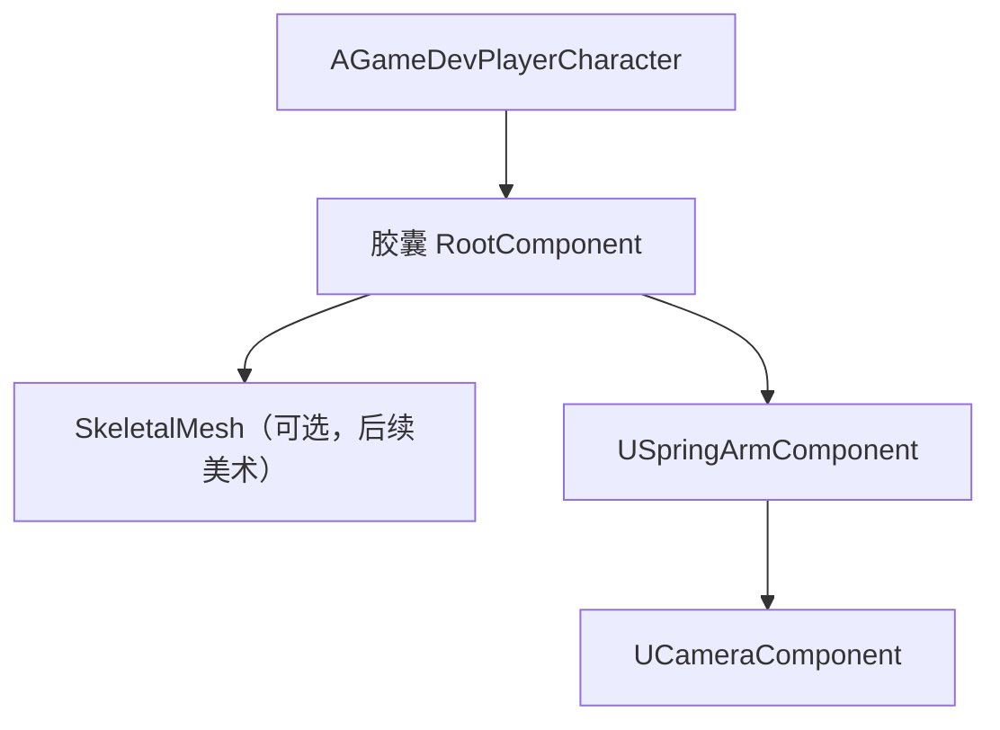
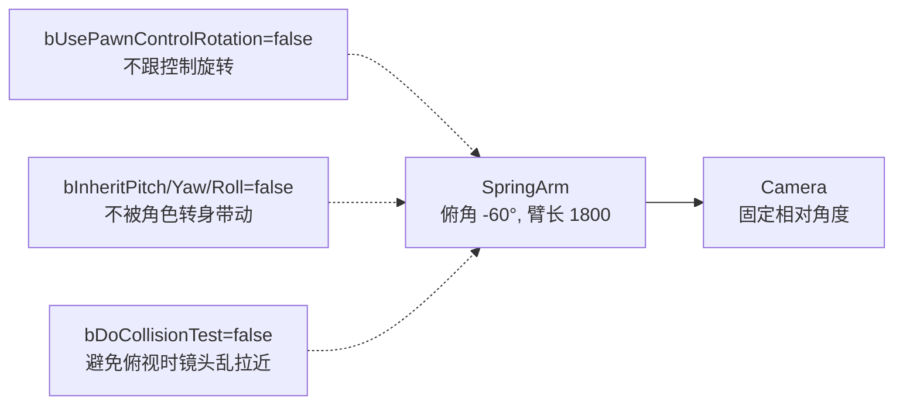

# K09 俯视角相机与角色

## 0. 一句话结论
俯视角 ARPG 的玩家实体是**"一具带移动能力的身体"**——在 UE 里就是 `ACharacter`（自带胶囊碰撞 + `UCharacterMovementComponent` 移动）。相机不直接挂在身体上、而是挂在一根**"吊臂" `USpringArmComponent`** 上，吊臂斜向下伸出（俯角），末端挂 `UCameraComponent`：这样身体怎么转、怎么动，相机都能稳定地"居高临下看着"。**弹簧臂 + 相机 + 可调参数**，就是本单元的全部落地物。

> 本单元配套总纲：`00-项目目录地图.md`。

> 🏭 **工业目标 / 技术债消除**：K06 曾把 GameMode 的 `DefaultPawnClass` 临时指向基类 `AGameDevPawn`（#技术债）。本单元建出真正的玩家角色 `AGameDevPlayerCharacter`，并**把 `DefaultPawnClass` 改成它——K06 的债在此清除**。相机采用官方 `SpringArm+Camera`（不自研）；若日后相机逻辑变复杂（瞄准偏移、镜头抖动、多模式），再抽成 `UGameDevCameraComponent`，当前不预留占位。

## 1. 为什么需要它
- **场景**：俯视角刷宝 ARPG（类恐怖黎明/暗黑）需要：斜向俯瞰的固定视角、相机能缩放、角色能被点击/按键驱动移动。
- **不学它会遇到的问题**：
  1. **拿 `APawn` 硬做玩家**：`APawn` 没有移动组件，K10 的点击寻路无从谈起——必须用 `ACharacter`（或自行实现移动组件，属自造轮子）。
  2. **相机直挂角色、跟随角色旋转**：视角乱转、无法俯视，玩家眩晕。
  3. **硬编码相机参数**：策划无法调俯角/臂长/缩放范围。
  4. **弹簧臂碰撞误判**：俯视下"吊臂"常撞到墙导致镜头猛拉近，需按需关闭 `bDoCollisionTest`。

## 2. 前置知识
- 前置单元：[K07 Actor 与 Component 生命周期](K07-Actor与Component生命周期.md)（构造函数里 `CreateDefaultSubobject` 创建组件、`SetupAttachment` 挂层级）。
- 需要先搞懂的 3 个概念（生活化的话）：
  1. **角色（Character）**：`ACharacter` = 「带身体和腿的 Pawn」。身体=胶囊碰撞，腿=`UCharacterMovementComponent`（负责走/跑/重力）。
  2. **弹簧臂（SpringArm）**：一根"自拍杆"。它从挂点向某个方向伸出固定长度，末端才是相机；遇到墙可自动缩短（可关）。
  3. **俯视角（Top-Down）**：相机从高处斜向下看，常用俯角约 -45°~-70°，臂长决定"看得多远"。

## 3. UE 里的相关概念（术语表）

| 术语 | 生活化类比 | 在本项目里具体指什么 | 官方一句话定义 |
|---|---|---|---|
| `ACharacter` | 带身体和腿的 Pawn | 玩家/NPC 的可移动实体 | 能行走的角色基类 |
| `AModularCharacter` | 会插零件的角色 | 官方插件版角色基类（支持组件注入） | 模块化角色 |
| `AGameDevPlayerCharacter` | **本项目的玩家角色** | 继承 `AModularCharacter`，带相机 | 自写玩家角色 |
| `UCharacterMovementComponent` | 角色的"腿" | 处理移动、重力、转向 | 角色移动组件 |
| `USpringArmComponent` | 自拍杆 | 决定相机与角色的距离/角度 | 弹簧臂组件 |
| `UCameraComponent` | 摄像机镜头 | 真正呈现画面的相机 | 相机组件 |
| `TargetArmLength` | 自拍杆长度 | 相机离角色的距离（缩放靠它） | 弹簧臂长度 |
| `bDoCollisionTest` | 是否让自拍杆避障 | 俯视一般关闭，避免镜头乱拉近 | 弹簧臂碰撞检测 |
| `bUsePawnControlRotation` | 是否让"视线"跟着玩家控制 | 俯视固定视角一般关 | 使用控制旋转 |
| `bOrientRotationToMovement` | 身体是否朝移动方向转 | 点击移动时角色转向目标 | 朝向移动方向 |
| `RootComponent` | 身体主干 | 角色根组件（胶囊） | 根场景组件 |

> **一句话记住**：**玩家 = `ACharacter`（带腿）；相机 = `SpringArm`（自拍杆）+ `Camera`（镜头），挂在角色上但固定俯角**。

## 4. 物理落位（物理模块 ↔ 逻辑层 ↔ 具体文件）
> 三维同时标注：**物理模块（DLL）** / **逻辑层** / **子目录**。物理模块规划见 `00-项目目录地图.md` 第 1.5 节。

**本单元新建/修改的文件：**

| 类 / 文件 | 物理模块（DLL） | 逻辑层（子目录） | 具体文件 | 新增/修改 |
|---|---|---|---|---|
| `AGameDevPlayerCharacter` | `GameDev` | 角色层 | `Source/GameDev/Character/GameDevPlayerCharacter.h` + `.cpp` | 新增 |
| `AGameDevGameMode`（改 `DefaultPawnClass`） | `GameDev` | 基础设施层 | `Source/GameDev/Framework/GameDevGameMode.cpp` | 修改 |

**物理模块 ↔ 逻辑层 ↔ 物理目录 对照树（只画本单元涉及的）：**

```text
Source/
└── GameDev/
    ├── Character/                ← 角色层
    │   ├── GameDevPlayerCharacter.h / .cpp   ← 本单元新增（玩家角色+相机）
    │   ├── GameDevPawn.h / .cpp              ← 已有（通用 Pawn 基类）
    │   └── GameDevPlayerState.h / .cpp       ← 已有
    └── Framework/                ← 基础设施层
        └── GameDevGameMode.cpp               ← 本单元修改（DefaultPawnClass 指向玩家角色）
```

- **为什么放 `Character/`（GameDev）**：玩家角色是"角色实体"，归角色层；依赖玩法实现，归 `GameDev` 模块。
- **为什么 `AGameDevPlayerCharacter` 不继承 K06 的 `AGameDevPawn`**：玩家需要移动 → 必须继承 `ACharacter`；`AGameDevPawn` 继承的是 `AModularPawn`（另一分支）。`AGameDevPawn` 保留作**通用可操控基类**（未来载具/炮台等），当前不承载玩家。
- 本单元不新增目录；`Character/` 已存在，**无需更新目录地图目录树**（文件已按 §4 登记逻辑层）。
- 注意区分：`NN-模块名/`（笔记内容目录）≠ 物理模块（DLL）。

## 5. 涉及的 UE 类与函数
> 引擎/插件自带，非我们自写。

| 类 / 函数 | 头文件 | 用大白话讲它是干嘛的 |
|---|---|---|
| `ACharacter` | `GameFramework/Character.h` | 带胶囊与移动组件的角色基类 |
| `AModularCharacter` | `ModularCharacter.h` | 模块化版角色基类 |
| `UCharacterMovementComponent` | `GameFramework/CharacterMovementComponent.h` | 角色的"腿"（移动/重力/转向） |
| `ACharacter::GetCharacterMovement()` | `GameFramework/Character.h` | 取移动组件 |
| `USpringArmComponent` | `GameFramework/SpringArmComponent.h` | 弹簧臂（相机吊杆） |
| `USpringArmComponent::SetupAttachment` | `Components/SceneComponent.h` | 把组件挂到父组件下 |
| `UCameraComponent` | `Camera/CameraComponent.h` | 相机镜头 |
| `AActor::CreateDefaultSubobject<T>()` | `GameFramework/Actor.h` | 构造函数里创建组件（K07） |
| `FMath::Clamp` | `Math/UnrealMathUtility.h` | 把数值限制在区间内（缩放夹取） |

## 6. 架构设计

### 6.1 组件层级


### 6.2 俯视相机参数


- **俯角**：把弹簧臂自身的相对旋转设为 `Pitch=-60°`（斜向下看）。因为不继承角色旋转，角色转身时相机保持稳定。
- **缩放**：改 `TargetArmLength`。本单元给 `AddCameraZoom` 供 K10 的滚轮输入调用，并用 `MinArmLength/MaxArmLength` 夹取。

### 6.3 客户端 / 服务端
- 相机是**纯客户端表现**（服务端不需要渲染）。`AGameDevPlayerCharacter` 在所有端都存在，但相机只在有本地玩家的端呈现画面。
- 移动是**服务端权威**（K10/M04 详述）；相机只是"看"。

## 7. 函数逐个设计

### 7.1 `AGameDevPlayerCharacter::AGameDevPlayerCharacter()`
- **签名**：`AGameDevPlayerCharacter::AGameDevPlayerCharacter();`
- **所属文件**：`Source/GameDev/Character/GameDevPlayerCharacter.cpp`。
- **参数表**：无。
- **返回值**：无。
- **调用时机**：构造时（CDO 与实例各一次）。
- **内部步骤（伪代码）**：
  ```
  AGameDevPlayerCharacter::AGameDevPlayerCharacter()
  {
      // 1) 不用控制器旋转带动身体（俯视固定视角）
      bUseControllerRotationYaw = false;
      // 2) 身体朝向移动方向转（点击移动时面朝目标）——K10 生效
      GetCharacterMovement()->bOrientRotationToMovement = true;
      GetCharacterMovement()->RotationRate = FRotator(0.f, 720.f, 0.f);
      // 3) 创建弹簧臂并挂到胶囊根
      SpringArm = CreateDefaultSubobject<USpringArmComponent>(TEXT("SpringArm"));
      SpringArm->SetupAttachment(RootComponent);
      SpringArm->TargetArmLength = DefaultArmLength;
      SpringArm->SetRelativeRotation(FRotator(CameraPitch, 0.f, 0.f));   // 俯角
      SpringArm->bUsePawnControlRotation = false;   // 不跟控制旋转
      SpringArm->bInheritPitch = false;             // 不继承角色旋转
      SpringArm->bInheritYaw = false;
      SpringArm->bInheritRoll = false;
      SpringArm->bDoCollisionTest = false;          // 俯视禁用避障
      // 4) 创建相机挂到弹簧臂末端 Socket
      Camera = CreateDefaultSubobject<UCameraComponent>(TEXT("Camera"));
      Camera->SetupAttachment(SpringArm, USpringArmComponent::SocketName);
      Camera->bUsePawnControlRotation = false;
  }
  ```
- **常见坑**：
  1. `CreateDefaultSubobject` 仅可在构造函数用（K07）。
  2. 忘 `SetupAttachment` → 组件不挂层级、位置错乱。
  3. 相机若继承角色旋转会导致"角色一转身视角就甩"。
  4. `bDoCollisionTest=true` 在俯视下常导致镜头被墙拉近，按需关闭。

### 7.2 `AGameDevPlayerCharacter::AddCameraZoom(float Delta)`
- **签名**：`void AGameDevPlayerCharacter::AddCameraZoom(float Delta);`
- **所属文件**：`Source/GameDev/Character/GameDevPlayerCharacter.cpp`。
- **参数表**：
  | 参数 | 类型 | 含义 | 取值范围 |
  |---|---|---|---|
  | Delta | `float` | 本次缩放增量（正=拉远/负=拉近，或反之按符号约定） | 任意浮点 |
- **返回值**：无。
- **调用时机**：收到相机缩放输入时（K10 由控制器转发）。
- **内部步骤（伪代码）**：
  ```
  AddCameraZoom(float Delta)
  {
      if (SpringArm)
          SpringArm->TargetArmLength =
              FMath::Clamp(SpringArm->TargetArmLength + Delta, MinArmLength, MaxArmLength);
  }
  ```
- **常见坑**：不夹取会让相机飞走或穿进角色；放大缩系数应可配。

## 8. 完整代码示例

> 代码保存到第 4 节列出的文件。全部带逐行中文注释。

### 8.1 `Source/GameDev/Character/GameDevPlayerCharacter.h`
```cpp
// 【保存到 Source/GameDev/Character/GameDevPlayerCharacter.h】
#pragma once

#include "CoreMinimal.h"
#include "ModularCharacter.h"                 // 官方插件基类 AModularCharacter
#include "GameDevPlayerCharacter.generated.h"

class USpringArmComponent;                    // 前置声明
class UCameraComponent;

// 本项目玩家角色：带移动的 Character + 俯视相机（弹簧臂+镜头）。
UCLASS()
class GAMEDEV_API AGameDevPlayerCharacter : public AModularCharacter
{
	GENERATED_BODY()

public:
	AGameDevPlayerCharacter();

	// 相机缩放（供输入调用；正负号由调用方约定）。
	UFUNCTION(BlueprintCallable, Category="Camera")
	void AddCameraZoom(float Delta);

	// —— 可调相机参数（数据驱动，策划可在 Details 改）——
	// 默认臂长
	UPROPERTY(EditDefaultsOnly, Category="Camera")
	float DefaultArmLength = 1800.f;
	// 最小/最大臂长（缩放夹取范围）
	UPROPERTY(EditDefaultsOnly, Category="Camera")
	float MinArmLength = 600.f;
	UPROPERTY(EditDefaultsOnly, Category="Camera")
	float MaxArmLength = 3200.f;
	// 俯角（负值=向下看）
	UPROPERTY(EditDefaultsOnly, Category="Camera")
	float CameraPitch = -60.f;

protected:
	// 弹簧臂：决定相机距离与角度。
	UPROPERTY(VisibleAnywhere, BlueprintReadOnly, Category="Camera")
	TObjectPtr<USpringArmComponent> SpringArm;

	// 相机：真正呈现画面。
	UPROPERTY(VisibleAnywhere, BlueprintReadOnly, Category="Camera")
	TObjectPtr<UCameraComponent> Camera;
};
```

### 8.2 `Source/GameDev/Character/GameDevPlayerCharacter.cpp`
```cpp
// 【保存到 Source/GameDev/Character/GameDevPlayerCharacter.cpp】
#include "GameDevPlayerCharacter.h"
#include "GameFramework/SpringArmComponent.h"                 // USpringArmComponent
#include "Camera/CameraComponent.h"                           // UCameraComponent
#include "GameFramework/CharacterMovementComponent.h"         // GetCharacterMovement()

AGameDevPlayerCharacter::AGameDevPlayerCharacter()
{
	// 1) 不用控制器 Yaw 带动身体（俯视固定视角，避免身体随鼠标转）。
	bUseControllerRotationYaw = false;

	// 2) 身体朝移动方向转（K10 点击移动时角色会面向目标）。
	if (UCharacterMovementComponent* Move = GetCharacterMovement())
	{
		Move->bOrientRotationToMovement = true;
		Move->RotationRate = FRotator(0.f, 720.f, 0.f);       // 转身速度
	}

	// 3) 弹簧臂：挂到胶囊根，斜向下俯视。
	SpringArm = CreateDefaultSubobject<USpringArmComponent>(TEXT("SpringArm"));
	SpringArm->SetupAttachment(RootComponent);
	SpringArm->TargetArmLength = DefaultArmLength;            // 臂长（缩放靠它）
	SpringArm->SetRelativeRotation(FRotator(CameraPitch, 0.f, 0.f)); // 俯角
	SpringArm->bUsePawnControlRotation = false;               // 不跟控制旋转
	SpringArm->bInheritPitch = false;                         // 不继承角色旋转
	SpringArm->bInheritYaw = false;
	SpringArm->bInheritRoll = false;
	SpringArm->bDoCollisionTest = false;                      // 俯视禁用避障，避免镜头乱拉近

	// 4) 相机：挂到弹簧臂末端 Socket。
	Camera = CreateDefaultSubobject<UCameraComponent>(TEXT("Camera"));
	Camera->SetupAttachment(SpringArm, USpringArmComponent::SocketName);
	Camera->bUsePawnControlRotation = false;                  // 相机不吃控制旋转
}

void AGameDevPlayerCharacter::AddCameraZoom(float Delta)
{
	if (SpringArm)
	{
		// 把臂长限制在 [Min, Max]，防止相机穿进角色或飞走。
		SpringArm->TargetArmLength =
			FMath::Clamp(SpringArm->TargetArmLength + Delta, MinArmLength, MaxArmLength);
	}
}
```

### 8.3 `Source/GameDev/Framework/GameDevGameMode.cpp`（修改构造函数，消除 K06 技术债）
```cpp
// 【修改 Source/GameDev/Framework/GameDevGameMode.cpp 的构造函数】
#include "GameDevGameMode.h"
#include "Character/GameDevPawn.h"                 // 保留（AGameDevPawn 仍作通用基类）
#include "Character/GameDevPlayerCharacter.h"      // 新增：真正的玩家角色
#include "GameDevPlayerController.h"
#include "GameDevGameState.h"
#include "Character/GameDevPlayerState.h"

AGameDevGameMode::AGameDevGameMode()
{
	// 玩家默认使用“带相机与移动”的玩家角色（消除 K06 的临时默认）。
	DefaultPawnClass = AGameDevPlayerCharacter::StaticClass();
	PlayerControllerClass = AGameDevPlayerController::StaticClass();
	PlayerStateClass = AGameDevPlayerState::StaticClass();
	GameStateClass = AGameDevGameState::StaticClass();
}
```

## 9. 验证方法
- **怎么运行**：落盘后编译 → Play PIE（地图 `Content/test`）。
- **预期输出/画面**：
  1. 画面呈**斜向下俯视**（约 -60°），能看见角色在画面中心。
  2. World Outliner 里玩家 Pawn 类型是 `AGameDevPlayerCharacter`（不再是 `AGameDevPawn`）。
  3. Output Log 仍有 `[GameDev] Pawn 被控制：...`（来自基类/父类）。
- **断点看变量**：
  1. 在 `AGameDevPlayerCharacter` 构造函数断点，Watch `SpringArm`、`Camera` 非空。
  2. 运行时 Watch `SpringArm->TargetArmLength`（应为 1800）。
  3. 手动在 Details 里改 `CameraPitch`/`DefaultArmLength` 观察视角变化（需在 BP 子类上调）。

## 10. 常见错误与排查
| 现象 | 原因 | 解决 |
|---|---|---|
| 没有俯视视角 / 看不到角色 | 相机没挂对层级或没创建 | 确认 `SetupAttachment` 链：Capsule→SpringArm→Camera |
| 角色转身时视角乱甩 | 相机/弹簧臂继承了角色旋转 | `bInheritYaw/Pitch/Roll=false` 且 `bUsePawnControlRotation=false` |
| 镜头老是猛地拉近 | 弹簧臂避障撞墙 | `bDoCollisionTest=false` |
| 出现两个默认 Pawn（旧的 AGameDevPawn） | GameMode 没改 `DefaultPawnClass` | 改成 `AGameDevPlayerCharacter::StaticClass()` |
| 编译报找不到 `ModularCharacter.h` | 插件依赖/未启用 | 确认 `ModularGameplayActors` 在依赖与 `.uproject`（见 PLUGINS.md） |
| 缩放不生效 | 没夹取或没接输入 | 检查 `AddCameraZoom` 调用（K10）；`Min/Max` 合理 |
| PIE 里角色能走但相机不动 | 相机未随角色（正常） | 相机挂在角色上，随角色移动；俯角固定符合预期 |

## 11. 动手练习
1. **必做**：PIE 后把 `DefaultArmLength` 从 1800 改到 1000、`CameraPitch` 从 -60 改到 -45，观察画面变化，理解"臂长=远近、俯角=倾斜"。
2. **必做**：临时把 `SpringArm->bInheritYaw` 改为 `true`，旋转角色，观察视角如何被带动，再改回 `false`。
3. **可选（永久有用）**：给 `AGameDevPlayerCharacter` 加一个 `UPROPERTY(EditDefaultsOnly) float ZoomStep = 200.f;` 并让 `AddCameraZoom` 用它，为 K10 滚轮缩放做准备。
4. **思考题**：为什么相机要做成"不被角色旋转带动"？（提示：俯视 ARPG 要稳定的大局视野）

## 12. 关联单元
- 上游：K07 Actor 与 Component 生命周期（构造函数创建组件、`SetupAttachment`）。
- 下游：K10 鼠标点击移动与 NavMesh 寻路（移动 + 相机缩放）、K08 Enhanced Input（输入由控制器统一处理）。
- 相关：K06 Gameplay 框架核心类（本单元消除其 `DefaultPawnClass` 技术债）。

## 13. 参考
- 本项目 `00-项目目录地图.md`、`02-引擎基础/K06-Gameplay框架核心类.md`、`02-引擎基础/K07-Actor与Component生命周期.md`
- Epic Games, *ACharacter / Character Movement Component*（官方角色与移动）
- Epic Games, *Spring Arm Component / Camera Component*（官方相机组件）
- UE 官方模板 *Top Down*（俯视相机与角色的官方范例）
