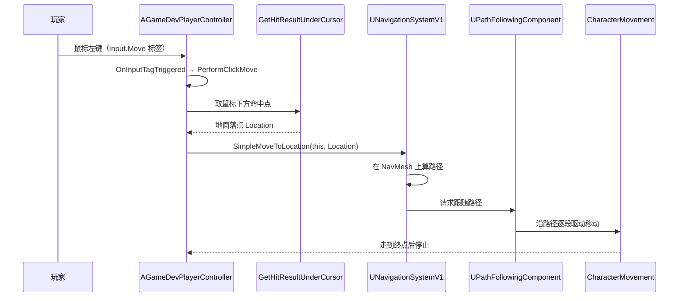

# K10 鼠标点击移动与 NavMesh 寻路

## 0. 一句话结论
"点哪走哪"分两步：**① 点击 → 屏幕坐标换算成世界坐标（找落点）**；**② 让角色沿导航网格（NavMesh）自动绕障碍走到该点**。第①步是 `PlayerController` 的本职（鼠标归它管）；第②步用官方 `UNavigationSystemV1::SimpleMoveToLocation`——它内部通过 **`UPathFollowingComponent`（路径跟随）** 驱动角色的 **`UCharacterMovementComponent`（腿）** 沿路径走。**我们不自己写寻路，只调用官方接口**。

> 本单元配套总纲：`00-项目目录地图.md`。

> 🏭 **工业目标 / 当前落地**：全程用官方导航系统与路径跟随（`UPathFollowingComponent`），**不自研寻路**。本单元只改 `AGameDevPlayerController`，**不新建文件、无技术债**。点击是"客户端输入"，真正移动的服务端权威在 M04/K21 统一处理。

## 1. 为什么需要它
- **场景**：暗黑/恐怖黎明式操作——鼠标点地面，角色自动绕过墙、箱子走到目标；点远处就沿最短路径走。
- **不学它会遇到的问题**：
  1. **直接朝目标直线走**：撞墙卡住、绕不过障碍——因为没有寻路。
  2. **自己写 A\* 寻路**：重复造轮子，还要处理网格生成、动态障碍、代理半径。官方 NavMesh 全都有。
  3. **在错误的地方处理点击**：鼠标事件必须在 `PlayerController` 里 deproject；写在 Pawn 里拿不到鼠标。
  4. **忘建导航网格**：地图里没有 `NavMeshBoundsVolume`，`SimpleMoveToLocation` 直接失败（日志/静默）。

## 2. 前置知识
- 前置单元：[K08 Enhanced Input 输入系统](K08-EnhancedInput输入系统.md)（输入绑定在控制器、统一入口 `OnInputTagTriggered`）、[K09 俯视角相机与角色](K09-俯视角相机与角色.md)（玩家是 `ACharacter`，有 `UCharacterMovementComponent`）。
- 需要先搞懂的 3 个概念（生活化的话）：
  1. **导航网格（NavMesh）**：把可行走地面"铺一层看不见的地毯网格"，寻路就在这层上找路径。由 `NavMeshBoundsVolume` 框定范围、引擎自动生成。
  2. **屏幕→世界（Deproject）**：鼠标只有 2D 屏幕坐标，"从相机射一条线穿过鼠标点、打到地面"得到 3D 落点。
  3. **路径跟随（Path Following）**：算出一条折线路径后，让角色沿它一段段走。官方组件是 `UPathFollowingComponent`。

## 3. UE 里的相关概念（术语表）

| 术语 | 生活化类比 | 在本项目里具体指什么 | 官方一句话定义 |
|---|---|---|---|
| NavMesh | 看不见的"可行走地毯网" | 引擎根据地面/障碍生成的导航网格 | 导航网格 |
| `ANavMeshBoundsVolume` | 划定"地毯铺到哪"的框 | 关卡里圈定可寻路范围 | 导航网格边界体积 |
| `ARecastNavMesh` | 地毯本身 | 由上面的框自动生成 | 导航数据 |
| 寻路（Pathfinding） | 找一条能绕开障碍的路 | `SimpleMoveToLocation` 内部完成 | 路径规划 |
| `UPathFollowingComponent` | "沿着路线走的司机" | 控制器上的路径跟随组件 | 路径跟随组件 |
| `UCharacterMovementComponent` | 角色的腿 | 实际执行位移 | 角色移动组件 |
| `SimpleMoveToLocation` | 一键"走到那" | 官方便捷接口（含建路径+跟随） | 简易移动接口 |
| `GetHitResultUnderCursor` | "鼠标点到了啥" | 取鼠标下方地面命中点 | 光标命中查询 |
| `PlayerController` | 玩家的意志+鼠标 | 处理点击、发移动命令 | 玩家控制器 |

> **一句话记住**：**`PlayerController` 算落点 → `SimpleMoveToLocation` 算路径并跟随 → `CharacterMovement` 走路**。NavMesh 要从"框 + 地面"先建出来。

## 4. 物理落位（物理模块 ↔ 逻辑层 ↔ 具体文件）
> 三维同时标注：**物理模块（DLL）** / **逻辑层** / **子目录**。物理模块规划见 `00-项目目录地图.md` 第 1.5 节。

**本单元新建/修改的文件：**

| 类 / 文件 | 物理模块（DLL） | 逻辑层（子目录） | 具体文件 | 新增/修改 |
|---|---|---|---|---|
| `AGameDevPlayerController`（点击移动 + 路径跟随） | `GameDev` | 基础设施层 | `Source/GameDev/Framework/GameDevPlayerController.h` + `.cpp` | 修改 |
| 关卡导航 | —（非代码） | — | `Content/Maps/L_Prototype.umap`（放 `NavMeshBoundsVolume`） | 新增（编辑器内建） |

**物理模块 ↔ 逻辑层 ↔ 物理目录 对照树（本单元涉及的，均已有）：**

```text
Source/
└── GameDev/
    └── Framework/
        └── GameDevPlayerController.h / .cpp   ← 本单元修改（点击移动）
```

- **为什么点击移动写在 `PlayerController`**：鼠标/输入归控制器；控制器 cross-Pawn 存活，命令角色移动、跨 Pawn 切换都自然。
- 本单元**不新增目录/文件**，**无需更新 `00-项目目录地图.md`**。
- 注意区分：`NN-模块名/`（笔记内容目录）≠ 物理模块（DLL）。

## 5. 涉及的 UE 类与函数
> 引擎/插件自带，非我们自写。

| 类 / 函数 | 头文件 | 用大白话讲它是干嘛的 |
|---|---|---|
| `UNavigationSystemV1` | `NavigationSystem.h` | 导航总系统 |
| `UNavigationSystemV1::SimpleMoveToLocation(...)` | `NavigationSystem.h` | 一键让某控制器控制的对象走到目标点 |
| `UPathFollowingComponent` | `Navigation/PathFollowingComponent.h` | 沿着算出的路径行走 |
| `APlayerController::GetHitResultUnderCursor(...)` | `GameFramework/PlayerController.h` | 取鼠标下方命中结果 |
| `APlayerController::bShowMouseCursor` | `GameFramework/PlayerController.h` | 显示鼠标指针 |
| `APlayerController::SetInputMode(...)` | `GameFramework/PlayerController.h` | 设置输入模式（游戏/UI） |
| `FInputModeGameAndUI` | `GameFramework/PlayerController.h` | 游戏+UI 混合输入模式 |
| `UCharacterMovementComponent` | `GameFramework/CharacterMovementComponent.h` | 角色的腿（被路径跟随驱动） |
| `AGameDevPlayerCharacter::AddCameraZoom` | 自写（K09） | 相机缩放 |

## 6. 架构设计

### 6.1 点击移动流程


### 6.2 为什么控制器要有路径跟随组件
- `SimpleMoveToLocation` 需要一个"能跟随路径的组件"来驱动角色。官方 `AAIController` 自带 `UPathFollowingComponent`，而 `APlayerController` 默认没有——所以本单元在控制器构造函数里**创建一个**（与 `AAIController` 内部做法一致），让玩家角色也能走 NavMesh。

### 6.3 客户端 / 服务端
- **点击与寻路是本地行为**（`SimpleMoveToLocation` 在本地算路径、本地驱动 `CharacterMovement`）。
- **单机**：本机即权威，直接有效。
- **联机**：本地算的移动需经服务端权威校验/复制（M04/K21）。本单元先实现单机点击移动，**联网权威留到 M04**（已在 TODO 备注）。

## 7. 函数逐个设计

### 7.1 `AGameDevPlayerController::PerformClickMove()`
- **签名**：`void AGameDevPlayerController::PerformClickMove();`
- **所属文件**：`Source/GameDev/Framework/GameDevPlayerController.cpp`。
- **参数表**：无。
- **返回值**：无。
- **调用时机**：收到 `Input.Move` 标签时（点击）。
- **内部步骤（伪代码）**：
  ```
  PerformClickMove()
  {
      FHitResult Hit;
      // 从相机穿过鼠标点射出，取地面命中（Visibility 通道）
      if (GetHitResultUnderCursor(ECC_Visibility, /*bTraceComplex=*/false, Hit))
      {
          const FVector Dest = Hit.ImpactPoint;
          // 官方接口：让本控制器控制的对象在 NavMesh 上走到 Dest。
          UNavigationSystemV1::SimpleMoveToLocation(this, Dest);
      }
  }
  ```
- **常见坑**：
  1. 地面必须阻挡 `Visibility`（默认地面阻挡）；否则打不中。
  2. 地图没有 `NavMeshBoundsVolume` → `SimpleMoveToLocation` 找不到路径（打日志确认）。
  3. 目标点不在 NavMesh 上（如墙上）→ 建议查询投影点（见练习）。

### 7.2 `AGameDevPlayerController::OnInputTagTriggered(...)`（K10 重写分发）
- **签名**：`virtual void AGameDevPlayerController::OnInputTagTriggered(const FInputActionValue& Value, FGameplayTag InputTag) override;`
- **所属文件**：`Source/GameDev/Framework/GameDevPlayerController.cpp`。
- **参数表**：见 K08 §7.3。
- **返回值**：无。
- **调用时机**：任何已绑定的输入动作触发时。
- **内部步骤（伪代码）**：
  ```
  OnInputTagTriggered(Value, InputTag)
  {
      if (InputTag == MoveInputTag && MoveInputTag.IsValid())
          PerformClickMove();                       // 点击移动
      else if (InputTag == CameraZoomInputTag && CameraZoomInputTag.IsValid())
          if (AGameDevPlayerCharacter* C = Cast<AGameDevPlayerCharacter>(GetPawn()))
              C->AddCameraZoom(Value.Get<float>() * ZoomStep);   // 滚轮缩放
      else
          UE_LOG(Log, "未处理的输入标签：%s", *InputTag.ToString());   // 便于发现漏接
  }
  ```
- **常见坑**：
  1. `MoveInputTag`/`CameraZoomInputTag` 是 `UPROPERTY`，需在 `BP_GameDevPlayerController` 里设成 `Input.Move`/`Input.Camera.Zoom`（避免硬编码字符串）。
  2. 轴输入用 `Value.Get<float>()`；布尔输入恰别 `.Get<float>()`（类型要匹配）。
  3. `GetPawn()` 可能为空，`Cast` 前判空。

### 7.3 `AGameDevPlayerController::AGameDevPlayerController()`
- **签名**：`AGameDevPlayerController::AGameDevPlayerController();`
- **所属文件**：`Source/GameDev/Framework/GameDevPlayerController.cpp`。
- **参数表**：无。**返回值**：无。
- **调用时机**：构造时。
- **内部步骤（伪代码）**：
  ```
  AGameDevPlayerController::AGameDevPlayerController()
  {
      // 1) 让玩家也能走 NavMesh：装一个路径跟随组件（AAIController 也是这么做的）。
      PathFollowingComponent = CreateDefaultSubobject<UPathFollowingComponent>(TEXT("PathFollowingComponent"));
      // 2) 显示鼠标指针（点击移动需要）。
      bShowMouseCursor = true;
  }
  ```
- **常见坑**：`bShowMouseCursor` 还需配合 `SetInputMode`（见 `BeginPlay`），否则点击可能只到 UI 不到游戏。

### 7.4 `AGameDevPlayerController::BeginPlay()`（补充）
- **内部步骤**：先 `Super::BeginPlay()`；再 `SetInputMode(FInputModeGameAndUI())`（允许鼠标指针存在同时接收游戏输入）。

## 8. 完整代码示例

> 代码保存到第 4 节列出的文件。全部带逐行中文注释。

### 8.1 `Source/GameDev/Framework/GameDevPlayerController.h`（K10 修改后完整内容）
```cpp
// 【保存到 Source/GameDev/Framework/GameDevPlayerController.h】
#pragma once

#include "CoreMinimal.h"
#include "ModularPlayerController.h"        // 官方插件基类 AModularPlayerController
#include "GameplayTagContainer.h"           // FGameplayTag
#include "GameDevPlayerController.generated.h"

class UInputMappingContext;                 // 前置声明
class UGameDevInputConfig;
struct FInputActionValue;

// 本项目 PlayerController：代表“玩家意志”，管输入、相机命令与点击移动。
UCLASS()
class GAMEDEV_API AGameDevPlayerController : public AModularPlayerController
{
	GENERATED_BODY()

public:
	AGameDevPlayerController();

	// —— 输入配置（K08）——
	UPROPERTY(EditDefaultsOnly, Category="Input")
	TObjectPtr<UGameDevInputConfig> InputConfig;
	UPROPERTY(EditDefaultsOnly, Category="Input")
	TObjectPtr<UInputMappingContext> DefaultMappingContext;
	UPROPERTY(EditDefaultsOnly, Category="Input")
	int32 InputMappingPriority = 0;

	// —— 意图标签（在 BP 里设，避免硬编码）——
	// “点击移动”对应的意图标签（如 Input.Move）
	UPROPERTY(EditDefaultsOnly, Category="Input", meta=(Categories="Input"))
	FGameplayTag MoveInputTag;
	// “相机缩放”对应的意图标签（如 Input.Camera.Zoom）
	UPROPERTY(EditDefaultsOnly, Category="Input", meta=(Categories="Input"))
	FGameplayTag CameraZoomInputTag;
	// 滚轮每一格的缩放步长
	UPROPERTY(EditDefaultsOnly, Category="Camera")
	float ZoomStep = 200.f;

protected:
	virtual void SetupInputComponent() override;
	virtual void BeginPlay() override;
	virtual void EndPlay(const EEndPlayReason::Type EndPlayReason) override;

	// 输入统一入口：K10 在此按标签分发到移动/缩放。
	virtual void OnInputTagTriggered(const FInputActionValue& Value, FGameplayTag InputTag) override;

	// 鼠标点击 → 找落点 → 命令角色沿 NavMesh 移动。
	void PerformClickMove();

private:
	void AddInputMappingContext();
	void RemoveInputMappingContext();
};
```

### 8.2 `Source/GameDev/Framework/GameDevPlayerController.cpp`（K10 修改后完整内容）
```cpp
// 【保存到 Source/GameDev/Framework/GameDevPlayerController.cpp】
#include "GameDevPlayerController.h"
#include "GameDev/Input/GameDevInputConfig.h"      // 输入配置（K08）
#include "Character/GameDevPlayerCharacter.h"      // 玩家角色（取相机缩放 / 后续扩展）
#include "EnhancedInputComponent.h"                // UEnhancedInputComponent
#include "InputActionValue.h"                      // FInputActionValue
#include "InputMappingContext.h"                   // UInputMappingContext
#include "EnhancedInputSubsystems.h"               // UEnhancedInputLocalPlayerSubsystem
#include "Engine/LocalPlayer.h"                    // ULocalPlayer::GetSubsystem
#include "Navigation/PathFollowingComponent.h"     // UPathFollowingComponent
#include "NavigationSystem.h"                      // UNavigationSystemV1::SimpleMoveToLocation
#include "Engine/World.h"                          // GetWorld()

AGameDevPlayerController::AGameDevPlayerController()
{
	// 让玩家也能走 NavMesh：装一个路径跟随组件（官方 AAIController 内部同样做法）。
	PathFollowingComponent = CreateDefaultSubobject<UPathFollowingComponent>(TEXT("PathFollowingComponent"));

	// 点击移动需要鼠标指针可见。
	bShowMouseCursor = true;
}

void AGameDevPlayerController::BeginPlay()
{
	Super::BeginPlay();

	// 允许鼠标指针存在的同时接收游戏输入（点击地面）。
	SetInputMode(FInputModeGameAndUI());

	UE_LOG(LogTemp, Log, TEXT("[GameDev] PlayerController BeginPlay：%s"), *GetName());
}

void AGameDevPlayerController::SetupInputComponent()
{
	Super::SetupInputComponent();      // 保留引擎默认绑定（含调试命令）

	UEnhancedInputComponent* EIC = Cast<UEnhancedInputComponent>(InputComponent);
	if (!EIC)
	{
		UE_LOG(LogTemp, Warning, TEXT("[GameDev] 未取得 UEnhancedInputComponent，输入不可用"));
		return;
	}

	// 1) 让默认映射上下文生效。
	AddInputMappingContext();

	// 2) 按数据配置逐条绑定：全部绑到统一入口，并带上该动作的意图标签。
	if (InputConfig)
	{
		for (const FGameDevInputAction& Entry : InputConfig->NativeInputActions)
		{
			if (Entry.InputAction && Entry.InputTag.IsValid())
			{
				EIC->BindAction(Entry.InputAction, ETriggerEvent::Triggered,
								this, &AGameDevPlayerController::OnInputTagTriggered, Entry.InputTag);
			}
		}
	}
	else
	{
		UE_LOG(LogTemp, Warning, TEXT("[GameDev] InputConfig 未设置，输入不会绑定"));
	}
}

void AGameDevPlayerController::OnInputTagTriggered(const FInputActionValue& Value, FGameplayTag InputTag)
{
	// 按意图标签分发（不关心具体按键）。
	if (MoveInputTag.IsValid() && InputTag == MoveInputTag)
	{
		PerformClickMove();                       // 点击移动
	}
	else if (CameraZoomInputTag.IsValid() && InputTag == CameraZoomInputTag)
	{
		// 轴类输入：取浮点读数乘步长，交给玩家角色缩放相机。
		if (AGameDevPlayerCharacter* PlayerChar = Cast<AGameDevPlayerCharacter>(GetPawn()))
		{
			PlayerChar->AddCameraZoom(Value.Get<float>() * ZoomStep);
		}
	}
	else
	{
		// 未处理的标签：打印，便于发现“配了动作但没接处理”。
		UE_LOG(LogTemp, Log, TEXT("[GameDev] 未处理的输入标签：%s"), *InputTag.ToString());
	}
}

void AGameDevPlayerController::PerformClickMove()
{
	FHitResult Hit;
	// 从相机穿过鼠标点射出，取地面命中（地面需阻挡 Visibility 通道）。
	if (GetHitResultUnderCursor(ECC_Visibility, /*bTraceComplex=*/false, Hit))
	{
		const FVector Dest = Hit.ImpactPoint;
		// 官方接口：让本控制器控制的对象在 NavMesh 上走到 Dest。
		const bool bOk = UNavigationSystemV1::SimpleMoveToLocation(this, Dest);
		if (!bOk)
		{
			UE_LOG(LogTemp, Warning, TEXT("[GameDev] SimpleMoveToLocation 失败：检查地图 NavMeshBoundsVolume 与目标点"));
		}
	}
}

void AGameDevPlayerController::AddInputMappingContext()
{
	ULocalPlayer* LP = GetLocalPlayer();
	if (!LP)
	{
		return;
	}
	UEnhancedInputLocalPlayerSubsystem* Sub = ULocalPlayer::GetSubsystem<UEnhancedInputLocalPlayerSubsystem>(LP);
	if (Sub && DefaultMappingContext)
	{
		Sub->AddMappingContext(DefaultMappingContext, InputMappingPriority);
	}
}

void AGameDevPlayerController::RemoveInputMappingContext()
{
	ULocalPlayer* LP = GetLocalPlayer();
	if (!LP)
	{
		return;
	}
	UEnhancedInputLocalPlayerSubsystem* Sub = ULocalPlayer::GetSubsystem<UEnhancedInputLocalPlayerSubsystem>(LP);
	if (Sub && DefaultMappingContext)
	{
		Sub->RemoveMappingContext(DefaultMappingContext);
	}
}

void AGameDevPlayerController::EndPlay(const EEndPlayReason::Type EndPlayReason)
{
	RemoveInputMappingContext();
	Super::EndPlay(EndPlayReason);
}
```

### 8.3 关卡导航准备（编辑器内建，非代码）
1. 打开 `Content/test`（`GameDefaultMap`）。
2. 从"Volumes"放置 **`NavMeshBoundsVolume`**，缩放覆盖整个可行走区域。
3. 按 **`P`** 显示导航网格（绿色），确认地面已生成 NavMesh；有障碍物应挖空。
4. 放置地面（如 `Plane`/`Floor`）与几块障碍，验证绕行。

## 9. 验证方法
- **怎么运行**：改好控制器 + 地图放 `NavMeshBoundsVolume` → 在 `BP_GameDevPlayerController` 设 `MoveInputTag=Input.Move`、`CameraZoomInputTag=Input.Camera.Zoom` → Play PIE。
- **预期输出/画面**：
  1. 鼠标指针可见。
  2. 点击地面，角色**绕开障碍**走到该点（不是直线穿墙）。
  3. 滚动滚轮，相机臂长变化（缩放）。
  4. Output Log 无"未处理的输入标签"警告（Move/Zoom 已接）。
- **调试快捷键**：`P` 显示/隐藏导航网格；点击若不动，先看 `SimpleMoveToLocation` 是否返回 false（有警告日志）。
- **断点看变量**：`PerformClickMove` 断点看 `Hit.ImpactPoint` 是否落在地面；`OnInputTagTriggered` 断点看 `InputTag` 与 `MoveInputTag` 是否相等。

## 10. 常见错误与排查
| 现象 | 原因 | 解决 |
|---|---|---|
| 点击完全没反应 | `MoveInputTag` 没设 / 输入没绑 / 没在 BP 控制器 | 设标签、确认 K08 绑定生效、GameMode 用 BP 控制器 |
| 角色走了但直线穿墙 | 没有 NavMesh / 没建 `NavMeshBoundsVolume` | 放体积框并 `P` 确认绿色网格 |
| `SimpleMoveToLocation` 返回 false | 控制器无路径跟随组件 / 目标不在网格 | 确认构造函数创建了 `UPathFollowingComponent`；用投影后的可达点 |
| 鼠标点了没落点 | 地面不阻挡 `Visibility` | 给地面设阻挡 Visibility 的碰撞，或换成命中地面通道 |
| 指针看不见 | `bShowMouseCursor=false` / 输入模式不对 | 构造函数设 true；`BeginPlay` 设 `FInputModeGameAndUI` |
| 滚轮不缩放 | 轴输入用 `Get<float>()` 但标签没接 | 设 `CameraZoomInputTag`；确认 IA 是 Axis1D |
| 角色不转身 | `bOrientRotationToMovement=false` | K09 已设 true；检查是否被覆盖 |
| UI 抢走点击 | 输入模式是 UI | 用 `FInputModeGameAndUI` 或按情境切换 |

## 11. 动手练习
1. **必做**：放 `NavMeshBoundsVolume` + 几块墙，点击墙后地面，确认绕行；按 `P` 观察网格。
2. **必做**：加 `IA_CameraZoom`（Axis1D）+ 滚轮映射 + 标签 `Input.Camera.Zoom`，设到控制器 `CameraZoomInputTag`，验证滚轮缩放。
3. **可选（永久有用）**：把落点用 `UNavigationSystemV1::ProjectPointToNavigation` 投影到最近导航点，避免点到障碍/墙外导致移动失败——这是长期有效的健壮性处理，不是练习物。
4. **思考题**：为什么点击移动写在 PlayerController，而不是角色里？（提示：鼠标属于控制器）

## 12. 关联单元
- 上游：K08 Enhanced Input 输入系统（输入入口）、K09 俯视角相机与角色（Character+Movement）。
- 下游：M04 网络同步（点击移动的服务端权威，K21 RPC/Authority）、K55 线性地图与传送（大范围寻路/传送）。
- 相关：K07 生命周期（控制器 EndPlay 清理）。

## 13. 参考
- 本项目 `00-项目目录地图.md`、`02-引擎基础/K08-EnhancedInput输入系统.md`、`02-引擎基础/K09-俯视角相机与角色.md`
- Epic Games, *Navigation System / NavMesh*（官方导航系统）
- Epic Games, *Path Following Component*、*Simple Move To Location*
- Epic Games, *Player Controller / Deprojection*（官方控制器与屏幕投影）
